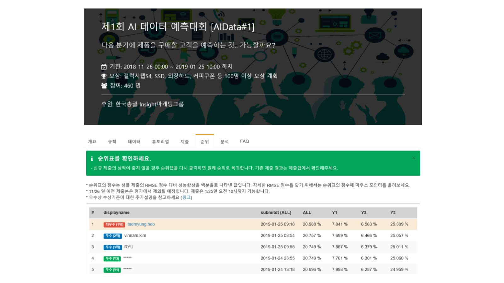
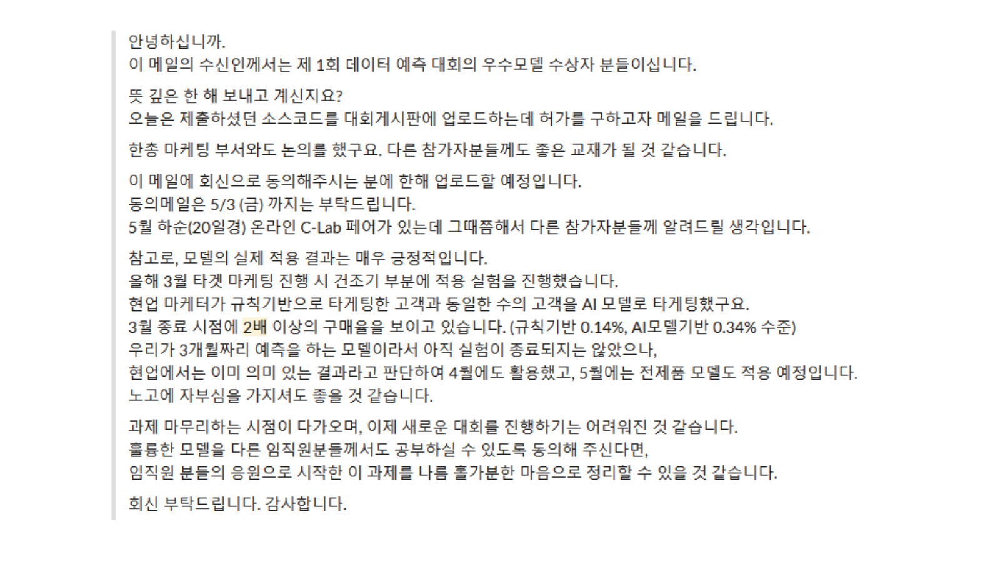
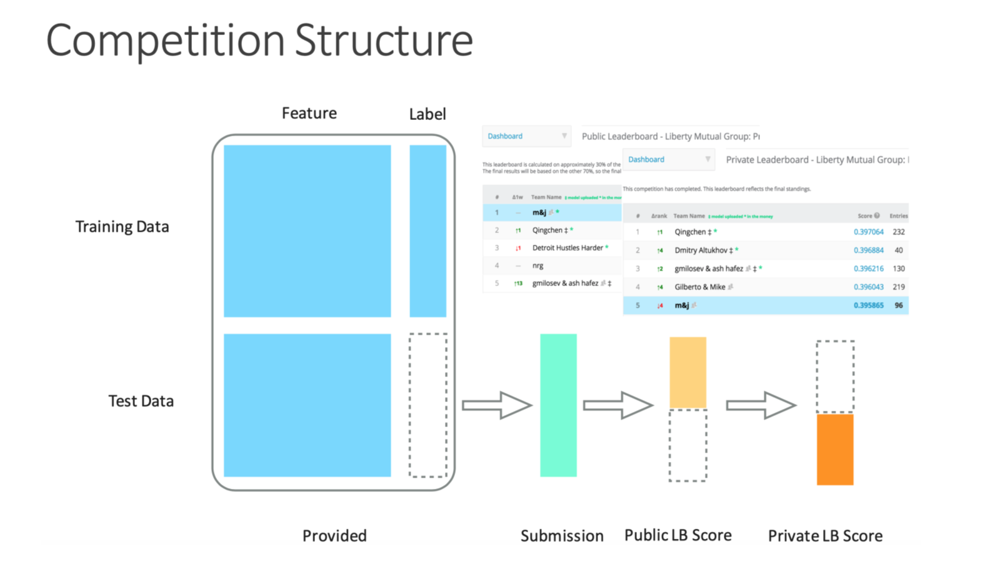

# 캐글 소개: 데이터를 보고 예측하고, 결과로 실력을 겨루는 곳

캐글을 처음 접하는 동료들을 위해, 제가 참여한 머신러닝 대회 경험과 캐글의 기본 구조를 소개합니다.
이 글을 읽고 나면 대회 참가자가 무엇을 제출하는지, 순위는 어떻게 정해지는지, 이어지는 스마트폰 중독 예측 대회 후기에서 어떤 점을 보면 좋을지 이해할 수 있습니다.

## 먼저, 삼성전자에서 경험한 머신러닝 대회 이야기

삼성전자에 재직할 때 사내 머신러닝 대회에 참가해 1등을 했습니다.
대회 이름은 ‘제1회 AI·데이터 예측대회’였고, 다음 분기에 제품을 구매할 고객을 예측하는 문제였습니다.
아래는 당시 대회 페이지와 순위표입니다.
`taemyung.heo` 옆에 ‘최우수 (1위)’가 표시되어 있습니다.

*삼성전자 사내 대회 우승 기록.*

이후 대회 운영진에게서 모델의 실제 적용 결과를 알리는 메일을 받았습니다.
운영진은 우수 모델 수상자들에게 제출 코드를 다른 임직원의 학습 자료로 공개해도 되는지 물으면서, 마케팅 적용 실험의 경과도 함께 전했습니다.

*실제 적용 결과를 공유하고 수상자들의 기여에 감사를 전한 운영진 메일.*

메일에 따르면, 건조기 마케팅에서 현업 담당자가 규칙으로 고른 고객과 같은 수의 고객을 AI 모델로 골라 비교했습니다.
3월 말 기준 구매율은 규칙 기반 0.14%, AI 모델 기반 0.34%로, AI 모델로 고른 고객군에서 두 배 이상의 구매율을 보였습니다.
현업에서는 의미 있는 결과로 판단해 4월에도 활용했고, 5월에는 전 제품군에 적용할 예정이라고 했습니다.
다만 메일을 보낸 시점에는 3개월 예측 모델의 적용 실험이 아직 끝나지 않은 상태였습니다.

대회에서 만든 모델이 실제 업무에 쓰이고, 그 결과가 다시 참가자에게 전달된 사례입니다.
이 경험을 먼저 소개한 이유는 머신러닝 대회에서 풀려는 문제가 어떤 것인지 보여 주기 위해서입니다.
‘누가 제품을 구매할까?’처럼 업무에서 궁금한 질문을 데이터로 풀고, 예측 결과를 정해진 기준으로 비교하는 것입니다.
이 순위표와 메일은 삼성전자 사내 대회에 관한 자료입니다.
이제 이런 예측 대회가 전 세계 참가자에게 열리는 캐글을 살펴보겠습니다.

## 캐글은 어떤 곳인가요?

캐글(Kaggle)은 머신러닝 대회를 열고, 데이터를 나누고, 분석 코드를 실행하고 공유하는 온라인 플랫폼입니다.
전 세계 참가자들이 같은 문제를 풀면서 결과를 겨루고, 서로의 접근 방법을 배우는 커뮤니티이기도 합니다.
대회, 데이터, 코드 실행 환경, 토론 공간이 한곳에 모여 있습니다.

캐글은 ‘회사’와 ‘커뮤니티’라는 두 관점에서 볼 수 있습니다.
2010년에 설립되어 2017년 구글에 인수된 회사라는 배경을 알면, 캐글이 서비스를 제공하는 플랫폼이라는 점을 이해할 수 있습니다.
이용자 입장에서 더 직접적으로 만나는 것은 그 안에서 문제를 풀고 자료를 나누는 사람들입니다.

## 대회에서는 무엇을 하나요?

예측 대회에서는 주최자가 문제와 데이터, 평가 기준을 제시하고, 참가자가 그 데이터를 바탕으로 예측 모델을 만듭니다.
여기서 모델은 과거 사례를 통해 입력 정보와 결과의 관계를 학습한 프로그램이라고 생각하면 됩니다.
고객 구매 예측이라면, 고객에 관한 정보를 받아 앞으로 구매할 가능성을 계산하는 식입니다.

주최자는 기업이나 연구기관 등일 수 있고, 참가자는 개인 또는 팀으로 문제를 풉니다.
캐글은 대회 페이지와 제출·채점 기능, 순위표, 코드 실행 환경과 토론 공간을 제공합니다.
상금이 걸린 대회도 있고, 학습이나 연습을 목적으로 참여하는 대회도 있습니다.

## 정답을 주는데, 무엇을 예측하나요?

핵심은 **학습할 때 쓰는 데이터에는 정답이 있고, 제출할 데이터에는 정답이 공개되지 않는다**는 점입니다.
아래 그림은 학습 데이터와 테스트 데이터가 주어지고, 예측을 제출해 공개·최종 점수를 받는 대회 구조를 보여 줍니다.

그림의 왼쪽은 참가자에게 주어지는 데이터, 가운데는 제출한 예측, 오른쪽은 공개·최종 평가를 나타냅니다.
고객 구매 예측에 빗대어 읽으면 다음과 같습니다.

1. **정답이 있는 사례로 학습합니다.** 고객 정보와 실제 구매 결과를 함께 보고, 어떤 정보가 구매를 예측하는 데 도움이 되는지 찾습니다.
2. **정답이 숨겨진 사례를 예측합니다.** 별도로 주어진 고객 정보를 보고 구매할 가능성을 계산합니다.
3. **예측 결과를 제출합니다.** 참가자는 고객별 예측값을 파일로 만들어 제출합니다.
4. **캐글이 채점합니다.** 주최자 측이 가진 정답과 제출한 예측을 대회의 평가 기준에 따라 비교합니다.
5. **점수와 순위를 확인합니다.** 순위표를 보면서 다른 참가자와 비교했을 때 자신의 예측이 어느 정도인지 확인합니다.

이때 고객의 구매 이력처럼 예측에 사용하는 정보를 **입력 변수**(feature), 실제 구매 여부처럼 맞히려는 값을 **정답**(label)이라고 부릅니다.
정답과 함께 배우는 자료는 **학습 데이터**(training data), 정답을 숨겨 두고 제출 결과를 평가하는 자료는 **테스트 데이터**(test data)입니다.
**순위표**(leaderboard)는 같은 평가 기준으로 참가자들의 제출 결과를 비교한 표입니다.

대회에서 정해진 문제를 푼다는 것은, 이 과정에서 더 좋은 예측을 만드는 방법을 찾는 일입니다.
어떤 정보를 사용할지, 데이터를 어떻게 정리할지, 어떤 모델을 사용할지 바꾸어 가며 결과를 비교합니다.

## 대회 중 순위와 최종 순위가 왜 다른가요?

위 그림에는 Public과 Private이라는 두 순위표가 나옵니다.
이번 스마트폰 중독 예측 대회도 이 구조를 사용했습니다.

**Public 순위표**는 테스트 데이터의 일부로 채점해 대회 중에 보여 주는 순위표입니다.
참가자는 여기서 제출 결과를 확인할 수 있습니다.
**Private 순위표**는 대회 중 공개하지 않았던 나머지 부분으로 채점한 최종 순위표입니다.
따라서 대회 중에 보던 순위와 마지막 순위가 달라질 수 있습니다.

이렇게 평가를 나누는 것은 모델의 **일반화 성능**, 즉 학습하거나 모델을 고르는 데 쓰지 않은 새로운 데이터에서도 얼마나 잘 예측하는지를 확인하기 위한 장치입니다.
최종 평가에 쓰는 부분의 점수를 끝까지 숨겨 두면, 참가자가 그 점수를 보고 모델을 계속 바꾸는 일을 막을 수 있습니다.

공개 점수를 확인할 때마다 모델이나 설정을 바꾸고, 점수가 오른 방법만 반복해서 선택하면 어떤 일이 생길까요?
공개 평가 데이터에 우연히 잘 맞는 방법을 고르게 되어, 새로운 데이터에 대한 예측 능력은 좋아지지 않았는데 공개 점수만 높아질 수 있습니다.
이를 **공개 점수에 대한 과적합**(overfitting)이라고 합니다.
정답을 직접 보지 않더라도, 점수를 반복해서 확인하며 모델을 고르는 과정에서 그 데이터에 맞춰질 수 있는 것입니다.

이렇게 공개 점수에 과적합한 모델은 대회 중에는 높은 순위를 기록해도, 최종 평가에서는 순위가 크게 떨어질 수 있습니다.
다만 두 평가에 쓰인 데이터의 차이와 우연한 변동도 영향을 주므로, 순위가 떨어졌다는 사실만으로 과적합이라고 단정할 수는 없습니다.
그래서 참가자는 공개 점수에만 의존하지 않고, 학습 데이터 일부를 따로 떼어 두고 처음 보는 데이터처럼 예측해 보는 **검증**도 합니다.
이어지는 대회 후기에서 여러 번 등장하는 ‘검증’은 새로 시도한 방법이 실제로 더 나아졌는지 확인하는 과정입니다.

## 대회에 참가하지 않아도 사용할 수 있습니다

캐글에서는 대회 참가와 별개로 데이터를 공유하고 분석할 수 있습니다.
관심 있는 데이터를 찾아 직접 분석해 볼 수도 있고, 다른 사람이 같은 데이터를 어떻게 분석했는지 코드를 읽어 볼 수도 있습니다.
데이터를 이해하는 데서 막히면 공개된 분석 결과와 토론을 참고할 수 있습니다.

캐글의 **Code 메뉴**에서는 다른 사람이 공개한 분석 코드를 찾아 읽고 실행해 볼 수 있습니다.
이곳에서 사용하는 문서 형식인 **노트북**(Notebook)은 코드와 설명, 실행 결과를 함께 담습니다.
캐글은 브라우저에서 직접 코드를 작성하고 실행한 뒤 공유하는 환경도 제공합니다.
대회와 데이터 공유를 같은 플랫폼에서 제공하므로, 데이터를 찾고 다른 사람의 분석을 읽다가 직접 대회에 참여하는 식으로 활동을 넓힐 수 있습니다.

## 이제 스마트폰 중독 예측 대회 이야기로

이어지는 [Kaggle S6E8 Predicting Smartphone Addiction 대회 후기](s6e8-retrospective-presentation.md)는 생활 습관 정보로 스마트폰 중독 여부를 예측하는 대회에 참여한 기록입니다.
여기서 다룬 것은 실제 개인의 진단이 아니라, 합성 데이터에 주어진 정답을 얼마나 잘 예측하는지 겨루는 문제였습니다.
저는 여러 방법을 실험하고 예측 결과를 조합해 최종 3,532팀 중 14위를 기록했습니다.

처음 읽을 때는 모델 이름을 모두 알 필요는 없습니다.
‘어떤 정보를 보고 예측했는가’, ‘새로운 방법이 더 좋아졌는지 어떻게 확인했는가’, ‘어떤 실험이 최종 결과에 도움이 되었는가’를 따라가면 됩니다.
앞에서 본 학습 데이터, 테스트 데이터, 검증, 순위표가 실제 참가 과정에서 어떻게 쓰였는지 살펴보겠습니다.
