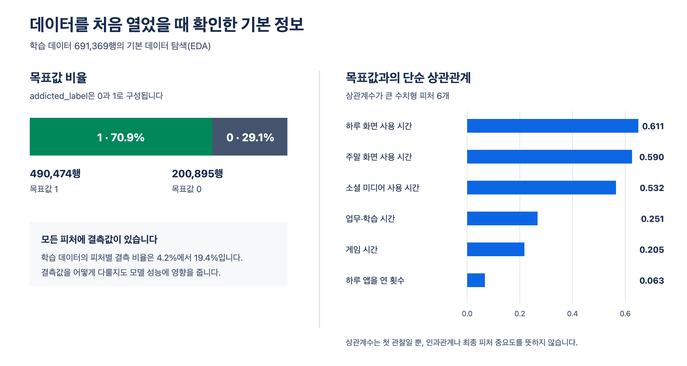
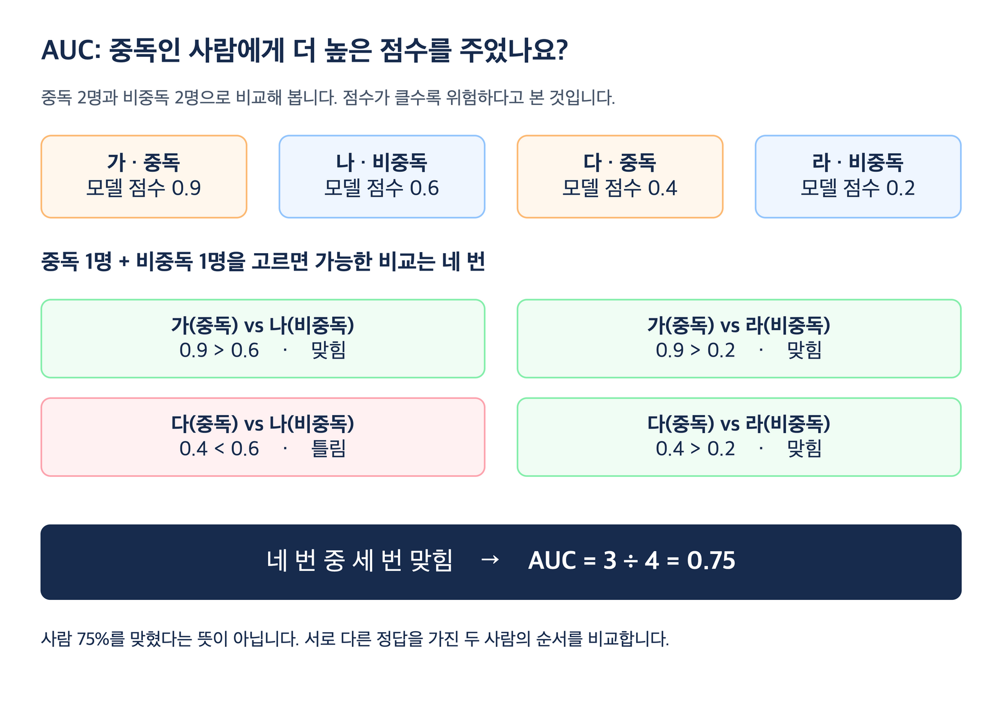
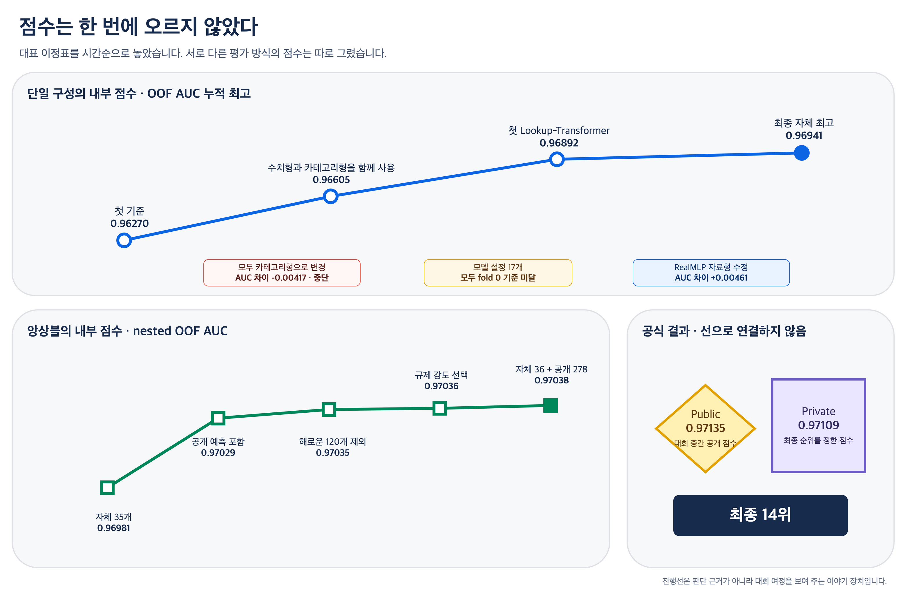
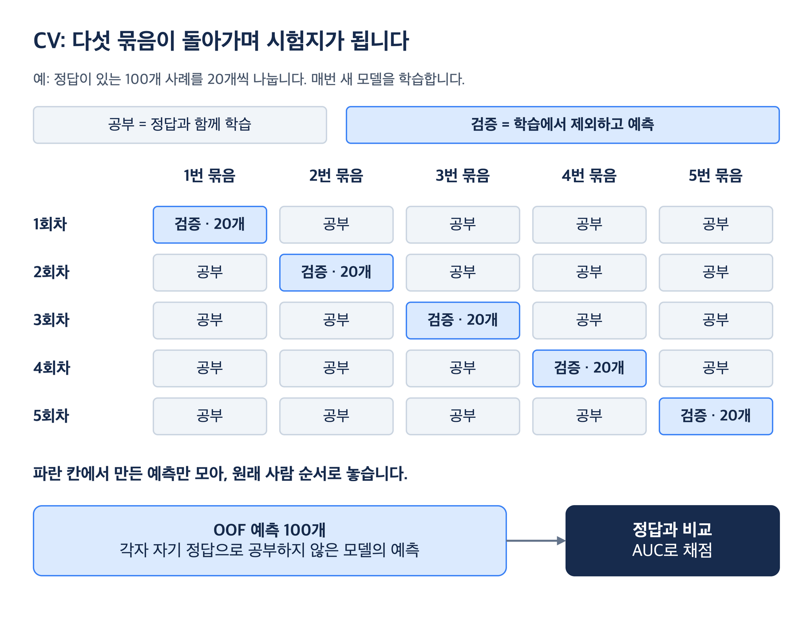
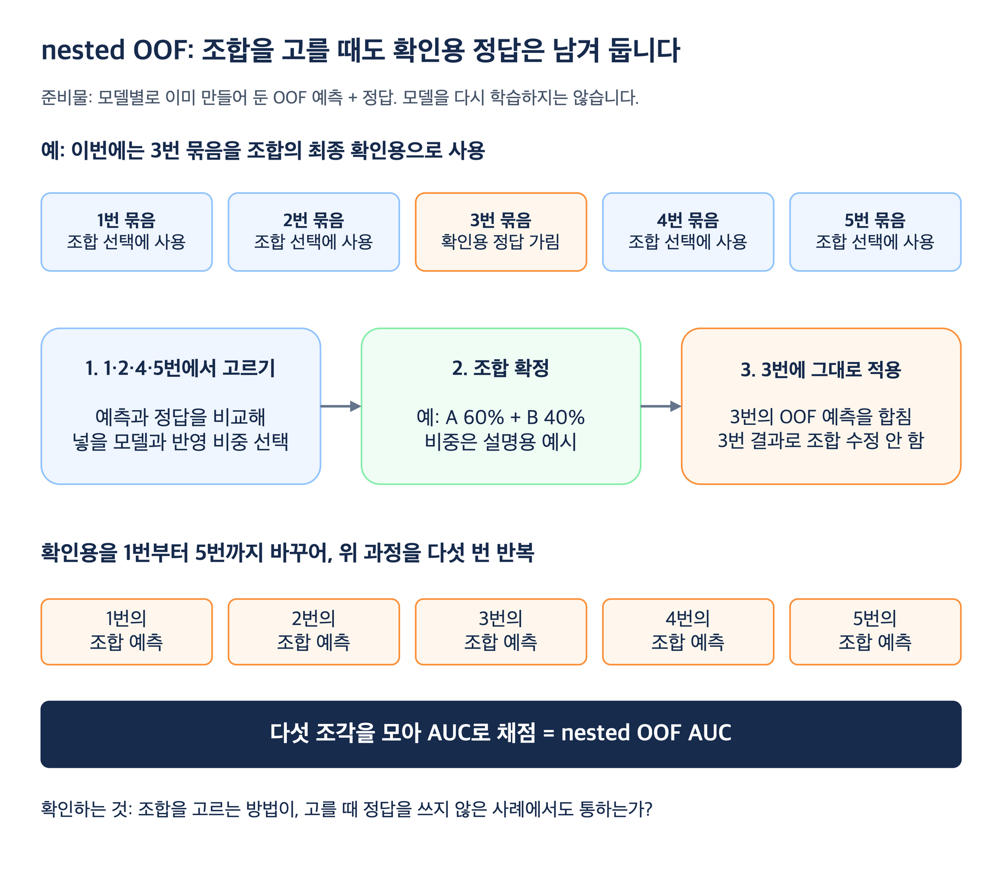
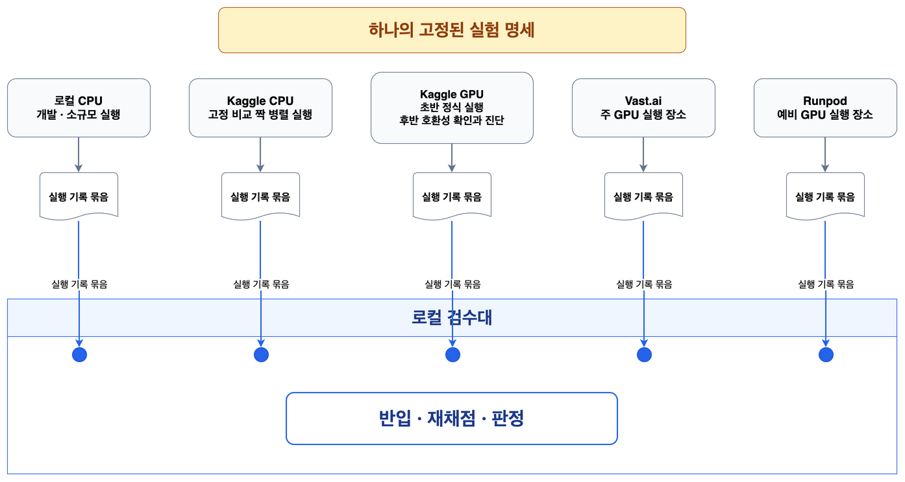
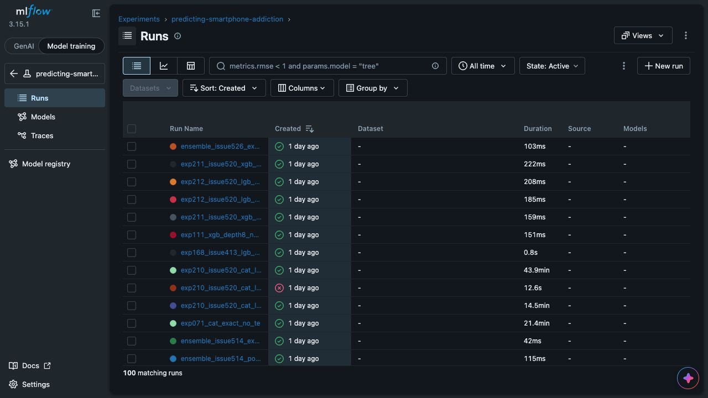
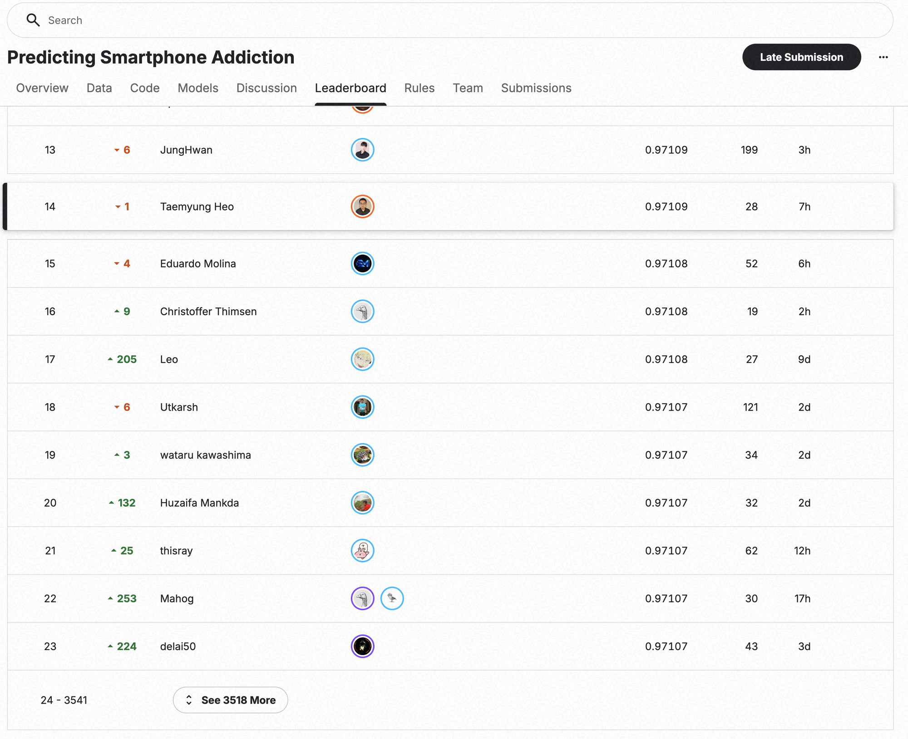

# Kaggle S6E8 Predicting Smartphone Addiction 대회 후기

12개 생활 습관 피처로 스마트폰 중독 여부를 예측하는 대회였습니다.
첫 베이스라인에서 최종 14위까지 무엇을 시도했고 어디서 실패했는지 시간순으로 적었습니다.
실험을 판단하는 기준이 중간에 어떻게 바뀌었는지도 같이 남깁니다.

## 어떤 문제를 푼 대회였을까요?

Kaggle Playground Series S6E8은 생활 습관 정보를 보고 스마트폰 중독 여부를 뜻하는 `addicted_label`의 확률을 예측하는 이진 분류 대회였습니다.
학습 데이터에는 정답이 있고 테스트 데이터에는 정답이 없어서, 참가자는 테스트 데이터의 예측 확률을 제출합니다.

모델이 내놓는 값은 사람마다 0에서 1 사이의 위험 점수입니다.
실제 개인을 진단하는 도구는 아니고, 합성 데이터에서 예측 확률의 정확도를 겨루는 문제입니다.

- 학습 데이터: 691,369행
- 테스트 데이터: 296,302행
- 입력 피처: 수치형 9개, 카테고리형 3개
- 평가 방식: ROC AUC

### 모델에 주어진 12개 피처

식별자와 목표값을 빼면 아래 12개 피처만 주어졌습니다.

| 종류 | 의미 | 피처 이름 |
| --- | --- | --- |
| 수치형 | 나이 | `age` |
| 수치형 | 하루 화면 사용 시간 | `daily_screen_time_hours` |
| 수치형 | 소셜 미디어 사용 시간 | `social_media_hours` |
| 수치형 | 게임 시간 | `gaming_hours` |
| 수치형 | 업무·학습 시간 | `work_study_hours` |
| 수치형 | 수면 시간 | `sleep_hours` |
| 수치형 | 하루 알림 수 | `notifications_per_day` |
| 수치형 | 하루 앱을 연 횟수 | `app_opens_per_day` |
| 수치형 | 주말 화면 사용 시간 | `weekend_screen_time` |
| 카테고리형 | 성별 | `gender` |
| 카테고리형 | 스트레스 수준 | `stress_level` |
| 카테고리형 | 학업·업무 영향 여부 | `academic_work_impact` |

학습 데이터를 처음 열었을 때는 목표값 비율, 결측값, 수치형 피처와 목표값의 단순 상관관계부터 확인했습니다.
목표값 1이 70.9%로 많았고, 12개 피처 모두에 결측값이 있었습니다.
화면 사용 시간과 소셜 미디어 사용 시간이 목표값과 가장 높은 상관을 보였습니다.
첫 관찰일 뿐이라 최종 피처 중요도와는 별개였습니다.

### ROC AUC는 순서 전체를 채점합니다

제출하는 값은 확률이지만, 평가는 그 확률로 사람들을 줄 세웠을 때 순서가 얼마나 좋은지를 봅니다.
그래서 확률 자체가 얼마나 정확한지보다 중독인 사람을 비중독인 사람보다 위에 놓았는지가 점수를 정합니다.

ROC AUC는 중독인 사람 한 명과 비중독인 사람 한 명을 짝지었을 때, 중독인 사람에게 더 높은 위험 점수를 준 쌍의 비율입니다.
무작위로 줄을 세우면 0.5, 완벽하게 줄을 세우면 1.0이 됩니다.

네 사람만 놓고 보겠습니다.
가와 다는 중독, 나와 라는 비중독입니다.
예측 A는 위험 점수가 높은 순서로 가, 나, 다, 라를 놓았고 예측 B는 가, 다, 나, 라를 놓았습니다.

중독 두 명과 비중독 두 명으로 만들 수 있는 쌍은 네 개입니다.
A는 그중 세 쌍에서, B는 네 쌍 모두에서 중독인 사람을 더 위에 놓았습니다.
그래서 B가 더 좋은 위험 순서입니다.
실제 대회 점수도 같은 원리로, 학습 데이터 전체에서 만들 수 있는 모든 쌍을 세어 계산합니다.

## 합성 데이터라서 행동의 의미만으로는 부족했습니다

Kaggle Playground Series는 표 형식 데이터를 주제로 매달 열리는 대회입니다.
이번 대회의 약 98만 행은 실제 개인을 관찰한 기록이 아닙니다.
공개된 Smartphone Addiction Prediction Dataset을 바탕으로 새로 만들어 낸 합성 데이터였습니다.

화면 사용 시간이나 수면 시간이 현실에서 무엇을 뜻하는지는 당연히 봐야 했습니다.
동시에 원본 데이터의 특성이 합성 과정에서 어떤 통계적 흔적으로 남았는지도 봐야 했습니다.

### 합성 데이터를 읽는 두 가지 관점

| 관점 | 확인할 내용 |
| --- | --- |
| 행동 정보 | 화면 사용, 소셜 미디어, 게임, 수면, 스트레스가 중독 여부와 어떤 관계를 보이는지 확인합니다. |
| 합성 과정 | 특정 수치가 반복해서 나타나는 패턴, 원본 데이터와 달라진 분포, 결측값 구조와 피처 사이의 계산 관계를 확인합니다. |

이번 데이터에서는 수치형 피처가 연속적으로 퍼지지 않고 정해진 값에 반복해서 모였고, 같은 수치에서는 목표값 비율도 안정적으로 반복됐습니다.
하루 화면 사용 시간에서 소셜 미디어, 게임, 업무·학습 시간을 뺀 차이도 새로운 신호가 됐습니다.
저는 이런 패턴을 사람 행동의 법칙으로 읽지 않았습니다.
원본 데이터가 합성 데이터로 바뀌면서 남은 흔적에 가깝다고 봤습니다.

## 결과부터 적으면 최종 14위입니다

- 최종 순위: 14위
- Private 점수: `0.97109`
- 최종 앙상블: 자체 모델 예측 36개 + 공개 모델 예측 278개

파란 선은 단일 모델의 OOF AUC, 초록 선은 앙상블의 nested OOF AUC가 시간순으로 어떻게 올라갔는지 보여 줍니다.
두 점수는 학습 데이터로 계산한 내부 검증 점수이고, Public과 Private은 테스트 데이터로 매긴 공식 점수라서 따로 두었습니다.
선 아래 상자는 최고점을 바꾸지는 못했지만 이후 판단에 영향을 준 사건입니다.

## 출발점은 OOF AUC 0.96270이었습니다

첫 모델은 12개 원본 피처를 그대로 쓴 LightGBM 베이스라인이었습니다.
OOF AUC `0.96270`을 출발점으로 정한 뒤, 같은 검증 방식에서 그때까지 가장 좋은 결과와 비교하며 피처와 모델을 하나씩 바꿔 갔습니다.

### 베이스라인에서 최종 앙상블까지 탐색 범위를 넓혔습니다

모델과 함께 피처 엔지니어링과 앙상블 방법도 바꿨습니다.
같은 피처를 수치형으로 줄지 카테고리형으로 줄지부터 여러 예측을 어떻게 합칠지까지 차례로 실험했습니다.

1. LightGBM 베이스라인 - 원본 피처 12개로 OOF AUC `0.96270`
2. 피처 엔지니어링 - 수치형과 카테고리형 변환, 잔차, 결측값 보완
3. 트리 모델 확장 - LightGBM에 이어 XGBoost와 CatBoost
4. NN 모델 확장 - Lookup-Transformer, TabM, RealMLP, TabCNN, Scalar Token Transformer, Contextual Spline Transformer, TabPFN-3
5. 앙상블 - 서로 다르게 틀리는 예측을 골라 함께 사용

앞 단계를 버리고 다음 단계로 갈아탄 것은 아닙니다.
이전 예측을 그대로 남겨 둔 채 새 피처와 모델을 붙여 봤고, 단독 점수가 높거나 기존 예측의 약점을 보완한 결과를 최종 앙상블 후보로 모았습니다.

## 같은 다섯 fold에서 비교한 실험

비교 조건부터 같아야 했습니다.
결과를 보기 전에 학습 데이터를 목표값 비율이 같은 다섯 묶음으로 나누고, 그 분할을 파일로 고정했습니다.
이 묶음 하나를 fold라고 부릅니다.
이후 모든 실험은 이 다섯 fold를 읽기만 했습니다.
결과가 마음에 들지 않는다고 다시 나눈 적은 없습니다.

점수를 낼 때는 fold 하나를 검증용으로 비우고 나머지 네 fold로 학습한 뒤, 비운 fold의 예측을 만들었습니다.
이 과정을 다섯 번 반복하면 학습 데이터의 모든 행에 자기 정답을 보지 않은 모델이 매긴 예측이 하나씩 생깁니다.
이 예측을 OOF라고 부르고, OOF를 ROC AUC로 채점한 값이 OOF AUC입니다.
이 글에 나오는 실험 점수는 특별한 언급이 없으면 모두 이 OOF AUC입니다.

## fold 하나를 봉인한 앙상블 평가

가장 단순한 앙상블은 모델 N개의 예측을 똑같은 비중으로 평균 내는 것입니다.
ROC AUC는 순서만 보기 때문에 확률 대신 각 모델의 순위를 평균 내는 방식을 썼고, 여기까지는 아무것도 고르지 않으니 평균한 예측의 OOF AUC를 그대로 믿어도 됩니다.

문제는 어떤 모델을 넣고 뺄지, 모델마다 비중을 얼마로 줄지 고르기 시작할 때입니다.
모델 하나의 OOF AUC를 믿을 수 있는 이유는 그 모델이 점수를 매길 행의 정답을 학습 때 보지 않았기 때문입니다.
그런데 앙상블을 고를 때는 수많은 조합을 OOF 점수로 비교해서 가장 높은 것을 뽑습니다.
이렇게 뽑은 조합의 OOF AUC는 이미 그 행들의 정답에 맞춰 고른 값이라 실제 실력보다 높게 나옵니다.
채점을 끝낸 뒤에 점수가 가장 잘 나온 답안을 고르고, 그 점수를 실력이라고 말하는 것과 같습니다.
이렇게 부풀려진 점수는 처음 보는 테스트 데이터에서는 재현되지 않습니다.
그래서 조합을 고르는 데 쓰는 데이터와 점수를 확인하는 데이터를 나눠야 합니다.

앙상블을 평가할 때는 fold 하나를 봉인해 두고, 나머지 네 fold에서만 어떤 예측을 넣고 어떻게 합칠지 정했습니다.
그다음 봉인한 fold에서 한 번만 점수를 확인했습니다.
봉인할 fold를 바꿔 가며 다섯 번 반복해 얻은 점수가 nested OOF AUC입니다.

fold 3을 봉인한 경우로 순서를 적으면 이렇습니다.

1. 각 모델의 OOF 예측은 이미 고정한 5-fold로 한 번 만들어져 있어서, 모든 학습 행에 예측값이 하나씩 있습니다.
2. fold 1, 2, 4, 5에 속한 행의 OOF 예측값과 정답만 꺼냅니다.
3. 그 행들 위에서 점수가 가장 좋아지는 모델 조합과 가중치를 정합니다. fold 3의 정답은 여기서 보지 않습니다.
4. 이미 정해진 조합과 가중치를 fold 3 행의 OOF 예측에 그대로 적용해 fold 3의 앙상블 예측을 얻습니다. fold 3 점수를 보고 조합을 바꾸지는 않습니다.
5. 봉인할 fold를 1부터 5까지 바꿔 가며 반복하고, 다섯 조각을 이어 붙여 ROC AUC로 채점합니다.

이때 모델을 다시 학습하지는 않습니다.
안쪽에서 fold를 다시 나누는 것도 아니고, 이미 만들어 둔 OOF 예측 가운데 네 fold의 행만 써서 앙상블의 구성과 가중치를 정할 뿐입니다.
그래서 완전한 이중 교차검증은 아니고, 앙상블을 고르는 단계에서 정답을 미리 보는 낙관만 걷어 내는 방식입니다.

이때부터 실험마다 두 가지를 따로 물었습니다.
혼자 잘하는지는 단일 모델의 OOF AUC로 봤습니다.
함께할 때 돕는지는 기존 앙상블에 더해 보고 nested OOF AUC가 얼마나 움직이는지로 봤습니다.

혼자 잘하는 모델이 앙상블에도 꼭 도움이 되는 것은 아닙니다.
앙상블이 결국 평균이기 때문입니다.
두 모델이 서로 다른 행에서 틀리면 평균을 냈을 때 한쪽의 실수를 다른 쪽이 메워 줍니다.
반대로 같은 행에서 똑같이 틀리면 평균을 내도 그 실수는 그대로 남습니다.
그래서 단독 점수가 최고가 아니어도 기존 모델들과 다른 행에서 틀리는 모델은 앙상블 점수를 올려 후보로 남았습니다.
단독 점수가 높아도 이미 있는 모델과 거의 같은 행에서 틀리는 모델은 더해도 점수가 움직이지 않아 넣지 않았습니다.

## 점수가 올랐다고 바로 채택하지 않은 이유

대회 후반에 결측값 증강을 적용한 실험이 좋은 예입니다.
학습 데이터의 관측값 일부를 추가로 가린 복제본을 함께 보여 줘서, 값이 비어 있어도 모델이 견디게 하는 방법이었습니다.
앙상블 후보 가운데 다섯 자리를 결측값 증강판으로 바꿨을 때 nested OOF AUC 차이는 `+0.0000469`였습니다.

이 숫자 하나로는 채택할 수 없다고 봤습니다.
차이가 크든 작든, 전체 점수 한 번은 우연히 오른 결과와 구분되지 않기 때문입니다.

| 확인한 근거 | 결과 |
| --- | --- |
| 전체 nested OOF AUC 차이 | `+0.0000469` |
| 봉인한 fold 다섯 곳의 방향 | 다섯 곳 모두 양수 |
| 결과를 보기 전에 정한 채택 기준 | 두 기준 모두 통과 |
| 결론 | 채택 |

여기서 양수는 fold 하나를 봉인해 얻은 앙상블 예측의 점수가 바꾸기 전 앙상블보다 높았다는 뜻입니다.
전체 차이가 이렇게 작은 경계 구간에서는 다섯 곳 가운데 세 곳 이상에서 같은 방향이어야 한다는 조건이 미리 붙어 있었고, 실제로는 다섯 곳 모두 같은 방향이었습니다.
같은 기준은 이후 실험에도 그대로 적용했습니다.
점수가 오른 실험만 늘어놓으면 계속 성공한 것처럼 읽히지만, 실제로는 기준에 못 미친 결과를 보면서 같은 방향의 시도를 멈추거나 다음 실험을 정했습니다.

## 어디서 실험하든 판정은 로컬에서 한 번 더 했습니다

실험이 늘면서 실험 장소도 늘었습니다.
로컬 CPU, Kaggle CPU와 GPU, Vast.ai, Runpod을 상황에 따라 썼는데, 장소가 달라도 실험은 같은 실험이어야 했습니다.

실험 설정은 하나로 고정해 어느 장소로든 보냈고, 결과는 설정과 예측, 점수, 진단을 한데 묶은 실험 기록으로 돌려받았습니다.
로컬에서는 이 기록의 해시를 대조하고 OOF를 다시 채점한 결과만 판정에 썼습니다.
원격에서 보고한 점수를 그대로 믿지는 않았습니다.
결과를 받아 온 뒤에는 원격 자원을 지우고 과금이 멈췄는지까지 한 번에 확인했습니다.
레시피는 하나로 두고 주방만 여럿 쓰되, 검수는 한 곳에서 한 셈입니다.

## Claude Code와 Codex가 조사와 실험의 폭을 넓혔습니다

예전에 코딩 에이전트 없이 Kaggle에 참가했을 때는 자료 찾기부터 모델 구현, 실험, 결과 정리까지 대부분 직접 반복했습니다.
이번에는 이 반복 작업을 AI 코딩 에이전트인 Claude Code와 Codex에 맡겼습니다.
조사 범위가 넓어졌고 실험 수도 크게 늘었는데, 들인 시간과 노력은 오히려 줄었습니다.

| 조사한 영역 | 실제로 한 일 |
| --- | --- |
| 이전 대회 상위 솔루션 | 비슷한 11개 대회를 추리고 상위권 후기 12건에서 반복되는 전략을 정리했습니다. |
| 글과 기술 블로그 | Playground Series 관련 글과 기술 블로그 14건을 읽고 이번 대회에 적용할 가설을 골랐습니다. |
| 대회 Discussion | 초기 25개 글을 모두 읽고, 대회가 진행되는 동안 새 글과 댓글을 계속 반영했습니다. |
| 공개 Code | 득표가 있던 공개 Code 267개를 목록화하고, 상위 37개는 코드 셀까지 읽어 검증할 후보를 찾았습니다. |

조사 결과는 쌓아 두는 대신 곧바로 실험 후보로 옮겼습니다.
자료를 찾으면 주장과 코드를 확인하고, 실험 후보로 다듬은 다음, 늘 같은 검증 방식에서 판단했습니다.

공개된 방법과 코드는 검증을 통과한 것만 실험에 활용했고, 출처와 판본을 함께 기록했습니다.
조사와 구현, 실험과 기록은 코딩 에이전트가 빠르게 돌렸습니다.
무엇을 검증할지와 무엇을 채택할지는 제가 정했습니다.

반복 작업에 쓰던 시간을 덜어 가설과 검증 결과를 판단하는 데 썼습니다.
실험을 455개까지 이어 가고 14위로 마친 데에도 이 시간이 크게 작용했다고 봅니다.

## 같은 숫자를 두 관점으로 보여 주자 점수가 뛰었습니다

처음 크게 오른 순간은 복잡한 모델을 새로 추가했을 때가 아니었습니다.
하루 화면 사용 시간(`daily_screen_time_hours`)이 7.5시간인 사람을 예로 들면, 이 값 하나를 두 가지로 읽을 수 있습니다.
7.4시간보다 크고 7.6시간보다 작다는 순서와 거리로 볼 수도 있고, 정확히 7.5시간인 사람들끼리 묶는 이름표로 볼 수도 있습니다.

수치형 피처 아홉 개를 그대로 두면서 같은 값끼리 묶는 카테고리형 복제 피처 아홉 개를 함께 보여 주자, 같은 조건의 LightGBM에서 OOF AUC가 `0.96276`에서 `0.96605`로 올랐습니다.
차이는 `+0.00329`였습니다.

숫자를 모두 카테고리형으로만 바꾼 실험도 했는데, 이쪽은 `0.95859`로 떨어졌고 차이는 `-0.00417`이었습니다.
문제는 카테고리형 변환 자체가 아니었습니다.
순서와 거리 정보를 통째로 버린 쪽이 손해였습니다.
둘 중 하나를 고르지 않고 두 관점을 나란히 남겼습니다.

## 트리 모델을 넓히고 신경망을 더했습니다

피처 엔지니어링이 자리를 잡은 뒤에는 모델의 폭을 넓혔습니다.
LightGBM에 이어 XGBoost와 CatBoost를 같은 다섯 fold에서 비교했고, 단독 점수가 비슷해도 서로 다르게 틀리는 예측이면 앙상블 후보로 남겼습니다.

신경망은 Lookup-Transformer, TabM, RealMLP, TabCNN, Scalar Token Transformer, Contextual Spline Transformer, TabPFN-3까지 시도했고, 이 일곱 계열이 모두 최종 앙상블 후보에 들어갔습니다.
이 가운데 Lookup-Transformer는 같은 값끼리 묶어 조회하는 표와 연속 수치의 부드러운 추세를 함께 쓰는 구조여서, 트리 모델과는 틀리는 사람이 달랐습니다.
트리 모델이 잘못 예측한 사람 가운데 일부를 Lookup-Transformer는 맞혔고, 그 반대도 있어서 둘을 평균 내면 서로의 실수를 메울 수 있었습니다.
처음 만든 판의 OOF AUC는 `0.96892`로 당시 최고보다 `+0.00038` 높았고, 기존 앙상블에 더했을 때도 `+0.00025`만큼 도움이 됐습니다.
가장 비슷한 기존 예측과의 순위 상관도 `0.98149`로 중복 기준 `0.998`보다 낮아서 후보로 남겼습니다.

일찍 멈춘 탐색도 그만큼 많았습니다.
Lookup-Transformer의 학습률과 학습 일정, 최적화 알고리즘을 바꾼 모델 설정 17개는 fold 0 기준을 모두 넘지 못해서 전체 5-fold 실험을 열지 않았습니다.
새로 시도한 신경망 네 종류도 같은 기준에서 일찍 멈췄습니다.

## 점수가 가장 크게 오른 것은 구현 오류를 고쳤을 때였습니다

RealMLP를 처음 옮겼을 때 기대보다 낮은 점수가 나왔습니다.
모델의 한계라고 단정하기 전에 데이터가 실제로 어떻게 넘어가는지부터 봤습니다.
카테고리형 값을 내부 번호로 바꾸기 전에 자료형이 먼저 바뀌고 있었습니다.
그 탓에 학습 때 없던 값으로 처리되는 칸이 대량으로 생겼습니다.

| | 수정 전 | 자료형 변환 순서 수정 후 |
| --- | ---: | ---: |
| 검증 데이터에서 학습 때 없던 값으로 처리된 피처 칸 | 800,896건 | 23건 |
| 3시드 평균 OOF AUC | `0.96371` | `0.96832` |
| AUC 차이 | | `+0.00461` |

이 숫자는 사람 수나 서로 다른 값의 개수가 아닙니다.
검증 데이터 한 묶음에서 12개 카테고리형 피처를 변환하면서, 학습 때 없던 값으로 처리된 데이터 칸을 모두 센 결과입니다.

이 `+0.00461`은 대회 전체에서 단일 모델이 가장 크게 오른 사건이었습니다.
이때부터는 새 구성을 찾는 쪽과 이미 만든 구성이 제대로 도는지 확인하는 쪽에 같은 시간을 들였습니다.

## 실험 장소의 변화와 비용

GPU가 필요한 신경망 실험이 늘면서 실험 장소의 역할도 바뀌었습니다.
Kaggle GPU는 초반에 정식 실험을 맡았지만, 후반에는 사람이 지켜보는 호환성 확인과 진단으로 역할을 좁혔습니다.

같은 실험을 Runpod과 Vast.ai에서 실제로 돌려 보니 Runpod은 `$0.24`, Vast.ai는 `$0.12`가 들었습니다.
처음에는 준비 속도와 메모리 여유를 보고 Runpod을 우선했다가, 재고와 운영 경험이 쌓이면서 Vast.ai를 주 실험 장소로 바꿨습니다.
Vast.ai에서 서로 다른 두 호스트의 접속 준비가 잇달아 실패했을 때는 미리 정한 규칙대로 비교 짝 전체를 Runpod으로 옮겨 마쳤습니다.
두 장소의 결과를 반쪽씩 이어 붙이는 일은 없었습니다.

마지막 제출을 위해 바뀐 신경망 하나를 전체 데이터로 다시 학습한 비용은 약 `$0.39`였습니다.
Lookup-Transformer 한 판을 시드 세 개로 GPU 세 장에 나눠 학습한 값이고, 대회 전체 비용은 아닙니다.
결과를 회수하고 로컬에서 다시 검증한 뒤에는 계산 자원과 저장 공간을 모두 삭제했습니다.

## 실험 455개를 MLflow에 모았습니다

실험이 늘어나자 무엇을 바꿨는지 기억만으로는 따라갈 수 없었습니다.
실험 조건과 결과를 MLflow 한곳에 모았습니다.

MLflow에는 이번 대회에서 진행한 455개 실험 기록이 남아 있습니다.
이 화면은 나중에 실험을 다시 찾을 때 씁니다.

다만 판단은 MLflow 화면의 순위와 별개로 내렸습니다.
같은 데이터와 같은 분할에서 비교할 수 있는 결과만 판단에 사용했고, 채택과 중단의 이유는 별도 기록으로 남겼습니다.

## 마지막에는 한 점보다 서로 다른 오답을 모았습니다

단일 구성의 최고점이 `0.96941`에 이른 뒤에는 혼자 높은 점수를 내는지만 보지 않았습니다.
기존 예측과 다르게 틀리는지도 함께 확인했습니다.
단독 점수가 같은 두 예측이라도 서로 다른 행에서 틀리면 합칠 이유가 생깁니다.

앙상블의 nested OOF AUC는 다음 순서로 올라갔습니다.

| 단계 | nested OOF AUC |
| --- | ---: |
| 자체 모델 예측 35개 | `0.96981` |
| 검증한 공개 모델 예측 포함 | `0.97029` |
| 도움이 되지 않은 공개 모델 예측 120개 제외 | `0.97035` |
| 규제 강도 선택 | `0.97036` |
| 자체 모델 예측 36개 + 공개 모델 예측 278개, 최종 314개 | `0.97038` |

공개 모델 예측은 검증을 통과한 것만 남겼습니다.
그중 120개는 앙상블에 넣었을 때 오히려 `-0.000057`만큼 점수를 깎아서 다시 뺐습니다.
마지막에는 자체 모델 예측 36개와 공개 모델 예측 278개를 합쳐 `0.97038`을 만들었습니다.

여기서 314개는 서로 다른 모델의 수가 아니라 예측 결과의 수입니다.
같은 모델 계열에서 설정을 바꿔 얻은 결과와 공개 모델 예측도 각각 하나로 셌습니다.
전체 데이터로 다시 학습한 것은 자체 모델 36개뿐입니다.

마감 직전에는 327개까지 넓힌 구성도 만들었습니다.
전체 점수는 `+0.0000047` 높았지만 미리 정한 기준인 `+0.00002`에 못 미쳤고, 봉인한 fold 다섯 곳 중 세 곳에서만 같은 방향이었습니다.
이 단계의 기준은 전체 차이와 함께 다섯 곳 모두 양수일 것을 요구했기 때문에 채택하지 않았습니다.
최종 선택은 314개 구성으로 남겼습니다.

## 공식 결과는 Public 0.97135, Private 0.97109, 최종 14위였습니다

### Public과 Private 점수는 이렇게 계산됩니다

- Public 점수 `0.97135`는 대회가 진행되는 동안 테스트 데이터의 20%로 계산해 공개합니다.
- Private 점수 `0.97109`는 대회가 끝난 뒤 나머지 80%로 계산하며, 이 점수로 최종 순위가 정해집니다.

공개된 20%에만 맞춘 모델을 걸러 내려는 방식입니다.
처음 보는 데이터에서도 점수가 유지되는지 봐야 하니 채점을 두 번으로 나눕니다.
대회 중에는 Public `0.97135`가 공개됐고, 종료 후 Private `0.97109`를 기준으로 최종 14위가 정해졌습니다.

내부 검증에서 기준을 넘지 못했던 327개 구성도 마지막에 올려 봤는데, Private 점수는 `0.97108`로 314개 구성보다 조금 낮았습니다.
차이는 아주 작았지만, 결과를 보기 전에 정한 기준과 방향이 어긋나지는 않았습니다.

## 우승권과 남은 차이

1위 후기가 공개된 뒤에 무엇이 갈렸는지 짚어 봤습니다.
1위는 단일 RealMLP 하나로 자체 검증에서 약 `0.9707`을 냈고, 449개까지 늘린 앙상블과 여러 에이전트의 병렬 탐색으로 마무리했습니다.
제 최고 단일 모델은 `0.96941`이었는데, 검증 방식이 달라서 두 숫자의 차이를 그대로 계산할 수는 없습니다.
그래도 방향은 분명했습니다.

검증을 고정하고 서로 다른 오답을 모아 앙상블하는 기반은 이번 대회에서 충분히 작동했습니다.
부족했던 것은 그 기반 위에 올릴 더 강한 단일 모델을 더 넓게, 더 일찍 찾는 탐색이었습니다.
1위의 재현 명세가 모두 공개된 것은 아니라서 이 해석을 증명된 결론이라고 말하지는 않겠습니다.
다만 다음 대회에서 무엇을 먼저 바꿀지 정하기에는 충분한 근거였습니다.

## 다음 대회에서 바꿀 것과 지킬 것

다음에는 대회 초반에 작동 원리가 서로 다른 단일 모델을 넓게 탐색하는 데 시간을 더 쓰려고 합니다.
실험 수를 무작정 늘리자는 이야기는 아닙니다.
강한 후보를 일찍 넓게 찾고, 아니다 싶으면 작은 근거로도 빨리 접는 구조를 만들려고 합니다.

세 가지는 그대로 가져갑니다.
결과를 보기 전에 fold와 중단 기준을 고정하는 것, 혼자 잘하는지와 함께할 때 돕는지를 갈라 보는 것, 어디서 돌렸든 로컬에서 다시 채점하는 것입니다.

## 가장 크게 배운 것은 실험을 판단하는 기준이었습니다

이번 대회의 점수는 몇 번의 큰 개선만으로 만들어지지 않았습니다.
작은 변경을 같은 검증 방식으로 비교하고, 점수가 오르지 않은 실험도 왜 실패했는지 기록하면서 다음 실험을 정했습니다.
이 과정을 끝까지 반복한 덕분에 마지막에는 어떤 예측을 앙상블에 포함할지 근거를 가지고 결정할 수 있었습니다.
