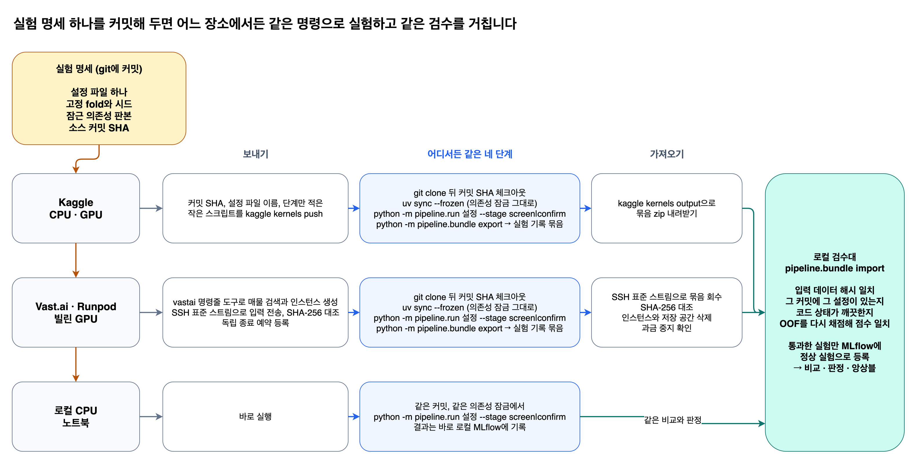
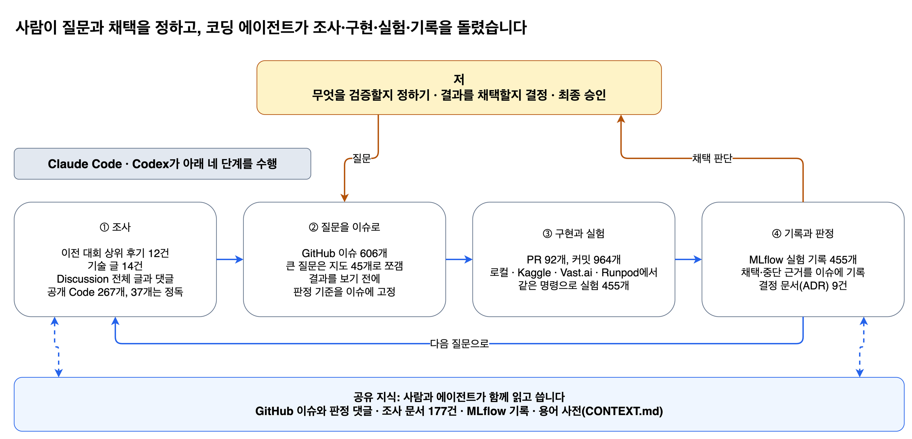

# Kaggle S6E8 Predicting Smartphone Addiction 대회 후기

나이, 화면 사용 시간, 수면 시간 등 12가지 생활 습관 정보로 스마트폰 중독 여부를 예측하는 대회였습니다.
모델이 예측에 사용하는 이런 정보를 피처라고 부릅니다.
첫 베이스라인에서 최종 14위까지 무엇을 시도했고 어디서 실패했는지 시간순으로 적었습니다.
실험을 판단하는 기준이 중간에 어떻게 바뀌었는지도 같이 남깁니다.

## 어떤 문제를 푼 대회였을까요?

Kaggle Playground Series S6E8은 생활 습관 정보를 보고 스마트폰 중독 여부를 뜻하는 `addicted_label`의 확률을 예측하는 이진 분류 대회였습니다.
학습 데이터에는 정답이 있고 테스트 데이터에는 정답이 없어서, 참가자는 테스트 데이터의 예측 확률을 제출합니다.

모델이 내놓는 값은 사람마다 0에서 1 사이의 위험 점수입니다.
실제 개인을 진단하는 도구는 아니고, 합성 데이터에서 중독으로 표시된 사람에게 더 높은 점수를 주는 능력을 겨루는 문제입니다.

- 학습 데이터: 691,369행
- 테스트 데이터: 296,302행
- 입력 피처: 수치형 9개, 카테고리형 3개
- 평가 방식: ROC AUC

### 모델에 주어진 12개 피처

식별자와 목표값을 빼면 아래 12개 피처만 주어졌습니다.

| 종류 | 의미 | 피처 이름 |
| --- | --- | --- |
| 수치형 | 나이 | `age` |
| 수치형 | 하루 화면 사용 시간 | `daily_screen_time_hours` |
| 수치형 | 소셜 미디어 사용 시간 | `social_media_hours` |
| 수치형 | 게임 시간 | `gaming_hours` |
| 수치형 | 업무·학습 시간 | `work_study_hours` |
| 수치형 | 수면 시간 | `sleep_hours` |
| 수치형 | 하루 알림 수 | `notifications_per_day` |
| 수치형 | 하루 앱을 연 횟수 | `app_opens_per_day` |
| 수치형 | 주말 화면 사용 시간 | `weekend_screen_time` |
| 카테고리형 | 성별 | `gender` |
| 카테고리형 | 스트레스 수준 | `stress_level` |
| 카테고리형 | 학업·업무 영향 여부 | `academic_work_impact` |

학습 데이터를 처음 열었을 때는 목표값 비율, 결측값, 수치형 피처와 목표값의 단순 상관관계부터 확인했습니다.
목표값 1이 70.9%로 많았고, 12개 피처 모두에 결측값이 있었습니다.
화면 사용 시간과 소셜 미디어 사용 시간이 목표값과 가장 높은 상관을 보였습니다.
첫 관찰일 뿐이라 최종 피처 중요도와는 별개였습니다.

### AUC는 “둘 중 누구에게 더 높은 점수를 주었나”를 봅니다

모델은 사람마다 0에서 1 사이의 점수를 내놓습니다.
점수가 클수록 중독일 가능성을 높게 본다는 뜻입니다.
이 대회에서는 그 점수로 **중독인 사람을 비중독인 사람보다 앞에 놓는 능력**을 평가했습니다.
그 평가 점수가 ROC AUC이고, 아래에서는 간단히 AUC라고 부르겠습니다.
여기서 ‘중독’과 ‘비중독’은 데이터에 적힌 정답을 뜻합니다.

먼저 두 사람만 비교해 보겠습니다.
가의 정답은 중독이고, 나의 정답은 비중독입니다.
모델이 가에게 0.9, 나에게 0.6을 주었다면 가를 더 위험하다고 보았으니 이 비교는 맞혔습니다.
반대로 가에게 더 낮은 점수를 주었다면 이 비교는 틀렸습니다.

이제 네 사람으로 늘려 보겠습니다.
중독인 가·다와 비중독인 나·라가 있고, 모델이 아래처럼 점수를 주었다고 하겠습니다.

중독인 사람 한 명과 비중독인 사람 한 명을 고르는 방법은 네 가지입니다.
그중 세 번은 중독인 사람에게 더 높은 점수를 주었으므로 **AUC는 3 ÷ 4 = 0.75**입니다.
만약 다의 점수를 0.7로 올려 나보다 앞에 놓았다면, 네 비교를 모두 맞혀 AUC는 1.0이 됩니다.
같은 점수를 준 쌍은 절반을 맞힌 것으로 계산합니다.

- **1.0:** 모든 중독·비중독 쌍의 순서를 맞혔습니다.
- **0.5:** 무작위로 순서를 정할 때 평균적으로 기대하는 수준입니다.
- **0.97:** 중독·비중독 쌍의 순서를 약 97% 맞혔다는 뜻입니다.

여기서 0.97은 ‘사람 100명 중 97명의 중독 여부를 맞혔다’는 뜻이 아닙니다.
각 사람을 중독·비중독으로 판정하는 정확도와, 두 사람 사이의 순서를 비교하는 AUC는 서로 다른 점수입니다.
또 AUC는 순서를 보므로 0.9라는 예측이 실제 90%의 확률에 해당하는지까지 알려 주지는 않습니다.

실제 평가도 같은 원리로 채점 대상 데이터의 중독·비중독 쌍을 비교합니다.
제가 직접 검증할 때는 따로 남겨 둔 학습 데이터의 정답을 쓰고, 캐글의 공식 채점에서는 공개되지 않은 테스트 데이터의 정답을 씁니다.

### 왜 정확도 대신 AUC를 쓰나요?

**어디서부터 중독이라고 판정할지 정하기 전에, 모델이 위험한 사람을 앞에 잘 놓는지 비교하기 위해서입니다.**
정확도를 계산하려면 먼저 ‘점수가 0.5 이상이면 중독’처럼 판정 기준을 정해야 합니다.
그런데 0.5가 항상 적절한 기준은 아닙니다.

이번에는 앞의 그림과 별개로, 다음과 같이 예측한 모델을 생각해 보겠습니다.

| 사람 | 실제 정답 | 모델 점수 |
| --- | --- | --- |
| 가 | 중독 | 0.4 |
| 나 | 중독 | 0.3 |
| 다 | 비중독 | 0.2 |
| 라 | 비중독 | 0.1 |

0.5 이상을 중독으로 판정하면 네 사람 모두 비중독으로 판단하므로, 두 사람만 맞혀 **정확도는 50%입니다.**
하지만 모델은 중독인 두 사람을 비중독인 두 사람보다 앞에 놓았습니다.
판정 기준을 0.25로 바꾸면 네 사람 모두 맞힙니다.
**AUC는 판정 기준과 관계없이 이 순서 구분 능력을 평가하므로 1.0**입니다.

실제로 몇 명에게 조치할지는 상황에 따라 달라집니다.
예를 들어 구매 예측 모델로 마케팅할 때, 이번 달에는 구매 가능성이 높은 상위 100명에게 연락하고 다음 달에는 1,000명에게 연락할 수 있습니다.
모델이 만든 순서는 그대로 활용하면서, 연락할 범위는 예산과 인력에 맞춰 바꾸는 것입니다.
AUC는 특정 판정 기준 하나에 묶이지 않고 모델의 전반적인 순서 구분 능력을 비교할 때 유용합니다.

다만 AUC가 높다고 실제 업무 성과까지 항상 좋은 것은 아닙니다.
상위 100명에게만 연락한다면, 그 100명 중 실제 구매자가 몇 명인지도 따로 확인해야 합니다.
전반적인 순서를 잘 정하는 모델이 상위 100명에서도 반드시 가장 좋은 모델은 아니기 때문입니다.
이번 대회에서는 주최자가 AUC를 평가 기준으로 정했으므로, 저는 중독인 사람을 더 높은 점수 쪽에 얼마나 잘 모으는지를 개선했습니다.

## 합성 데이터라서 행동의 의미만으로는 부족했습니다

Kaggle Playground Series는 표 형식 데이터를 주제로 매달 열리는 대회입니다.
이번 대회의 약 98만 행은 실제 개인을 관찰한 기록이 아닙니다.
공개된 Smartphone Addiction Prediction Dataset을 바탕으로 새로 만들어 낸 합성 데이터였습니다.

화면 사용 시간이나 수면 시간이 현실에서 무엇을 뜻하는지는 당연히 봐야 했습니다.
동시에 원본 데이터의 특성이 합성 과정에서 어떤 통계적 흔적으로 남았는지도 봐야 했습니다.

### 합성 데이터를 읽는 두 가지 관점

| 관점 | 확인할 내용 |
| --- | --- |
| 행동 정보 | 화면 사용, 소셜 미디어, 게임, 수면, 스트레스가 중독 여부와 어떤 관계를 보이는지 확인합니다. |
| 합성 과정 | 특정 수치가 반복해서 나타나는 패턴, 원본 데이터와 달라진 분포, 결측값 구조와 피처 사이의 계산 관계를 확인합니다. |

이번 데이터에서는 수치형 피처가 연속적으로 퍼지지 않고 정해진 값에 반복해서 모였고, 같은 수치에서는 목표값 비율도 안정적으로 반복됐습니다.
하루 화면 사용 시간에서 소셜 미디어, 게임, 업무·학습 시간을 뺀 차이도 새로운 신호가 됐습니다.
저는 이런 패턴을 사람 행동의 법칙으로 읽지 않았습니다.
원본 데이터가 합성 데이터로 바뀌면서 남은 흔적에 가깝다고 봤습니다.

## 결과부터 적으면 최종 14위입니다

- 최종 순위: 3,532팀 중 14위
- Private 점수: `0.97109`
- 최종 앙상블(여러 모델의 예측을 합친 결과): 자체 모델 예측 36개 + 공개 모델 예측 278개

파란 선은 모델 하나의 예측을 검증한 점수인 OOF AUC, 초록 선은 여러 예측을 합치는 방법까지 따로 검증한 점수인 nested OOF AUC입니다.
둘 다 앞에서 본 AUC로 채점하며, 어떤 예측을 평가에 쓰는지가 다릅니다.
구체적인 검증 방법은 아래에서 예로 설명하겠습니다.
두 점수는 학습 데이터로 계산한 내부 검증 점수이고, Public과 Private은 테스트 데이터로 매긴 공식 점수라서 따로 두었습니다.
선 아래 상자는 최고점을 바꾸지는 못했지만 이후 판단에 영향을 준 사건입니다.

## 출발점은 OOF AUC 0.96270이었습니다

첫 모델은 12개 원본 피처를 그대로 쓴 LightGBM 베이스라인이었습니다.
OOF AUC `0.96270`을 출발점으로 정한 뒤, 같은 검증 방식에서 그때까지 가장 좋은 결과와 비교하며 피처와 모델을 하나씩 바꿔 갔습니다.

### 베이스라인에서 최종 앙상블까지 탐색 범위를 넓혔습니다

모델과 함께 피처 엔지니어링과 앙상블 방법도 바꿨습니다.
같은 피처를 수치형으로 줄지 카테고리형으로 줄지부터 여러 예측을 어떻게 합칠지까지 차례로 실험했습니다.

1. LightGBM 베이스라인 - 원본 피처 12개로 OOF AUC `0.96270`
2. 피처 엔지니어링 - 수치형과 카테고리형 변환, 잔차, 결측값 보완
3. 트리 모델 확장 - LightGBM에 이어 XGBoost와 CatBoost
4. NN 모델 확장 - Lookup-Transformer, TabM, RealMLP, TabCNN, Scalar Token Transformer, Contextual Spline Transformer, TabPFN-3
5. 앙상블 - 서로 다르게 틀리는 예측을 골라 함께 사용

앞 단계를 버리고 다음 단계로 갈아탄 것은 아닙니다.
이전 예측을 그대로 남겨 둔 채 새 피처와 모델을 붙여 봤고, 단독 점수가 높거나 기존 예측의 약점을 보완한 결과를 최종 앙상블 후보로 모았습니다.

## CV와 OOF: 공부한 문제로 시험을 보지 않게 했습니다

모델이 공부할 때 본 데이터를 그대로 다시 맞혀 보게 하면 실력을 과대평가할 수 있습니다.
답을 외운 학생에게 같은 시험지를 다시 주는 것과 비슷합니다.
우리가 알고 싶은 것은 **처음 보는 데이터에서도 잘 예측하는가**입니다.
그래서 정답이 있는 학습 데이터 중 일부를 남겨 두고, 나머지로만 모델을 학습한 뒤 남겨 둔 부분을 예측하게 했습니다.
이렇게 실력을 확인하는 과정을 검증이라고 합니다.

한 번만 나누면 우연히 쉬운 사례나 어려운 사례가 검증용에 몰릴 수 있습니다.
이번에는 데이터를 다섯 묶음으로 나누고, 검증을 맡을 묶음을 바꾸어 가며 다섯 번 학습했습니다.
이 방법을 **교차검증**(CV, Cross-Validation)이라고 하고, 묶음 하나를 **fold**라고 부릅니다.
다섯 묶음을 쓰므로 5-fold 교차검증입니다.

### 다섯 묶음이 돌아가며 시험지가 됩니다

설명을 위해 정답이 있는 사례가 100개라고 생각해 보겠습니다.
20개씩 다섯 묶음으로 나눕니다.
첫 번째 모델은 2~5번 묶음의 80개 사례로 공부하고, 학습에서 빼 둔 1번 묶음의 20개를 예측합니다.
두 번째 모델은 새로 학습하되, 이번에는 2번 묶음을 빼고 나머지 80개로 공부합니다.
이렇게 다섯 번 반복합니다.
실제 대회에서는 100개 대신 약 69만 개의 사례를 같은 방식으로 나눴습니다.

다섯 번의 검증용 예측을 원래 사람 순서대로 모으면, 모든 사람에게 예측값이 하나씩 생깁니다.
각 예측은 **그 사람의 정답을 학습할 때 보지 않은 모델**이 만든 값입니다.
이것이 **OOF 예측**(Out-of-Fold prediction)입니다.

CV는 ‘묶음을 바꿔 가며 학습하고 검증하는 방법’이고, OOF는 ‘그 과정에서 각 검증 묶음에 대해 얻은 예측값’입니다.
그 예측값과 실제 정답을 앞에서 설명한 AUC 방식으로 비교한 것이 **OOF AUC**입니다.
다섯 점수의 단순 평균이 아니라, 다섯 조각의 예측을 모두 모아 AUC를 한 번 계산했습니다.
이 글에 나오는 단일 모델의 실험 점수는 특별한 언급이 없으면 이 OOF AUC입니다.

### 모든 실험에 같은 시험지를 썼습니다

모델이 바뀔 때마다 시험지가 달라지면 점수가 오른 이유를 알기 어렵습니다.
모델이 좋아졌을 수도 있고, 시험지가 쉬워졌을 수도 있기 때문입니다.
그래서 결과를 보기 전에 중독·비중독 비율이 비슷하도록 다섯 묶음을 나누고, 분할을 파일로 고정했습니다.
이후 모든 실험에 같은 묶음을 사용했고, 결과가 마음에 들지 않는다고 다시 나누지 않았습니다.

## 앙상블: 여러 모델의 예측을 함께 사용했습니다

같은 문제를 여러 사람에게 물어보듯, 서로 다른 모델의 예측을 모아 하나의 예측으로 만드는 방법을 **앙상블**이라고 합니다.
어떤 모델은 화면 사용 시간에서, 다른 모델은 수면이나 스트레스 정보에서 유용한 관계를 더 잘 찾을 수 있습니다.
틀리는 사례가 서로 다르면 예측을 합쳤을 때 실수를 줄이는 데 도움이 될 수 있습니다.
같은 사례에서 똑같이 틀리는 모델을 더하면 효과가 작을 수 있습니다.

가장 단순한 방법은 예측을 평균 내는 것입니다.
이번에는 AUC가 순서를 평가한다는 점을 이용해, 각 모델이 사람들을 위험한 순서로 줄 세운 뒤 그 순위를 평균 내는 방식을 사용했습니다.
예를 들어 어떤 사람을 모델 A는 10명 중 2번째, 모델 B는 4번째로 위험하다고 보았다면 평균 순위는 3입니다.
모든 사람의 평균 순위를 비교해 최종 순서를 정합니다.
모델마다 반영 비중을 다르게 줄 수도 있는데, 그 비중을 가중치라고 부릅니다.

## nested OOF: 조합을 고른 뒤, 남겨 둔 자료로 확인했습니다

모델별 OOF 예측을 만들었다고 해서, 그 예측을 어떻게 합쳐도 평가가 공정해지는 것은 아닙니다.
어떤 모델을 넣을지, 누구의 예측을 더 많이 반영할지 고르는 과정에도 정답이 쓰이기 때문입니다.

예를 들어 A와 B를 반반 섞어 보고, A를 더 많이 넣어 보고, C까지 넣어 본 뒤 점수가 가장 높은 조합을 고를 수 있습니다.
이때 조합을 고르는 데 쓴 자료로 다시 점수를 매기면, 그 자료에 우연히 잘 맞는 조합을 고른 효과까지 실력으로 보게 됩니다.
공개 점수를 반복해서 보며 모델을 바꾸다가 그 점수에 과적합하는 것과 같은 문제입니다.

그래서 **조합을 고를 때 쓰는 자료와, 고른 조합을 확인할 때 쓰는 자료를 나눴습니다.**
이미 만들어 둔 모델별 OOF 예측을 이용하되, 이번에는 다섯 묶음 중 하나를 ‘조합의 최종 확인용’으로 남겨 두었습니다.

### 3번 묶음을 최종 확인용으로 남겨 둔 예

1. **3번 묶음의 정답을 가립니다.** 조합을 고르는 동안에는 이 정답을 쓰지 않습니다.
2. **1·2·4·5번 묶음에서 조합을 고릅니다.** 모델별 OOF 예측과 정답을 비교해 어떤 모델을 얼마나 반영할지 정합니다.
3. **정한 조합을 3번 묶음에 그대로 적용합니다.** 3번 묶음에 이미 만들어 둔 모델별 OOF 예측을 같은 비중으로 합칩니다.
4. **그 예측을 보관합니다.** 3번 묶음의 정답과 비교한 결과를 보고 이번 조합을 다시 고치지 않습니다.
5. **확인용 묶음을 바꾸어 반복합니다.** 이렇게 얻은 다섯 조각을 모아 AUC를 계산합니다.

이 글에서는 이 점수를 **nested OOF AUC**라고 부릅니다.
묶음마다 나머지 자료로 조합을 새로 고르므로, 다섯 번에 선택된 조합은 서로 다를 수 있습니다.
이 점수는 ‘모든 정답을 보고 고른 한 조합의 최고점’보다, **조합을 고르는 방법이 고를 때 쓰지 않은 자료에서도 통하는지**를 확인하는 데 초점이 있습니다.

### OOF에서 한 번, 조합을 고를 때 한 번 더 나눕니다

| 확인하려는 것 | 학습하거나 고를 때 제외하는 것 | 이 글에서 부르는 이름 |
| --- | --- | --- |
| 모델 하나가 새 사례를 잘 예측하는가? | 그 모델을 학습할 때 검증 묶음의 사례와 정답을 제외합니다. | OOF AUC |
| 예측을 합치는 방법이 다른 사례에서도 도움이 되는가? | 조합과 비중을 고를 때 확인용 묶음의 정답을 제외합니다. | nested OOF AUC |

여기서 두 번째 과정은 이미 만든 예측을 합치는 단계입니다.
모델들을 처음부터 다시 학습하거나, 안쪽에서 데이터를 다시 나누어 교차검증하는 것은 아닙니다.
따라서 모델 학습부터 조합 선택까지 전부 분리하는 완전한 이중 교차검증과는 다릅니다.
줄이려는 것은 ‘조합을 고르는 데 사용한 정답으로 그 조합을 다시 평가해서 생기는 점수 부풀림’입니다.
이 점수를 반복해서 보며 실험 방향을 바꾸는 영향까지 없어지는 것은 아니므로, 최종 대회 점수를 보장하는 값으로 해석하지 않았습니다.

이때부터 실험마다 두 가지를 따로 물었습니다.
모델 혼자 잘하는지는 OOF AUC로 보고, 기존 모델들과 함께 쓸 때 도움이 되는지는 앙상블에 더해 nested OOF AUC가 올라가는지로 봤습니다.
단독 점수가 최고가 아니어도 기존 모델의 실수를 보완하면 후보로 남았고, 단독 점수가 높아도 더했을 때 도움이 없으면 넣지 않았습니다.

## 점수가 올랐다고 바로 채택하지 않은 이유

대회 후반에 결측값 증강을 적용한 실험이 좋은 예입니다.
학습 데이터의 관측값 일부를 추가로 가린 복제본을 함께 보여 줘서, 값이 비어 있어도 모델이 견디게 하는 방법이었습니다.
앙상블 후보 가운데 다섯 자리를 결측값 증강판으로 바꿨을 때 nested OOF AUC 차이는 `+0.0000469`였습니다.

이 숫자 하나로는 채택할 수 없다고 봤습니다.
차이가 크든 작든, 전체 점수 한 번은 우연히 오른 결과와 구분되지 않기 때문입니다.

| 확인한 근거 | 결과 |
| --- | --- |
| 전체 nested OOF AUC 차이 | `+0.0000469` |
| 확인용 묶음 다섯 곳에서 점수가 올랐는지 | 다섯 곳 모두 올랐음 |
| 결과를 보기 전에 정한 채택 기준 | 두 기준 모두 통과 |
| 결론 | 채택 |

확인용으로 남겨 둔 묶음에서 새 앙상블의 점수가 이전 앙상블보다 높으면, 그 묶음에서 점수가 오른 것으로 셌습니다.
전체 차이가 이렇게 작은 경계 구간에서는 다섯 곳 가운데 세 곳 이상에서 올라야 한다는 조건이 미리 붙어 있었고, 실제로는 다섯 곳 모두 올랐습니다.
같은 기준은 이후 실험에도 그대로 적용했습니다.
점수가 오른 실험만 늘어놓으면 계속 성공한 것처럼 읽히지만, 실제로는 기준에 못 미친 결과를 보면서 같은 방향의 시도를 멈추거나 다음 실험을 정했습니다.

## 어디서 실험하든 판정은 로컬에서 한 번 더 했습니다

실험이 늘면서 실험 장소도 늘었습니다.
로컬 CPU, Kaggle CPU와 GPU, Vast.ai, Runpod을 상황에 따라 썼는데, 장소가 달라도 실험은 같은 실험이어야 했습니다.
그래서 어느 장소에서든 같은 방식으로 돌아가는 실험 파이프라인부터 만들었습니다.

출발점은 실험 명세입니다.
실험 하나는 설정 파일 하나로 적고, 고정한 fold와 시드, 잠근 의존성 판본과 함께 git에 커밋합니다.
어느 장소든 이 커밋을 그대로 받아 같은 의존성을 설치하고, 같은 명령 하나로 실험을 돌립니다.
Kaggle에는 커밋과 설정 파일 이름만 적은 작은 스크립트를 보내 커널이 저장소를 받아 실행하게 했고, Vast.ai와 Runpod에는 명령줄 도구로 GPU를 빌린 뒤 SSH로 입력을 보내 같은 명령을 돌렸습니다.
장소마다 학습 코드를 따로 만든 적은 없습니다.

결과는 설정과 예측, 점수, 진단을 한데 묶은 실험 기록 묶음으로 돌려받습니다.
로컬에서는 이 묶음을 반입하면서 입력 데이터 해시가 같은지, 그 커밋에 그 설정이 실제로 있는지, 코드가 깨끗한 상태였는지 확인하고, OOF를 다시 채점해 원격에서 보고한 점수와 맞는지 봅니다.
검사를 통과한 실험만 로컬 MLflow에 정상 실험으로 올라가고, 그 뒤의 비교와 판정, 앙상블은 로컬에서 돌린 실험과 똑같이 진행됩니다.
원격에서 보고한 점수를 그대로 믿지는 않았습니다.
결과를 받아 온 뒤에는 원격 자원을 지우고 과금이 멈췄는지까지 한 번에 확인했습니다.
레시피는 하나로 두고 주방만 여럿 쓰되, 검수는 한 곳에서 한 셈입니다.

## Claude Code와 Codex가 조사와 실험의 폭을 넓혔습니다

예전에 코딩 에이전트 없이 Kaggle에 참가했을 때는 자료 찾기부터 모델 구현, 실험, 결과 정리까지 대부분 직접 반복했습니다.
이번에는 이 반복 작업을 AI 코딩 에이전트인 Claude Code와 Codex에 맡겼습니다.
조사 범위가 넓어졌고 실험 수도 크게 늘었는데, 들인 시간과 노력은 오히려 줄었습니다.

협업은 위 그림처럼 돌아갔습니다.
제가 검증할 질문을 정하면 에이전트가 자료를 조사하고, 질문을 GitHub 이슈로 쪼개 판정 기준을 먼저 적고, 코드를 구현해 실험을 돌리고, 결과와 근거를 기록합니다.
저는 그 기록을 보고 채택 여부를 정하고 다음 질문을 냅니다.
대회 기간 동안 GitHub 이슈 606개와 PR 92개, 커밋 964개가 이 순환으로 처리됐습니다.

| 조사한 영역 | 실제로 한 일 |
| --- | --- |
| 이전 대회 상위 솔루션 | 비슷한 11개 대회를 추리고 상위권 후기 12건에서 반복되는 전략을 정리했습니다. |
| 글과 기술 블로그 | Playground Series 관련 글과 기술 블로그 14건을 읽고 이번 대회에 적용할 가설을 골랐습니다. |
| 대회 Discussion | 초기 25개 글을 모두 읽고, 대회가 진행되는 동안 새 글과 댓글을 계속 반영했습니다. |
| 공개 Code | 득표가 있던 공개 Code 267개를 목록화하고, 상위 37개는 코드 셀까지 읽어 검증할 후보를 찾았습니다. |

조사 결과는 쌓아 두는 대신 곧바로 실험 후보로 옮겼습니다.
자료를 찾으면 주장과 코드를 확인하고, 실험 후보로 다듬은 다음, 늘 같은 검증 방식에서 판단했습니다.

공개된 방법과 코드는 검증을 통과한 것만 실험에 활용했고, 출처와 판본을 함께 기록했습니다.
조사와 구현, 실험과 기록은 코딩 에이전트가 빠르게 돌렸습니다.
무엇을 검증할지와 무엇을 채택할지는 제가 정했습니다.

반복 작업에 쓰던 시간을 덜어 가설과 검증 결과를 판단하는 데 썼습니다.
실험을 455개까지 이어 가고 14위로 마친 데에도 이 시간이 크게 작용했다고 봅니다.

## 같은 숫자를 두 관점으로 보여 주자 점수가 뛰었습니다

처음 크게 오른 순간은 복잡한 모델을 새로 추가했을 때가 아니었습니다.
하루 화면 사용 시간(`daily_screen_time_hours`)이 7.5시간인 사람을 예로 들면, 이 값 하나를 두 가지로 읽을 수 있습니다.
7.4시간보다 크고 7.6시간보다 작다는 순서와 거리로 볼 수도 있고, 정확히 7.5시간인 사람들끼리 묶는 이름표로 볼 수도 있습니다.

수치형 피처 아홉 개를 그대로 두면서 같은 값끼리 묶는 카테고리형 복제 피처 아홉 개를 함께 보여 주자, 같은 조건의 LightGBM에서 OOF AUC가 `0.96276`에서 `0.96605`로 올랐습니다.
차이는 `+0.00329`였습니다.

숫자를 모두 카테고리형으로만 바꾼 실험도 했는데, 이쪽은 `0.95859`로 떨어졌고 차이는 `-0.00417`이었습니다.
문제는 카테고리형 변환 자체가 아니었습니다.
순서와 거리 정보를 통째로 버린 쪽이 손해였습니다.
둘 중 하나를 고르지 않고 두 관점을 나란히 남겼습니다.

## 트리 모델을 넓히고 신경망을 더했습니다

피처 엔지니어링이 자리를 잡은 뒤에는 모델의 폭을 넓혔습니다.
LightGBM에 이어 XGBoost와 CatBoost를 같은 다섯 fold에서 비교했고, 단독 점수가 비슷해도 서로 다르게 틀리는 예측이면 앙상블 후보로 남겼습니다.

신경망은 Lookup-Transformer, TabM, RealMLP, TabCNN, Scalar Token Transformer, Contextual Spline Transformer, TabPFN-3까지 시도했고, 이 일곱 계열이 모두 최종 앙상블 후보에 들어갔습니다.
이 가운데 Lookup-Transformer는 같은 값끼리 묶어 조회하는 표와 연속 수치의 부드러운 추세를 함께 쓰는 구조여서, 트리 모델과는 틀리는 사람이 달랐습니다.
트리 모델이 잘못 예측한 사람 가운데 일부를 Lookup-Transformer는 맞혔고, 그 반대도 있어서 둘을 평균 내면 서로의 실수를 메울 수 있었습니다.
처음 만든 판의 OOF AUC는 `0.96892`로 당시 최고보다 `+0.00038` 높았고, 기존 앙상블에 더했을 때도 `+0.00025`만큼 도움이 됐습니다.
가장 비슷한 기존 예측과의 순위 상관도 `0.98149`로 중복 기준 `0.998`보다 낮아서 후보로 남겼습니다.

물론 기준을 넘지 못해 접은 실험도 그만큼 많았습니다.
Lookup-Transformer의 학습률과 학습 일정, 최적화 알고리즘을 바꾼 모델 설정 17개는 fold 0에서 기준을 하나도 넘지 못해, 전체 5-fold 실험으로 올리지 않고 접었습니다.
새로 시도한 신경망 네 종류도 같은 fold 0 기준에서 걸러졌습니다.

## 점수가 가장 크게 오른 것은 구현 오류를 고쳤을 때였습니다

RealMLP를 처음 옮겼을 때 기대보다 낮은 점수가 나왔습니다.
모델의 한계라고 단정하기 전에 데이터가 실제로 어떻게 넘어가는지부터 봤습니다.
원인은 float64와 float32 사이의 자료형 변환 순서였습니다.
RealMLP는 수치형 피처를 같은 값끼리 묶는 카테고리로도 쓰는데, 값마다 내부 번호를 매기는 사전은 float64 원본 값으로 만들었습니다.
그런데 실제로 번호를 매길 때는 사전을 찾기 전에 값을 float32로 먼저 바꿨습니다.
소수점이 있는 값은 float32로 바뀌면서 미세하게 달라져 사전에 없는 값으로 처리됐고, 소수점이 있는 피처 6개의 카테고리 채널은 학습 때부터 사실상 꺼져 있었던 셈입니다.
float32 변환을 사전 찾기 뒤로 옮기는 것만으로 문제가 풀렸습니다.

| | 수정 전 | 자료형 변환 순서 수정 후 |
| --- | ---: | ---: |
| 검증 데이터에서 학습 때 없던 값으로 처리된 피처 칸 | 800,896건 | 23건 |
| 3시드 평균 OOF AUC | `0.96371` | `0.96832` |
| AUC 차이 | | `+0.00461` |

이 숫자는 사람 수나 서로 다른 값의 개수가 아닙니다.
검증 데이터 한 묶음에서 12개 카테고리형 피처를 변환하면서, 학습 때 없던 값으로 처리된 데이터 칸을 모두 센 결과입니다.

이 `+0.00461`은 대회 전체에서 단일 모델이 가장 크게 오른 사건이었습니다.
이때부터는 새 구성을 찾는 쪽과 이미 만든 구성이 제대로 도는지 확인하는 쪽에 같은 시간을 들였습니다.

## 실험 장소의 변화와 비용

GPU가 필요한 신경망 실험이 늘면서 실험 장소의 역할도 바뀌었습니다.
처음에는 무료인 Kaggle GPU에서 Lookup-Transformer와 TabM을 정식으로 실험했습니다.
그런데 Kaggle의 T4는 사양이 낮아 신경망 실험 하나에 예닐곱 시간이 걸리는 경우가 있었고, GPU 할당량이 주당 30시간이라 일주일에 실험을 서너 번밖에 돌릴 수 없었습니다.
한 번에 돌릴 수 있는 시간도 약 9시간으로 제한돼 있었고, 장비와 소프트웨어 판본을 맞추는 데도 손이 갔습니다.
이대로는 신경망 실험을 넓힐 수 없어서, 시간당 요금을 내고 GPU를 빌리는 Vast.ai와 Runpod으로 옮겼습니다.
Kaggle GPU는 후반에 사람이 지켜보는 호환성 확인과 진단으로 역할을 좁혔습니다.

같은 실험을 Runpod과 Vast.ai에서 실제로 돌려 보니 Runpod은 `$0.24`, Vast.ai는 `$0.12`가 들었습니다.
처음에는 준비 속도와 메모리 여유를 보고 Runpod을 우선했다가, 재고와 운영 경험이 쌓이면서 Vast.ai를 주 실험 장소로 바꿨습니다.
Vast.ai에 접속 오류가 잦거나 쓸 만한 장비가 없을 때는 Runpod을 대신 썼습니다.

마지막 제출을 위해 바뀐 신경망 하나를 전체 데이터로 다시 학습한 비용은 약 `$0.39`였습니다.
Lookup-Transformer 한 판을 시드 세 개로 GPU 세 장에 나눠 학습한 값이고, 대회 전체 비용은 아닙니다.
결과를 회수하고 로컬에서 다시 검증한 뒤에는 계산 자원과 저장 공간을 모두 삭제했습니다.

## 실험 455개를 MLflow에 모았습니다

실험이 늘어나자 무엇을 바꿨는지 기억만으로는 따라갈 수 없었습니다.
실험 조건과 결과를 MLflow 한곳에 모았습니다.

MLflow에는 이번 대회에서 진행한 455개 실험 기록이 남아 있습니다.
이 화면은 나중에 실험을 다시 찾을 때 씁니다.

다만 판단은 MLflow 화면의 순위와 별개로 내렸습니다.
같은 데이터와 같은 분할에서 비교할 수 있는 결과만 판단에 사용했고, 채택과 중단의 이유는 별도 기록으로 남겼습니다.

## 마지막에는 한 점보다 서로 다른 오답을 모았습니다

단일 구성의 최고점이 `0.96941`에 이른 뒤에는 혼자 높은 점수를 내는지만 보지 않았습니다.
기존 예측과 다르게 틀리는지도 함께 확인했습니다.
단독 점수가 같은 두 예측이라도 서로 다른 행에서 틀리면 합칠 이유가 생깁니다.

앙상블의 nested OOF AUC는 다음 순서로 올라갔습니다.

| 단계 | nested OOF AUC |
| --- | ---: |
| 자체 모델 예측 35개 | `0.96981` |
| 검증한 공개 모델 예측 포함 | `0.97029` |
| 도움이 되지 않은 공개 모델 예측 120개 제외 | `0.97035` |
| 규제 강도 선택 | `0.97036` |
| 자체 모델 예측 36개 + 공개 모델 예측 278개, 최종 314개 | `0.97038` |

공개 모델 예측은 검증을 통과한 것만 남겼습니다.
그중 120개는 앙상블에 넣었을 때 오히려 `-0.000057`만큼 점수를 깎아서 다시 뺐습니다.

표의 규제 강도 선택은 예측을 고르는 단계가 아니라 합치는 방식을 손본 단계입니다.
마지막 앙상블은 313개 예측의 순위를 입력으로 받는 로지스틱 회귀로 가중치를 정했는데, 이 회귀에는 가중치가 몇몇 예측에 쏠리지 않도록 누르는 규제 강도라는 설정이 있습니다.
전에는 이 값을 하나로 고정해 두었지만, 이 단계부터는 앙상블에 넣을 예측을 고를 때와 같은 방식으로 봉인하지 않은 네 fold에서 규제 강도까지 함께 골랐습니다.

마지막에는 자체 모델 예측 36개와 공개 모델 예측 278개를 합쳐 `0.97038`을 만들었습니다.

여기서 314개는 서로 다른 모델의 수가 아니라 예측 결과의 수입니다.
같은 모델 계열에서 설정을 바꿔 얻은 결과와 공개 모델 예측도 각각 하나로 셌습니다.
전체 데이터로 다시 학습한 것은 자체 모델 36개뿐입니다.

마감 직전에는 327개까지 넓힌 구성도 만들었습니다.
전체 점수는 `+0.0000047` 높았지만 미리 정한 기준인 `+0.00002`에 못 미쳤고, 봉인한 fold 다섯 곳 중 세 곳에서만 점수가 올랐고 두 곳에서는 내려갔습니다.
이 단계의 기준은 전체 차이와 함께 다섯 곳 모두 오를 것을 요구했기 때문에 채택하지 않았습니다.
최종 선택은 314개 구성으로 남겼습니다.

## 공식 결과는 Public 0.97135, Private 0.97109, 최종 14위였습니다

### Public과 Private 점수는 이렇게 계산됩니다

- Public 점수 `0.97135`는 대회가 진행되는 동안 테스트 데이터의 20%로 계산해 공개합니다.
- Private 점수 `0.97109`는 대회가 끝난 뒤 나머지 80%로 계산하며, 이 점수로 최종 순위가 정해집니다.

공개된 20%에만 맞춘 모델을 걸러 내려는 방식입니다.
처음 보는 데이터에서도 점수가 유지되는지 봐야 하니 채점을 두 번으로 나눕니다.
대회 중에는 Public `0.97135`가 공개됐고, 종료 후 Private `0.97109`를 기준으로 최종 14위가 정해졌습니다.

내부 검증에서 기준을 넘지 못했던 327개 구성도 마지막에 올려 봤는데, Private 점수는 `0.97108`로 314개 구성보다 조금 낮았습니다.
차이는 아주 작았지만, 결과를 보기 전에 정한 기준의 판단과 어긋나지는 않았습니다.

## 다음 대회에서 바꿀 것과 지킬 것

다음에는 대회 초반에 작동 원리가 서로 다른 단일 모델을 넓게 탐색하는 데 시간을 더 쓰려고 합니다.
실험 수를 무작정 늘리자는 이야기는 아닙니다.
강한 후보를 일찍 넓게 찾고, 아니다 싶으면 작은 근거로도 빨리 접는 구조를 만들려고 합니다.

세 가지는 그대로 가져갑니다.
결과를 보기 전에 fold와 중단 기준을 고정하는 것, 혼자 잘하는지와 함께할 때 돕는지를 갈라 보는 것, 어디서 돌렸든 로컬에서 다시 채점하는 것입니다.

## 가장 크게 배운 것은 실험을 판단하는 기준이었습니다

이번 대회의 점수는 몇 번의 큰 개선만으로 만들어지지 않았습니다.
작은 변경을 같은 검증 방식으로 비교하고, 점수가 오르지 않은 실험도 왜 실패했는지 기록하면서 다음 실험을 정했습니다.
이 과정을 끝까지 반복한 덕분에 마지막에는 어떤 예측을 앙상블에 포함할지 근거를 가지고 결정할 수 있었습니다.
