이 문서는 `A 발표 우선` 형식으로 작성하는 35개 화면의 Markdown 발표 원본이다.
각 화면은 청중용 제목, 핵심 문장 하나, 시각 자료 하나, 발표자 메모, Confluence 보충 설명과 근거 연결을 같은 정보 위계로 유지한다.

[기술 정의와 근거 찾아보기](https://lgucorp.atlassian.net/wiki/spaces/~7120202a66323266d44ee697a3e30c7a270829/pages/1501596455)

## 화면 01. Private 0.97109, 최종 14위에서 시작합니다

공식 Private 점수 `0.97109`로 최종 14위였고, 오늘은 성적보다 이 결과를 만든 방식을 되짚습니다.

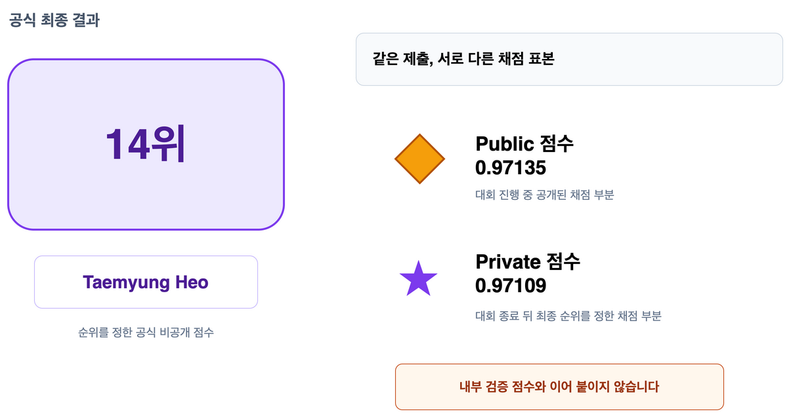

시각 자료 대체 설명: 공식 최종 결과는 14위이며, 같은 제출의 Public 점수 `0.97135`와 최종 순위를 정한 Private 점수 `0.97109`가 서로 다른 표식과 설명으로 나뉘어 있다.

### 발표자 메모

- `0.97109`는 대회 종료 뒤 최종 순위를 정한 Private 점수이고, `0.97135`는 같은 제출의 Public 점수입니다.
- 두 점수를 내부 검증 점수와 이어 붙이지 않고, 다음 화면에서는 같은 12개 변수에서 이 결과를 만든 세 축을 소개합니다.

### Confluence 보충 설명

Public 점수와 Private 점수는 같은 제출을 서로 다른 시험 표본에서 채점한 결과다.
두 값의 차이로 개별 실험의 개선량이나 일반화 효과를 역산하지 않는다.

근거: [발표용 성적과 실험 계보 근거](https://github.com/tmheo/predicting-smartphone-addiction/blob/main/docs/research/presentation-score-evidence.md), [최종 조립 실행 기록](https://github.com/tmheo/predicting-smartphone-addiction/blob/main/docs/research/extended-stack-final-assembly/issue514/report.md)

부록: [A. 공식 결과와 자료 범위](https://lgucorp.atlassian.net/wiki/spaces/~7120202a66323266d44ee697a3e30c7a270829/pages/1501596455)

## 화면 02. 검증 가능한 작은 실험을 조립한 결과였습니다

14위는 비밀 모델 하나가 아니라 작은 실험, 서로 다른 오차와 공통 검수 절차를 조립한 결과였습니다.

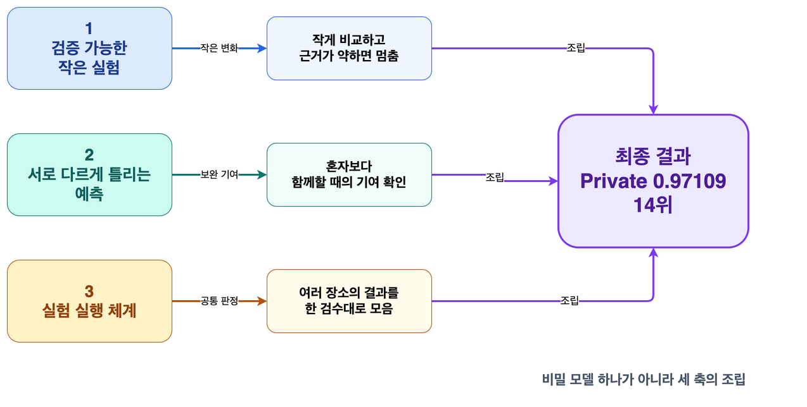

시각 자료 대체 설명: 작은 변화를 비교하고, 함께할 때 보완하는 예측을 남기며, 여러 실행 장소의 결과를 한 검수대로 모은 세 축이 최종 14위 결과로 합쳐진다.

### 발표자 메모

- 실험 실행 체계는 같은 실험 명세를 여러 실행 장소에서 돌리고 결과를 로컬의 같은 검수 절차로 모으는 전체 구조라고 처음 설명합니다.
- 이 세 축을 전후반의 길 안내판으로 사용하고, 하나의 모델이나 한 번의 큰 실험이 결과를 만들었다고 말하지 않습니다.

### Confluence 보충 설명

작은 실험은 화면 07부터 23, 서로 다른 오차는 화면 13부터 31, 공통 검수 절차는 화면 17부터 31에서 실제 사례로 이어진다.
세 축은 최종 결과를 사후에 설명하는 회고 구조이며 하나의 비밀 모델을 가리키지 않는다.

근거: [우리 최종 해법과 제출 계보 복원](https://github.com/tmheo/predicting-smartphone-addiction/blob/main/docs/research/s6e8-our-final-solution.md), [발표용 실행 환경과 전환 사건 근거](https://github.com/tmheo/predicting-smartphone-addiction/blob/main/docs/research/presentation-environment-evidence.md)

부록: [E. 실험 실행 체계, G. 서로 다른 오차와 Lookup-Transformer, H. 최종 314개 예측 열](https://lgucorp.atlassian.net/wiki/spaces/~7120202a66323266d44ee697a3e30c7a270829/pages/1501596455)

## 화면 03. 12개 생활 습관 변수로 중독 위험의 순서를 예측했습니다

식별자와 목표값을 뺀 12개 생활 습관 변수로 사람들의 스마트폰 중독 위험 순서를 예측했습니다.

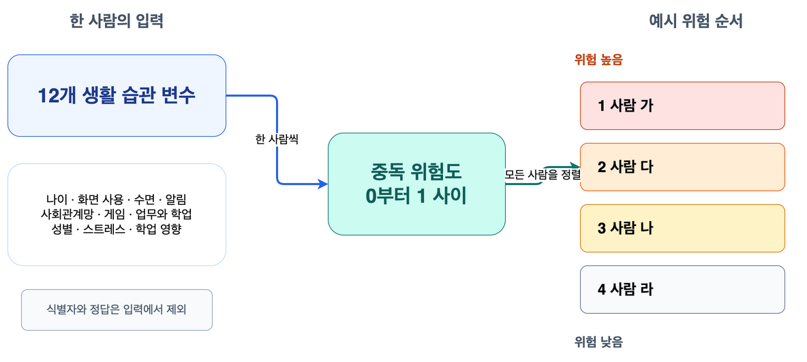

시각 자료 대체 설명: 한 사람의 나이, 화면 사용, 수면과 알림 등 12개 입력이 위험도 하나로 바뀌며, 모든 사람의 위험도를 정렬해 높은 사람부터 낮은 사람까지 순서를 만든다.

### 발표자 메모

- 자료 규모를 묻는 질문이 나오면 학습 자료는 약 69만 건, 예측 자료는 약 30만 건이라고 말합니다.
- 이 값은 대회 목표값의 순서를 위한 예측이며 개인을 진단하거나 실제 임상 위험을 판정한 결과라고 말하지 않습니다.

### Confluence 보충 설명

학습 자료는 `691,369`행, 시험 자료는 `296,302`행이며 이진 목표값은 `addicted_label`이다.
12개 입력 열의 정확한 이름과 자료 범위는 기술 근거 부록 A에서 확인할 수 있다.

근거: [첫 기준 실행 설정](https://github.com/tmheo/predicting-smartphone-addiction/blob/main/configs/exp001_lgbm_baseline.yaml), [첫 기준 실행 종결 기록](https://github.com/tmheo/predicting-smartphone-addiction/issues/18#issuecomment-5239693077)

부록: [A. 공식 결과와 자료 범위](https://lgucorp.atlassian.net/wiki/spaces/~7120202a66323266d44ee697a3e30c7a270829/pages/1501596455)

## 화면 04. ROC AUC는 순서 전체를 봅니다

ROC AUC는 임의로 고른 중독 한 명에게 비중독 한 명보다 높은 위험도를 준 비율입니다.

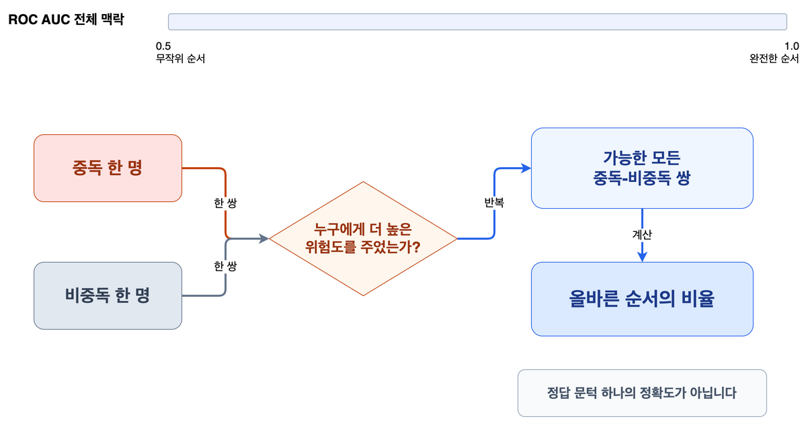

시각 자료 대체 설명: 중독 한 명과 비중독 한 명을 짝지어 누가 더 높은 위험도를 받았는지 모든 가능한 쌍에서 확인하며, 그 가운데 올바른 순서의 비율이 ROC AUC가 된다.

### 발표자 메모

- `0.5`는 무작위 순서, `1.0`은 완전한 순서라는 전체 맥락을 먼저 보여 줍니다.
- ROC AUC는 정답 문턱 하나의 정확도가 아니라 위험 순서 전체를 평가하는 값이라고 설명합니다.

### Confluence 보충 설명

이 설명은 ROC 곡선 아래 넓이와 같은 값을 주는 이진 목표값의 쌍 순서 해석이다.
동점 처리와 실제 점수 계산 위치는 기술 근거 부록 B에서 원본으로 연결한다.

근거: [비전문가 발표의 기술 용어와 표기 원칙](https://github.com/tmheo/predicting-smartphone-addiction/issues/579#issuecomment-5489318781), [발표용 성적과 실험 계보 근거](https://github.com/tmheo/predicting-smartphone-addiction/blob/main/docs/research/presentation-score-evidence.md)

부록: [B. 점수와 검증 경계](https://lgucorp.atlassian.net/wiki/spaces/~7120202a66323266d44ee697a3e30c7a270829/pages/1501596455)

## 화면 05. 청중 참여 1에서 더 좋은 위험 순서를 고릅니다

실제 중독 여부를 본 뒤 A와 B 가운데 더 좋은 위험 순서를 직접 골라 봅니다.

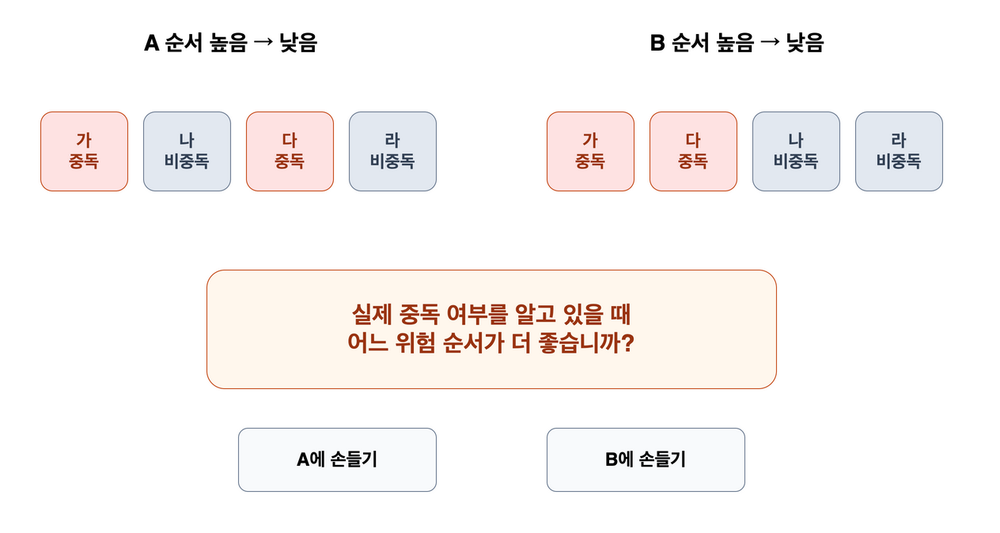

시각 자료 대체 설명: A는 가, 나, 다, 라 순서이고 B는 가, 다, 나, 라 순서이며, 청중에게 어느 위험 순서가 더 좋은지 손들어 선택하게 한다.

### 발표자 메모

- 손들기나 짧은 구두 투표로 선택만 받고 점수 계산은 요구하지 않습니다.
- 답을 먼저 말하지 않고 한두 명에게 선택 이유를 물은 뒤 다음 화면에서 같은 위치를 유지한 채 결과를 공개합니다.

### Confluence 보충 설명

네 사람과 두 순서는 ROC AUC의 작동 원리를 설명하기 위한 교육용 예시이며 실제 대회 행에서 뽑은 표본이 아니다.
중독 두 명과 비중독 두 명이므로 비교할 수 있는 쌍은 모두 네 개다.

근거: [비전문가용 핵심 개념 설명 장면](https://github.com/tmheo/predicting-smartphone-addiction/issues/570#issuecomment-5488821634)

부록: [B. 점수와 검증 경계의 교육용 네 사람 예시](https://lgucorp.atlassian.net/wiki/spaces/~7120202a66323266d44ee697a3e30c7a270829/pages/1501596455)

## 화면 06. B는 네 쌍 모두에서 중독 한 명을 더 위에 놓았습니다

교육용 예시에서 A는 네 쌍 중 세 쌍, B는 네 쌍 모두를 올바른 순서로 놓았습니다.

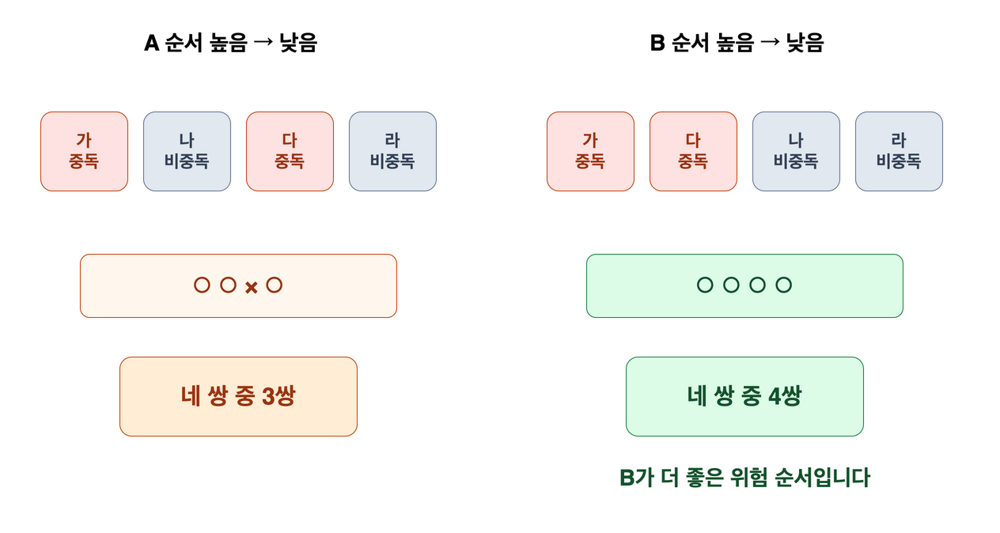

시각 자료 대체 설명: A 순서는 중독-비중독 네 쌍 가운데 세 쌍을 올바르게 놓았고, B 순서는 네 쌍 모두를 올바르게 놓아 B가 더 좋은 위험 순서다.

### 발표자 메모

- 앞 화면의 선택을 회수하고 B가 더 좋은 이유를 네 쌍의 순서로만 설명합니다.
- 교육용 네 사람의 계산을 실제 대회 점수라고 말하지 않고, ROC AUC가 순서 전체를 본다는 뜻만 반복합니다.

### Confluence 보충 설명

동점이 없는 이 교육용 예시에서 A의 쌍 순서 비율은 `3/4`, B는 `4/4`다.
실제 대회 ROC AUC는 학습 자료 전체의 양성 및 음성 행 쌍에 같은 원리를 적용해 계산한다.

근거: [비전문가용 핵심 개념 설명 장면](https://github.com/tmheo/predicting-smartphone-addiction/issues/570#issuecomment-5488821634)

부록: [B. 점수와 검증 경계의 교육용 쌍 계산표](https://lgucorp.atlassian.net/wiki/spaces/~7120202a66323266d44ee697a3e30c7a270829/pages/1501596455)

## 화면 07. 같은 숫자에도 두 관점이 있습니다

같은 수치 열을 연속적인 크기와 정확한 값 범주라는 두 정보 관점으로 함께 볼 수 있습니다.

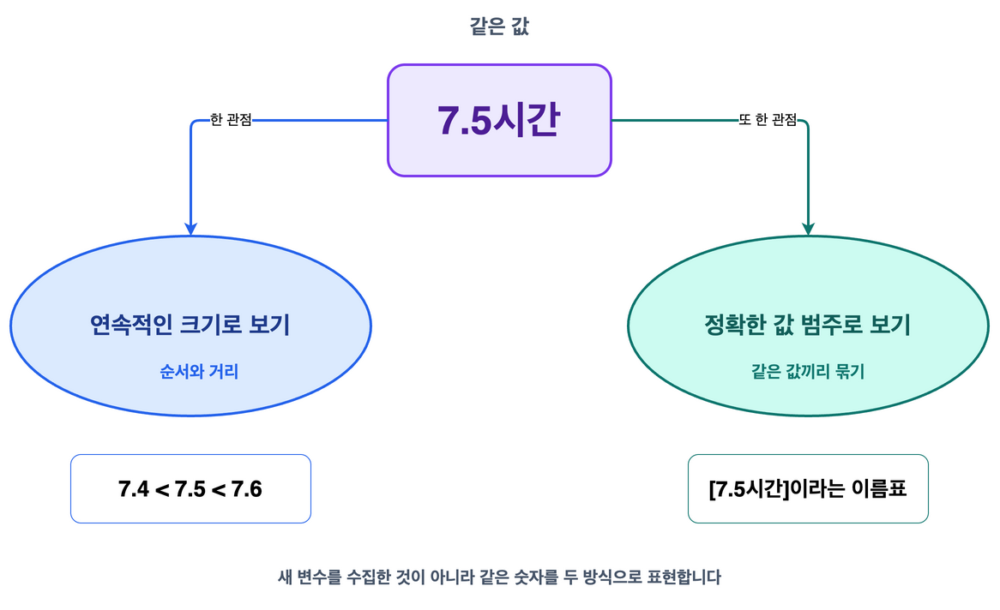

시각 자료 대체 설명: 같은 `7.5시간`을 `7.4 < 7.5 < 7.6`처럼 순서와 거리로 볼 수도 있고, `[7.5시간]`이라는 정확한 값 이름표로 볼 수도 있다.

### 발표자 메모

- 새 입력 변수를 수집한 것이 아니라 같은 숫자를 두 방식으로 모델에 보여 준 실험이라고 설명합니다.
- 범주 표현은 같은 값끼리 묶는 신호를 주고, 수치 표현은 순서와 거리 정보를 보존한다고 구분합니다.

### Confluence 보충 설명

전체 12개 입력 가운데 원래 수치 열 아홉 개를 그대로 유지하면서 같은 값의 범주 복제 열 아홉 개를 추가했다.
대상 열과 두 설정의 정확한 차이는 기술 근거 부록 C에서 확인할 수 있다.

근거: [정확값 범주 실험 설정](https://github.com/tmheo/predicting-smartphone-addiction/blob/main/configs/exp003_categorical_copies.yaml), [수치와 범주 복제 판정](https://github.com/tmheo/predicting-smartphone-addiction/issues/31#issuecomment-5242350228)

부록: [C. 같은 값을 표현한 실험](https://lgucorp.atlassian.net/wiki/spaces/~7120202a66323266d44ee697a3e30c7a270829/pages/1501596455)

## 화면 08. 두 관점을 함께 쓰자 OOF AUC가 +0.00329 올랐습니다

수치를 그대로 두고 정확값 범주를 함께 보여 주자 같은 비교 기준보다 OOF AUC가 `+0.00329` 높아졌습니다.

시각 자료 대체 설명: 일반 OOF AUC가 비교 기준 `0.96276`에서 수치와 정확값 범주를 함께 쓴 구성 `0.96605`로 올랐으며, 두 값의 차이는 `+0.00329`다.

### 발표자 메모

- OOF AUC는 각 행이 자기 정답으로 학습하지 않은 모델에서 받은 OOF 예측을 ROC AUC로 채점한 값입니다.
- 화면의 차이는 약 `0.0033`으로 읽고, Public 점수나 Private 점수로 이어지는 상승이라고 말하지 않습니다.

### Confluence 보충 설명

이 비교는 같은 자료 분할과 같은 LightGBM 설정에서 수치 열 아홉 개를 유지한 채 정확값 범주 복제 아홉 개를 추가한 단일 시드 직접 비교다.
비교 기준 `0.96276`은 이 짝비교의 기준 실행이며 첫 기준 실행을 소개할 때 쓰는 `0.96270`과 같은 값으로 줄이지 않는다.

근거: [전 피처 범주형 challenger 실험: 실행과 판정](https://github.com/tmheo/predicting-smartphone-addiction/issues/31#issuecomment-5242350228)

부록: [C. 같은 값을 표현한 실험](https://lgucorp.atlassian.net/wiki/spaces/~7120202a66323266d44ee697a3e30c7a270829/pages/1501596455)

## 화면 09. 전부 범주로만 쓰자 AUC 차이 -0.00417이었습니다

숫자의 순서 정보를 버리고 전부 범주로만 쓰자 같은 비교 기준보다 OOF AUC가 `-0.00417` 낮아졌습니다.

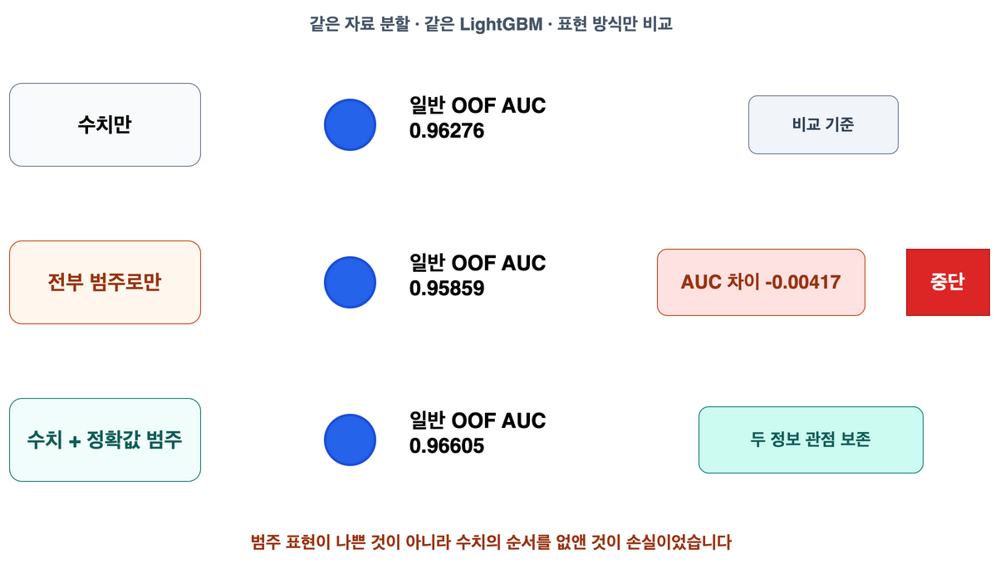

시각 자료 대체 설명: 수치만 쓴 비교 기준의 일반 OOF AUC는 `0.96276`, 전부 범주로만 쓴 값은 `0.95859`, 두 관점을 함께 쓴 값은 `0.96605`이며 전부 범주 변형은 `-0.00417`로 중단했다.

### 발표자 메모

- 범주 표현 자체가 나쁜 것이 아니라 수치의 순서 정보를 모두 없앤 것이 손실이었다고 제한합니다.
- 정답은 한 표현을 고르는 것이 아니라 보완하는 두 관점을 함께 보존하는 것이었다고 회수합니다.

### Confluence 보충 설명

전부 범주화와 수치 유지 및 범주 복제는 결과를 보기 전에 같은 이슈에서 고정한 두 직접 비교였다.
두 변형은 같은 자료 분할, 같은 LightGBM 설정과 같은 난수 42를 사용했다.

근거: [전부 범주화 설정](https://github.com/tmheo/predicting-smartphone-addiction/blob/main/configs/exp002_all_categorical.yaml), [수치와 범주 복제 판정](https://github.com/tmheo/predicting-smartphone-addiction/issues/31#issuecomment-5242350228)

부록: [C. 같은 값을 표현한 실험](https://lgucorp.atlassian.net/wiki/spaces/~7120202a66323266d44ee697a3e30c7a270829/pages/1501596455)

## 화면 12. nested OOF는 바깥 fold를 봉인합니다

나머지 fold에서 구성원과 결합 방식을 고른 뒤, 보지 않은 바깥 fold에서 한 번 평가합니다.

시각 자료 대체 설명: 다섯 바깥 fold를 차례로 하나씩 봉인하고, 남은 네 fold 안에서 선택한 결합을 봉인한 fold에 적용한 뒤 다섯 예측을 이어 nested OOF를 만든다.

### 발표자 메모

- 다섯 검사실 비유는 이 화면에서 한 번만 사용한 뒤 곧바로 바깥 fold와 안쪽 선택이라는 정식 표현으로 돌아옵니다.
- nested OOF는 구성원과 결합 방식 선택의 낙관을 줄이지만 기초 구성 생성 전의 모든 과거 선택까지 되풀이한 완전한 중첩 평가는 아닙니다.

### Confluence 보충 설명

한 바깥 fold의 목표값과 예측은 구성원 및 가중치 선택에 들어가지 않는다.
선택은 나머지 바깥 fold의 OOF만 사용하고, 선택 결과를 봉인한 fold에 적용해 얻은 예측을 다섯 번 이어 붙인다.

근거: [실험 채택 판정 계약](https://github.com/tmheo/predicting-smartphone-addiction/blob/main/docs/adr/0001-experiment-adoption-contract.md), [결합 평가 구현](https://github.com/tmheo/predicting-smartphone-addiction/blob/main/src/pipeline/ensemble.py)

## 화면 20. 성공과 실패를 같은 판정표에서 시작합니다

성공과 실패는 서로 다른 목록이 아니라 같은 판단 절차에서 나온 결론입니다.

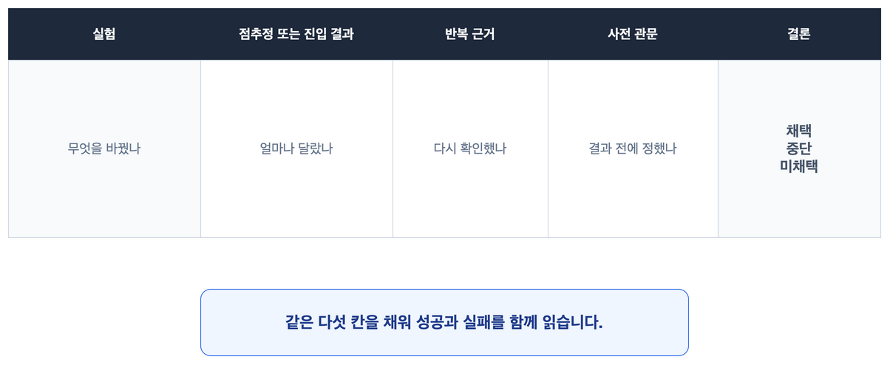

시각 자료 대체 설명: 모든 실험을 무엇을 바꿨는지, 얼마나 달랐는지, 다시 확인했는지, 결과 전에 관문을 정했는지와 최종 결론의 다섯 칸에 놓는다.

### 발표자 메모

- 성공은 자랑 목록으로, 실패는 비용 낭비 목록으로 떼지 않고 둘 다 다음 운영 원칙을 만든 근거로 다룹니다.
- `채택`, `중단`, `미채택`은 실제 판정이며, 뒤의 세 화면에서 같은 다섯 칸을 채워 갑니다.

### Confluence 보충 설명

점추정 하나만으로 결론을 내리지 않고 반복 근거와 결과 확인 전에 정한 관문을 함께 읽는다.
`근거 더 보기`는 앞선 참여 장면의 유보 선택이며 실제 실험 판정인 `미채택`과 구분한다.

근거: [차트와 다이어그램의 시각 문법](https://github.com/tmheo/predicting-smartphone-addiction/issues/569#issuecomment-5489136191), [발표 제작 장부의 공통 판정표](https://github.com/tmheo/predicting-smartphone-addiction/blob/main/docs/presentation/s6e8-retrospective-production-ledger.md#화면-20-성공과-실패를-같은-판정표에서-시작합니다)

## 화면 21. RealMLP 자료형 결함 수정이 +0.00461을 만들었습니다

가장 큰 단일 구성 상승은 새 복잡성을 더한 것이 아니라 입력 값의 의미와 구현을 맞춘 결과였습니다.

시각 자료 대체 설명: 어휘 매핑 전에 값을 `float32`로 바꾸던 순서를 고치자 검증 미등록값이 `800,896`개에서 `23`개로 줄었고, 3시드 평균 OOF AUC가 `0.9637131967`에서 `0.9683223458`로 회복됐다.

### 발표자 메모

- 화면에서는 `+0.00461`만 읽고 미등록값 수는 왜 영향이 컸는지 질문이 나올 때 설명합니다.
- 새로운 모델을 추가한 결과가 아니라 같은 RealMLP 이식판의 자료형 변환 순서 하나를 고친 짝비교입니다.

### Confluence 보충 설명

수정판은 어휘 매핑과 분위 구간 변환을 끝낸 뒤 `float32` 변환을 적용한다.
결함판과 수정판은 이 차이 외의 설정을 고정했고 같은 실행 환경 등급에서 난수 42, 43, 44를 짝지어 비교했다.

근거: [exp124 설정](https://github.com/tmheo/predicting-smartphone-addiction/blob/main/configs/exp124_realmlp_dtype_fix.yaml), [자료형 정합 복원 판정](https://github.com/tmheo/predicting-smartphone-addiction/issues/243#issuecomment-5343200265)

## 화면 22. 남긴 실험은 서로 다른 관점과 오차를 보탰습니다

남긴 실험은 같은 값의 다른 표현, 다른 오차 또는 결측에 견디는 학습이라는 구별되는 기여를 보였습니다.

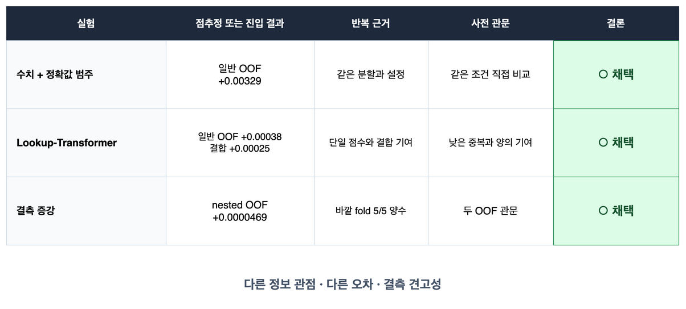

시각 자료 대체 설명: 수치와 정확값 범주는 일반 OOF `+0.00329`, Lookup-Transformer는 일반 OOF `+0.00038`과 결합 기여 `+0.00025`, 결측 증강은 nested OOF 약 `+0.0000469`와 바깥 fold `5/5` 양수 근거로 각각 채택됐다.

### 발표자 메모

- 세 방법이 같은 설정이나 같은 효과 크기로 채택됐다는 뜻은 아니며, 각자 다른 기준과 평가 관문을 통과했습니다.
- 상세 설정은 읽지 않고 `다른 정보 관점`, `다른 오차`, `결측 견고성`이라는 세 기여만 남깁니다.

### Confluence 보충 설명

수치와 정확값 범주는 같은 분할과 설정의 직접 비교였고, Lookup-Transformer는 단일 점수와 결합 기여를 따로 확인했다.
결측 증강은 후보 풀 전체를 대상으로 동결 OOF 조건부 절차와 직접 nested OOF의 두 관문을 통과했고 바깥 fold 다섯 곳에서 모두 같은 방향이었다.

근거: [수치와 정확값 범주 직접 비교](https://github.com/tmheo/predicting-smartphone-addiction/issues/31#issuecomment-5242350228), [Lookup-Transformer 판정](https://github.com/tmheo/predicting-smartphone-addiction/issues/58#issuecomment-5287565965), [결측 증강 일괄 판정](https://github.com/tmheo/predicting-smartphone-addiction/blob/main/docs/research/missingness-propagation-batch/issue512/report.md)

## 화면 23. 근거가 약한 탐색은 일찍 멈췄습니다

후보 수나 새로움이 아니라 미리 정한 1차 기준, 반복 근거와 전체 결합 기여로 탐색을 중단했습니다.

시각 자료 대체 설명: Lookup 설정 17개와 새 신경망 네 종류는 첫 fold의 진입 기준을 넘지 못해 중단했고, 외부 예측 120개 계열과 327열 결합은 전체 결합 기여 또는 반복 근거가 부족해 미채택했다.

### 발표자 메모

- Lookup 설정과 새 신경망은 fold 0 진입 진단에서 멈췄으므로 전체 5분할 결과처럼 말하지 않습니다.
- `중단`은 더 큰 실행을 열지 않았다는 뜻이고 `미채택`은 완성된 비교를 최종 구성에 넣지 않았다는 뜻입니다.

### Confluence 보충 설명

Lookup-Transformer 설정 17개는 학습률, 학습률 일정과 최적화 알고리즘을 바꿨지만 fold 0 기준보다 모두 낮았다.
약한 외부 예측 120개 계열의 한계 기여는 `-0.000057`이었고, 327열 결합은 점추정이 `+0.0000047` 높았지만 바깥 fold 다섯 곳 중 세 곳에서만 같은 방향이라 사전 관문을 넘지 못했다.

근거: [Lookup-Transformer 제한 탐색 판정](https://github.com/tmheo/predicting-smartphone-addiction/issues/160#issuecomment-5308772959), [확장 사다리 기록](https://github.com/tmheo/predicting-smartphone-addiction/blob/main/docs/research/extended-stack-ladder-2.md), [327열 판정 기록](https://github.com/tmheo/predicting-smartphone-addiction/blob/main/docs/research/extended-stack-ext327/issue526/comparison.json)

## 화면 24. 실행 장소가 달라도 판정은 한 검수대로 모였습니다

실행 장소마다 역할은 달랐지만 정식 판정은 모두 로컬의 같은 반입과 재채점 절차를 통과했습니다.

시각 자료 대체 설명: 다섯 실행 장소에서 만든 실행 기록 묶음이 로컬 검수대로 모이며, 로컬은 해시 대조, 입력 경계 확인, 재채점과 최종 판정을 맡는다.

### 발표자 메모

- 로컬은 개발과 소규모 실행뿐 아니라 결과 반입, 재채점, 판정과 최종 조립을 맡았습니다.
- 장소 자체를 성공이나 실패로 칠하지 않고 모든 관문을 통과한 결론에만 채택 표식을 붙입니다.

### Confluence 보충 설명

한 비교 짝은 같은 공급자와 같은 실행 환경 등급에 묶었다.
서로 다른 공급자에서 완결된 비교 짝은 각각 같은 계약을 통과한 뒤에만 한 판정 입력에 함께 넣었으며, 한쪽 실행끼리 이어 붙이지 않았다.

근거: [발표용 실행 환경과 전환 사건 근거](https://github.com/tmheo/predicting-smartphone-addiction/blob/main/docs/research/presentation-environment-evidence.md)

## 화면 25. 비용과 운영 경험에 따라 실행 장소를 바꿨습니다

실제 비용, 재고와 접속 경험을 새 근거로 받아들여 주 실행 장소와 예비 장소를 바꿨습니다.

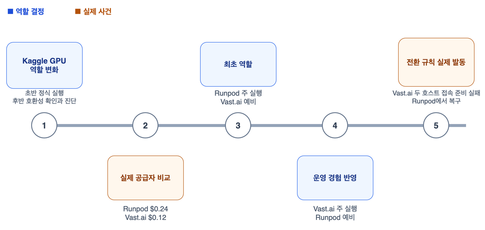

시각 자료 대체 설명: Kaggle GPU는 초반 정식 실행에서 후반 호환성 확인과 진단으로 역할이 바뀌었고, Runpod `$0.24`와 Vast.ai `$0.12`의 실제 비교 뒤에는 준비 속도와 메모리 여유를 보아 Runpod을 우선했다가 재고와 운영 경험을 반영해 Vast.ai 우선으로 바꿨으며 실제 접속 준비 실패 때 Runpod으로 전환했다.

### 발표자 메모

- Kaggle GPU는 초반 정식 신경망 실행을 맡았지만 후반 운영 정책에서는 사람이 지켜보는 호환성 확인과 진단으로 역할을 좁혔습니다.
- Vast.ai가 처음부터 주 실행 장소였던 것은 아니며, 첫 결정은 준비 속도와 메모리 여유를 중시한 Runpod 우선이었습니다.
- Runpod은 실패한 서비스가 아니라 Vast.ai의 서로 다른 두 호스트에서 접속 준비가 실패했을 때 정한 전환 규칙에 따라 실행을 끝낸 예비 장소였습니다.

### Confluence 보충 설명

동일한 선별 실행에서 Runpod은 모델 실행 26분 24초와 표시 차감액 `$0.24`, Vast.ai는 31분 45초와 `$0.12`였다.
후속 운영에서는 적합한 Vast.ai 자원을 제때 확보하지 못하거나 서로 다른 두 호스트에서 접속과 사전 검사가 실패하면 비교 짝 전체를 Runpod으로 옮기도록 정했으며, 두 공급자의 일부 결과를 이어 붙이지 않았다.

근거: [발표용 실행 환경과 전환 사건](https://github.com/tmheo/predicting-smartphone-addiction/blob/main/docs/research/presentation-environment-evidence.md), [Vast.ai 실패 뒤 Runpod 복구 기록](https://github.com/tmheo/predicting-smartphone-addiction/issues/108#issuecomment-5303015536)

## 화면 26. $0.39는 최종 Vast.ai 재학습 작업 비용입니다

약 `$0.39`는 대회 전체 비용이 아니라 마지막에 바뀐 신경망 하나의 전체 자료 재학습 작업 비용입니다.

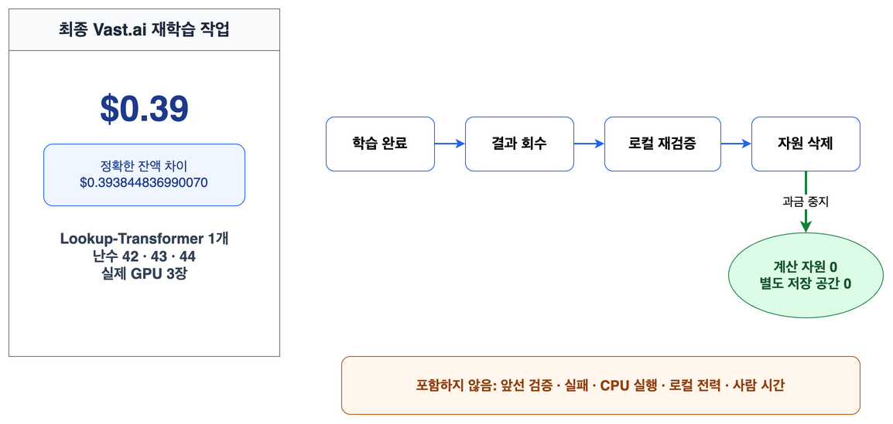

시각 자료 대체 설명: Vast.ai에서 Lookup-Transformer 하나의 난수 42, 43, 44를 GPU 세 장으로 전체 자료 재학습한 잔액 차이는 정확히 `$0.393844836990070`이며, 결과를 회수하고 로컬에서 다시 검증한 뒤 계산 자원과 별도 저장 공간을 모두 삭제했다.

### 발표자 메모

- 화면에서는 `$0.39`로 읽고 대회 전체 원격 비용, 전체 제출 비용이나 모든 최종 모델의 재학습 비용으로 넓히지 않습니다.
- 인스턴스에는 RTX A4000 네 장이 있었지만 실제 모델 실행에는 같은 설정의 난수 42, 43, 44를 맡은 세 장만 사용했습니다.

### Confluence 보충 설명

정확한 잔액 차이는 `$0.393844836990070`이다.
앞선 검증과 실패, CPU 실행, 로컬 전력과 사람 시간은 포함하지 않으며 결과 회수와 로컬 재검증 뒤 활성 계산 자원과 별도 저장 공간이 각각 0개임을 확인했다.

근거: [발표용 실행 환경과 비용 범위](https://github.com/tmheo/predicting-smartphone-addiction/blob/main/docs/research/presentation-environment-evidence.md#6-마지막-제출에서는-필요한-신경망-하나만-vastai에서-다시-학습했다), [최종 조립 실행 기록](https://github.com/tmheo/predicting-smartphone-addiction/blob/main/docs/research/extended-stack-final-assembly/issue514/report.md)

## 화면 27. 혼자 잘하는가와 함께할 때 돕는가를 두 번 시험했습니다

개인전 성능과 결합 기여를 서로 대신할 수 없는 두 검수로 판단했습니다.

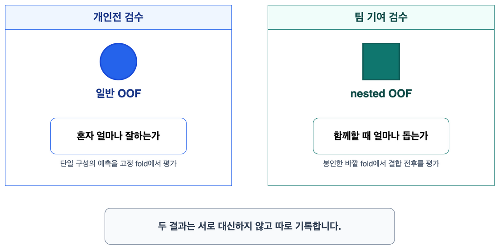

시각 자료 대체 설명: 왼쪽 개인전 검수는 단일 구성의 예측을 고정 fold에서 일반 OOF로 평가하고, 오른쪽 팀 기여 검수는 봉인한 바깥 fold에서 결합 전후를 nested OOF로 평가하며 두 결과를 따로 기록한다.

### 발표자 메모

- 일반 OOF와 nested OOF는 서로 다른 질문의 답이므로 한 점수선으로 잇거나 서로 대신하지 않습니다.
- 단독 점수가 최고가 아니어도 기존 예측과 다른 오차로 전체 결합을 높인다면 후보 풀에 남을 수 있습니다.

### Confluence 보충 설명

개인전 검수는 단일 구성의 재현성과 점수를 보고, 팀 기여 검수는 구성원과 결합 방식을 봉인한 바깥 fold에서 결합 전후를 비교한다.
Lookup-Transformer의 실제 값은 다음 두 화면과 원 판정에서 이어서 확인한다.

근거: [실험 채택 판정 계약](https://github.com/tmheo/predicting-smartphone-addiction/blob/main/docs/adr/0001-experiment-adoption-contract.md), [Lookup-Transformer 판정](https://github.com/tmheo/predicting-smartphone-addiction/issues/58#issuecomment-5287565965)

## 화면 28. 틀린 행이 다르면 함께할 이유가 생깁니다

같은 단독 점수라도 서로 다른 행에서 순서를 틀리면 두 예측을 합칠 이유가 생길 수 있습니다.

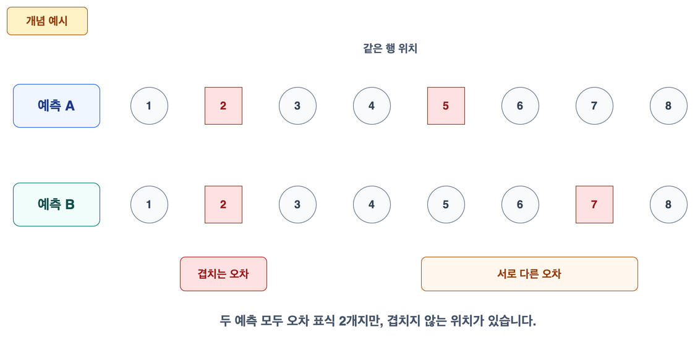

시각 자료 대체 설명: 예측 A와 B는 오차 표식이 각각 두 개로 같지만 2번 위치만 겹치고 A의 5번과 B의 7번 위치는 달라, 두 예측이 서로 보완할 가능성을 보여 준다.

### 발표자 메모

- 이 그림은 실제 두 구성의 행별 오차율을 측정한 결과가 아니라 같은 단독 점수와 다른 오차를 설명하는 교육용 개념 예시입니다.
- 다양성은 모델 이름의 개수가 아니라 같은 행의 예측 순서가 얼마나 다르게 어긋나는지로 설명합니다.

### Confluence 보충 설명

ROC AUC의 순서 오류는 단순한 행별 정오표와 같지 않으므로 그림의 두 표식을 실제 비율로 읽지 않는다.
Lookup-Transformer의 실제 다양성은 행 그림이 아니라 후보 풀의 최근접 구성과의 순위 상관 및 결합 기여로 확인했다.

근거: [오차 겹침 시각 문법](https://github.com/tmheo/predicting-smartphone-addiction/issues/569#issuecomment-5489136191), [Lookup-Transformer 판정](https://github.com/tmheo/predicting-smartphone-addiction/issues/58#issuecomment-5287565965)

## 화면 29. Lookup-Transformer는 결합 기여로 자리를 얻었습니다

Lookup-Transformer는 낮은 중복과 양의 결합 기여를 함께 보여 후보 풀에 들어갔습니다.

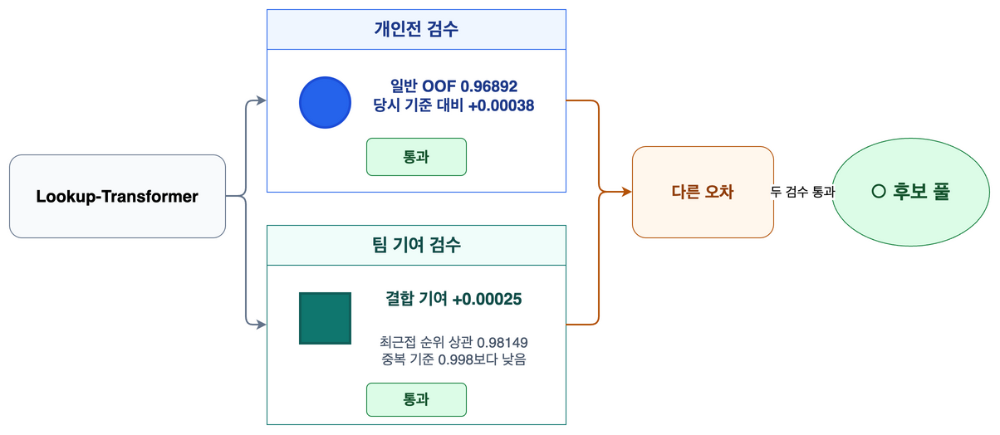

시각 자료 대체 설명: Lookup-Transformer의 일반 OOF AUC는 `0.96892`로 당시 기준보다 `+0.00038` 높았고, 최근접 구성과의 순위 상관 `0.98149`는 중복 기준 `0.998`보다 낮았으며 표준 평가 결합을 `+0.00025` 높였다.

### 발표자 메모

- 정확값 조회와 부드러운 수치 추세가 나무 계열과 다른 오차를 만들었다고만 말하고 신경망 구조의 상세 설명은 부록으로 보냅니다.
- 당시 단일 점수도 기준을 넘었지만 후보 풀에 남긴 결정은 낮은 중복과 양의 결합 기여를 별도로 확인한 결과였습니다.

### Confluence 보충 설명

최근접 구성은 `exp045_xgb_depth8`이었고 스피어만 순위 상관은 `0.98149`로 중복 기준 `0.998`보다 낮았다.
표준 평가 결합은 표시값 기준 `0.96813`에서 `0.96839`로 높아졌고 정확한 한계 기여는 `+0.00025`였다.

근거: [Lookup-Transformer 판정](https://github.com/tmheo/predicting-smartphone-addiction/issues/58#issuecomment-5287565965), [발표용 성적과 실험 계보 근거](https://github.com/tmheo/predicting-smartphone-addiction/blob/main/docs/research/presentation-score-evidence.md#2-다르게-틀리는-구성의-가치)

## 화면 30. 자체 35개에서 최종 314개 예측 열까지 갔습니다

자체 35개 결합의 nested OOF AUC `0.96981`에서 최종 314개 예측 열의 `0.97038`까지 내부 결합 점수가 높아졌습니다.

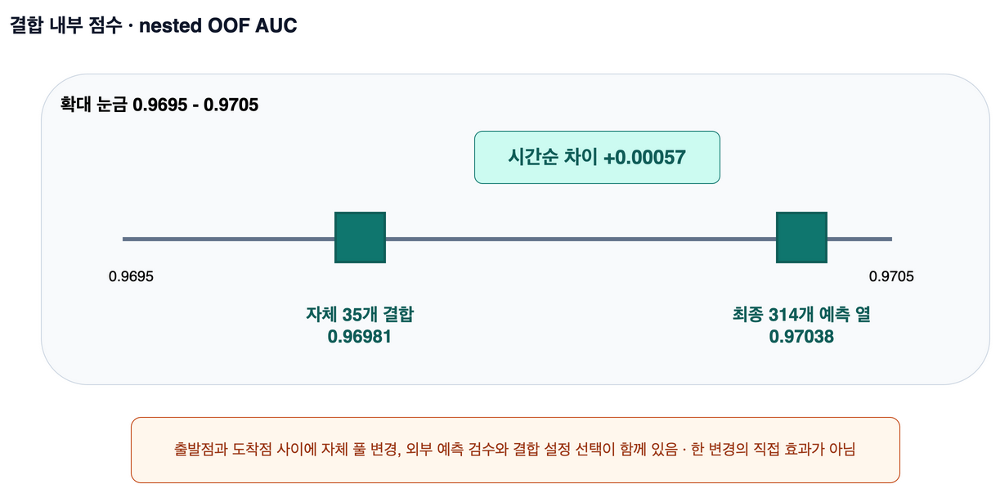

시각 자료 대체 설명: 자체 35개 결합의 nested OOF AUC `0.96981`과 최종 314개 예측 열의 `0.97038`을 같은 결합 내부 점수 눈금에 놓되, 두 값 사이에 여러 변경이 있었음을 함께 표시한다.

### 발표자 메모

- 두 점은 시간순 출발점과 도착점이며 외부 예측 추가 하나만의 직접 효과가 아닙니다.
- 중간에는 자체 풀이가 35개에서 36개로 바뀌었고 외부 예측 검수와 결합 설정 선택도 함께 있었습니다.

### Confluence 보충 설명

결합 내부 점수 계보는 자체 35개, 외부 207개를 더한 242열, 해로운 외부 계열을 뺀 313열, 결합 규제를 내부에서 고른 313열과 최종 314열로 이어진다.
각 단계의 구성과 선택 절차가 함께 달라졌으므로 출발점과 도착점의 차이를 한 기법의 인과 효과로 읽지 않는다.

근거: [발표용 성적과 실험 계보 근거](https://github.com/tmheo/predicting-smartphone-addiction/blob/main/docs/research/presentation-score-evidence.md), [314열 재조립 판정](https://github.com/tmheo/predicting-smartphone-addiction/blob/main/docs/research/extended-stack-pool-reassembly/issue513/report.md)

## 화면 31. 314개 예측 열은 검수해 남긴 조립 재료입니다

자체 36개와 외부 278개의 예측 열을 무결성과 nested OOF 판정으로 검수해 최종 314열 조립 입력으로 남겼습니다.

시각 자료 대체 설명: 자체 예측 36열과 외부 예측 278열이 열 순서, 행 정렬, 해시와 라이선스 장부 검수 및 nested OOF 판정을 지나 최종 314열 결합 입력이 된다.

### 발표자 메모

- 314개는 모델 수가 아니라 출처별 예측값 열 수입니다.
- 외부 278개를 모두 우리가 다시 학습했다는 뜻이 아니며, 자체 36개만 전체 자료로 다시 학습했습니다.

### Confluence 보충 설명

외부 구성원의 분할 근거와 라이선스 수준은 완전히 같지 않다.
외부 278개 가운데 64개는 사용 한정으로 분류했고, 이 한계는 최종 구성원 장부와 기술 근거 부록에 남겼다.

근거: [우리 최종 해법과 제출 계보 복원](https://github.com/tmheo/predicting-smartphone-addiction/blob/main/docs/research/s6e8-our-final-solution.md), [314열 재조립 판정](https://github.com/tmheo/predicting-smartphone-addiction/blob/main/docs/research/extended-stack-pool-reassembly/issue513/report.md)

## 화면 32. 공식 결과는 Public 0.97135, Private 0.97109, 최종 14위였습니다

내부 검증으로 고른 314개 예측 열 제출은 공식 대회에서 Public 점수 `0.97135`, Private 점수 `0.97109`와 최종 14위를 기록했습니다.

시각 자료 대체 설명: 공식 최종 순위 14위와 참가자 이름을 왼쪽에 표시하고, 같은 제출 `55907610`의 Public 점수 `0.97135`와 Private 점수 `0.97109`를 서로 다른 표식 및 채점 범위 설명과 함께 오른쪽에 표시한다.

### 발표자 메모

- Public 점수와 Private 점수는 같은 제출을 서로 다른 공식 표본에서 채점한 결과입니다.
- 결합 규제를 내부에서 고른 313열 판과 최종 314열 판의 두 공식 표시값은 같았으므로 마지막 변경이 공식 점수를 높였다고 말하지 않습니다.

### Confluence 보충 설명

내부 nested OOF와 공식 점수는 평가한 행과 선택 경계가 달라 그 차이를 개선량으로 계산할 수 없다.
마지막으로 올린 327열 제출은 Private 점수 `0.97108`이었으므로 최종 14위 성적을 만든 제출은 마지막 업로드가 아니라 314열 제출이다.

근거: [우리 최종 해법과 제출 계보 복원](https://github.com/tmheo/predicting-smartphone-addiction/blob/main/docs/research/s6e8-our-final-solution.md), [최종 조립 제출 기록](https://github.com/tmheo/predicting-smartphone-addiction/blob/main/docs/research/extended-stack-final-assembly/issue514/submission-record.json)

## 화면 33. 남은 차이는 더 강한 단일 모델 탐색이었습니다

이 회고에서는 우승권과의 차이를 더 강한 단일 모델을 더 빨리 찾는 탐색 역량의 차이로 해석합니다.

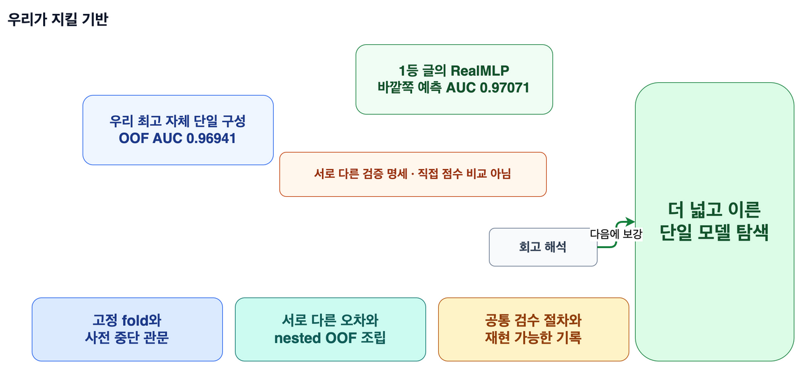

시각 자료 대체 설명: 우리가 지킬 검증과 조립 기반 옆에 더 넓고 이른 단일 모델 탐색을 보강 축으로 세우며, 우리 최고 자체 단일 구성과 1등 글의 RealMLP 점수는 검증 명세가 달라 직접 비교하지 않는다고 표시한다.

### 발표자 메모

- 공개 기록에서 1등 RealMLP의 바깥쪽 예측 AUC는 `0.970706453`이고 우리 최고 자체 단일 구성의 OOF AUC는 `0.9694062694`지만 검증 명세가 달라 점수 차이를 직접 계산하지 않습니다.
- 1등 RealMLP의 최종 Private 점수와 전체 재현 명세는 공개되지 않았으므로 이 해석을 인과적으로 증명한 결론처럼 말하지 않습니다.

### Confluence 보충 설명

1등 글에서 확인되는 것은 높은 단일 RealMLP 바깥쪽 예측 AUC, 449개까지 늘어난 결합과 여러 에이전트의 병렬 탐색이다.
분할표, 전처리 경계, 설정, 구성원 장부와 결합식은 공개되지 않았으므로 이 화면은 확인된 사실에서 도출한 회고 해석이지 같은 조건의 대조 결과가 아니다.

근거: [1등 해법 원문 조사](https://github.com/tmheo/predicting-smartphone-addiction/blob/main/docs/research/s6e8-first-place-writeup.md), [발표용 성적과 실험 계보 근거](https://github.com/tmheo/predicting-smartphone-addiction/blob/main/docs/research/presentation-score-evidence.md)

## 화면 34. 넓은 단일 모델 탐색을 일찍 엽니다

다음 대회에서는 넓은 단일 모델 탐색을 일찍 시작하되 고정 fold와 사전 중단 관문은 유지합니다.

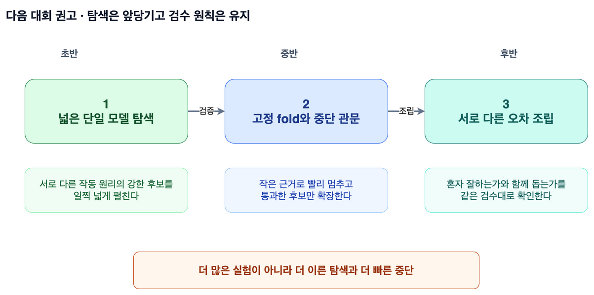

시각 자료 대체 설명: 다음 대회 초반에 서로 다른 작동 원리의 단일 모델을 넓게 탐색하고, 고정 fold와 중단 관문을 거쳐 통과한 서로 다른 오차만 후반에 조립하는 순서를 보여 준다.

### 발표자 메모

- 더 많은 실험을 무조건 수행한다는 뜻이 아니라 강한 후보를 일찍 넓게 찾고 작은 근거로 빨리 멈추는 구조입니다.
- 결과를 보기 전에 분할과 중단 기준을 고정하고, 혼자 잘하는가와 함께할 때 돕는가를 나누는 원칙은 바꾸지 않습니다.

### Confluence 보충 설명

이 시간선은 이번 회고에서 도출한 다음 대회 권고이며 이미 확정한 실험 프로그램이나 우승 해법을 그대로 복제하겠다는 계획이 아니다.
새 후보의 구체적인 범위와 자원 배분은 다음 대회의 자료와 제약을 확인한 뒤 별도 결정한다.

근거: [1등 해법 원문 조사](https://github.com/tmheo/predicting-smartphone-addiction/blob/main/docs/research/s6e8-first-place-writeup.md), [발표 제작 장부](https://github.com/tmheo/predicting-smartphone-addiction/blob/main/docs/presentation/s6e8-retrospective-production-ledger.md)

## 화면 35. 작게 검증하고, 다르게 틀리는 예측을 모으고, 같은 검수대로 조립합니다

작은 검증, 서로 다른 오차와 공통 검수대라는 세 원칙이 이번 결과를 설명합니다.

시각 자료 대체 설명: 작은 검증, 서로 다른 오차, 공통 검수대라는 세 조각이 최종 14위 결과로 모이며, 다음 대회에서는 같은 원칙 위에서 넓은 단일 모델 탐색을 더 일찍 시작한다.

### 발표자 메모

- 새로운 수치는 덧붙이지 않고 앞에서 본 RealMLP 수정, Lookup-Transformer, 실행 기록 묶음과 314열 조립을 한 문장씩 회수합니다.
- 마지막 문장은 질의응답을 여는 질문으로 바꿔 읽습니다.

### Confluence 보충 설명

작은 검증은 결과를 보기 전에 비교와 중단 관문을 고정하는 습관을 뜻한다.
서로 다른 오차는 단독 점수만 높이는 것이 아니라 기존 예측과 결합했을 때 보완하는 예측을 남긴다는 뜻이며, 공통 검수대는 실행 장소와 상관없이 같은 무결성 및 재채점 절차를 적용한다는 뜻이다.

근거: [발표 제작 장부](https://github.com/tmheo/predicting-smartphone-addiction/blob/main/docs/presentation/s6e8-retrospective-production-ledger.md)
