이 문서는 35개 화면 전체 제작에 앞서 문장 밀도, 정보 위계, 발표자 메모, Confluence 보충 설명과 시각 자료 표현을 검토하기 위한 대표 화면 시제품이다.
화면 08, 12, 21, 23, 24, 31, 35를 실제 원본 경로와 최종 자산 경로에 먼저 작성했다.

[기술 정의와 근거 찾아보기](https://lgucorp.atlassian.net/wiki/spaces/~7120202a66323266d44ee697a3e30c7a270829/pages/1501596455)

## 화면 08. 두 관점을 함께 쓰자 OOF AUC가 +0.00329 올랐습니다

수치를 그대로 두고 정확값 범주를 함께 보여 주자 같은 비교 기준보다 OOF AUC가 `+0.00329` 높아졌습니다.

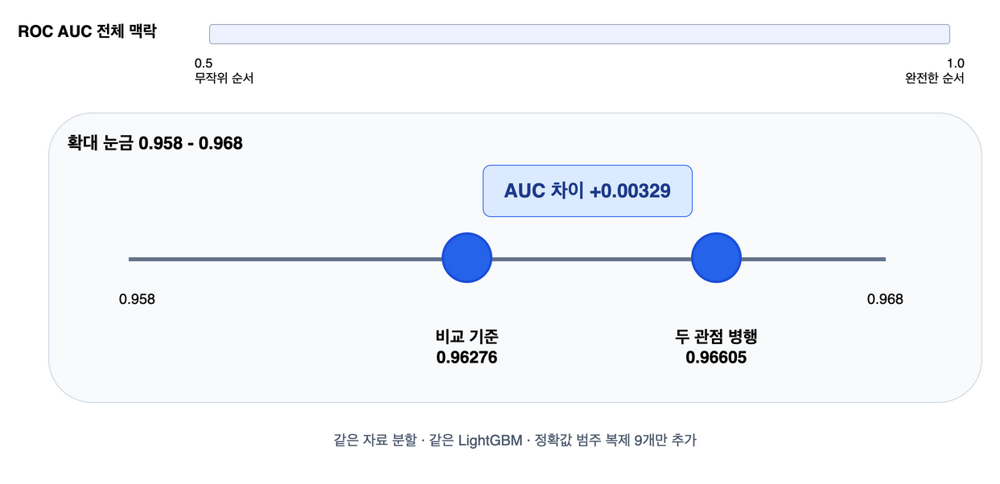

시각 자료 대체 설명: 일반 OOF AUC가 비교 기준 `0.96276`에서 수치와 정확값 범주를 함께 쓴 구성 `0.96605`로 올랐으며, 두 값의 차이는 `+0.00329`다.

### 발표자 메모

- OOF AUC는 각 행이 자기 정답으로 학습하지 않은 모델에서 받은 OOF 예측을 ROC AUC로 채점한 값입니다.
- 화면의 차이는 약 `0.0033`으로 읽고, Public 점수나 Private 점수로 이어지는 상승이라고 말하지 않습니다.

### Confluence 보충 설명

이 비교는 같은 자료 분할과 같은 LightGBM 설정에서 수치 열 아홉 개를 유지한 채 정확값 범주 복제 아홉 개를 추가한 단일 시드 직접 비교다.
비교 기준 `0.96276`은 이 짝비교의 기준 실행이며 첫 기준 실행을 소개할 때 쓰는 `0.96270`과 같은 값으로 줄이지 않는다.

근거: [전 피처 범주형 challenger 실험: 실행과 판정](https://github.com/tmheo/predicting-smartphone-addiction/issues/31#issuecomment-5242350228)

## 화면 10. 모든 실험은 같은 다섯 fold에서 비교했습니다

결과를 보기 전에 한 번 만든 같은 다섯 fold를 모든 실험 비교에 그대로 사용했습니다.

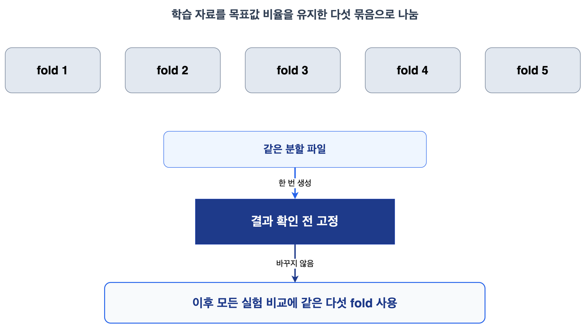

시각 자료 대체 설명: 학습 자료가 fold 1부터 fold 5까지의 다섯 묶음으로 나뉘고 `결과 확인 전 고정` 단계를 거친 뒤, 이후 모든 실험 비교가 같은 분할을 사용한다.

### 발표자 메모

- 결과를 보기 전에 자료를 같은 다섯 묶음으로 나눴고, 그 묶음 하나를 fold라고 부릅니다.
- fold는 자료 묶음 하나이며 모델 다섯 개를 뜻하지 않습니다.

### Confluence 보충 설명

목표값 비율을 유지하는 5분할을 `shuffle=True`, 난수 42로 한 번 만들었다.
커밋한 분할 파일을 이후 실행에서 읽기만 하며, 실험 결과에 맞춰 다시 나누지 않는다.

근거: [분할 생성 코드](https://github.com/tmheo/predicting-smartphone-addiction/blob/main/scripts/make_folds.py), [실험 채택 판정 계약](https://github.com/tmheo/predicting-smartphone-addiction/blob/main/docs/adr/0001-experiment-adoption-contract.md)

## 화면 11. OOF는 자기 정답을 보지 않은 모델의 예측입니다

각 학습 행은 자기 정답으로 학습하지 않은 모델에서 OOF 예측 하나를 받았습니다.

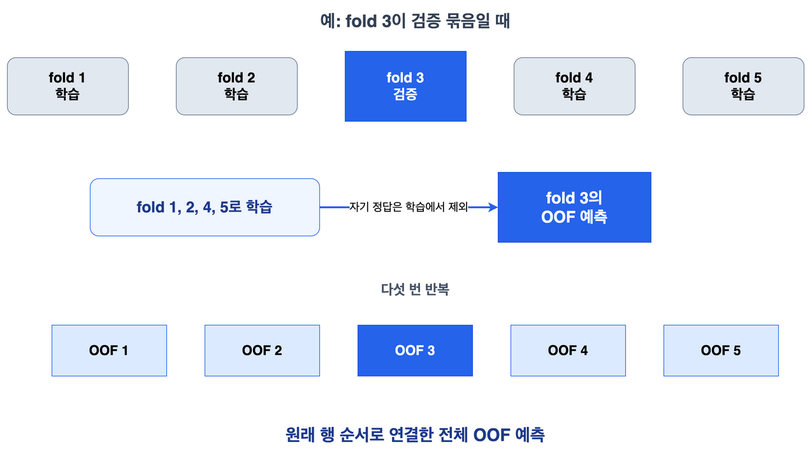

시각 자료 대체 설명: fold 3을 검증용으로 비운 예에서는 fold 1, 2, 4, 5로 학습하고 fold 3의 OOF 예측을 만든다.
같은 과정을 다섯 fold에 반복한 OOF 조각을 원래 행 순서로 이어 전체 OOF 예측을 만든다.

### 발표자 메모

- OOF는 예측값이며, 이 예측을 ROC AUC로 채점한 값이 OOF AUC입니다.
- 각 행의 목표값은 그 행을 예측한 모델의 학습에 들어가지 않습니다.

### Confluence 보충 설명

각 차례에는 한 fold의 행을 검증용으로 두고 나머지 네 fold의 행만 모델 학습에 사용한다.
검증 행의 예측을 원래 행 위치에 저장해 다섯 조각을 모두 채운 배열이 OOF 예측이다.

근거: [교차검증 실행 구현](https://github.com/tmheo/predicting-smartphone-addiction/blob/main/src/pipeline/run.py), [OOF 채점 구현](https://github.com/tmheo/predicting-smartphone-addiction/blob/main/src/pipeline/cv.py), [실험 채택 판정 계약](https://github.com/tmheo/predicting-smartphone-addiction/blob/main/docs/adr/0001-experiment-adoption-contract.md)

## 화면 12. nested OOF는 바깥 fold를 봉인합니다

나머지 fold에서 구성원과 결합 방식을 고른 뒤, 보지 않은 바깥 fold에서 한 번 평가합니다.

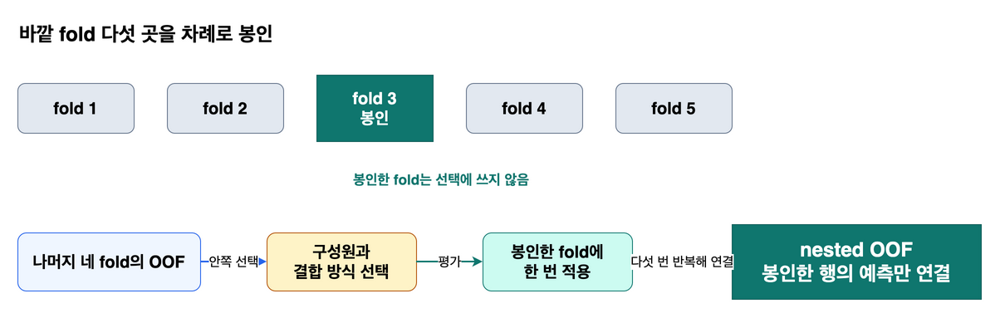

시각 자료 대체 설명: 다섯 바깥 fold를 차례로 하나씩 봉인하고, 남은 네 fold 안에서 선택한 결합을 봉인한 fold에 적용한 뒤 다섯 예측을 이어 nested OOF를 만든다.

### 발표자 메모

- 다섯 검사실 비유는 이 화면에서 한 번만 사용한 뒤 곧바로 바깥 fold와 안쪽 선택이라는 정식 표현으로 돌아옵니다.
- nested OOF는 구성원과 결합 방식 선택의 낙관을 줄이지만 기초 구성 생성 전의 모든 과거 선택까지 되풀이한 완전한 중첩 평가는 아닙니다.

### Confluence 보충 설명

한 바깥 fold의 목표값과 예측은 구성원 및 가중치 선택에 들어가지 않는다.
선택은 나머지 바깥 fold의 OOF만 사용하고, 선택 결과를 봉인한 fold에 적용해 얻은 예측을 다섯 번 이어 붙인다.

근거: [실험 채택 판정 계약](https://github.com/tmheo/predicting-smartphone-addiction/blob/main/docs/adr/0001-experiment-adoption-contract.md), [결합 평가 구현](https://github.com/tmheo/predicting-smartphone-addiction/blob/main/src/pipeline/ensemble.py)

## 화면 13. 개인전 점수와 ensemble 기여는 다른 질문입니다

혼자 점수가 높은지와 기존 예측에 더했을 때 전체 결과를 높이는지는 서로 다른 판단입니다.

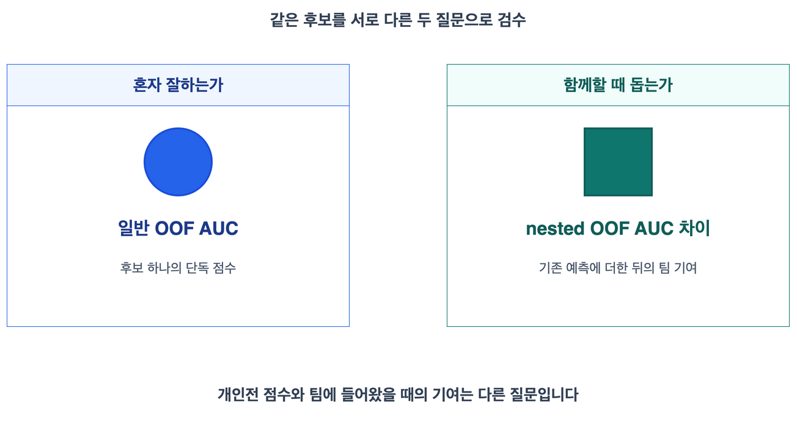

시각 자료 대체 설명: 왼쪽 검수대는 일반 OOF AUC로 `혼자 잘하는가`를 묻고, 오른쪽 검수대는 기존 예측에 더한 뒤의 nested OOF AUC 차이로 `함께할 때 돕는가`를 묻는다.

### 발표자 메모

- ensemble은 여러 예측을 합치되 개인전 점수와 팀에 들어왔을 때의 기여를 따로 보는 과정입니다.
- 단독 점수가 최고가 아니어도 기존 예측과 다르게 틀리면 함께할 때 도움이 될 수 있습니다.

### Confluence 보충 설명

단일 구성 점수는 후보 하나의 일반 OOF AUC를 비교한다.
결합 기여는 기존 구성원만 쓴 결합과 후보를 더한 결합을 같은 nested OOF 절차에서 비교한다.

근거: [Lookup-Transformer의 다양성 기여 결정](https://github.com/tmheo/predicting-smartphone-addiction/issues/58#issuecomment-5287565965), [결합 평가 구현](https://github.com/tmheo/predicting-smartphone-addiction/blob/main/src/pipeline/ensemble.py)

## 화면 14. 청중 참여 2에서 +0.0000469만 보고 결정합니다

전체 nested OOF AUC 차이 `+0.0000469` 하나만으로는 채택 여부를 정할 수 없습니다.

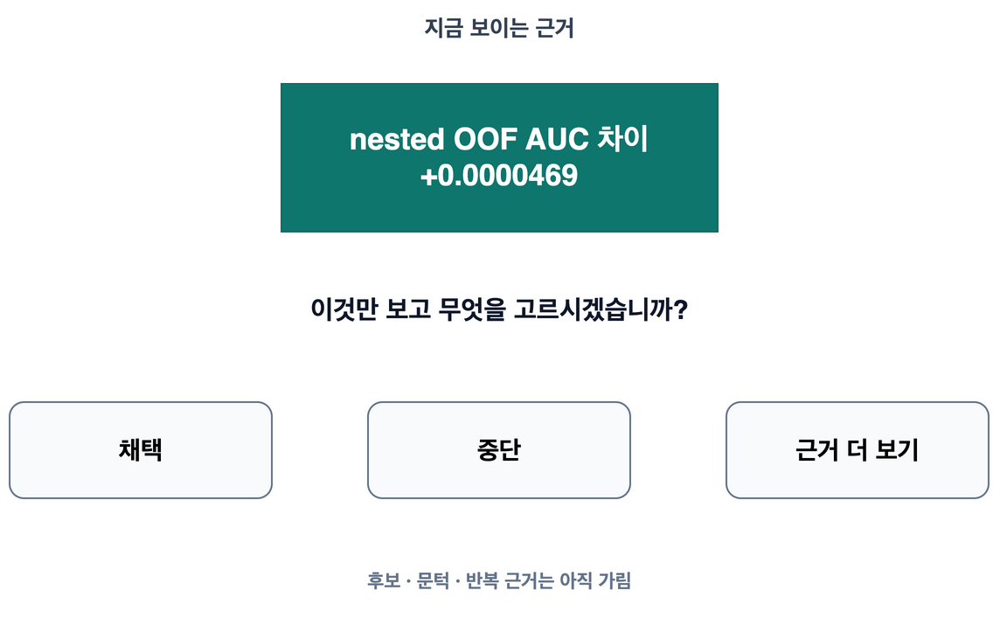

시각 자료 대체 설명: 현재 공개된 근거는 전체 nested OOF AUC 차이 `+0.0000469` 하나뿐이며, 청중은 `채택`, `중단`, `근거 더 보기` 중 하나를 고른다.

### 발표자 메모

- 손들기나 짧은 구두 투표로 세 선택 가운데 하나를 받습니다.
- 첫 답은 수치가 작아서가 아니라 후보, 문턱과 평가 절차를 아직 보지 않았기 때문에 `근거 더 보기`입니다.

### Confluence 보충 설명

정확한 차이는 현재 풀과 제안 풀의 직접 nested OOF AUC를 비교한 `+0.00004688661361140767`이다.
Public 점수나 Private 점수의 차이가 아니며, 전체 점추정의 부호만으로 채택하지 않았다.

근거: [결측 증강 전파 일괄 판정](https://github.com/tmheo/predicting-smartphone-addiction/blob/main/docs/research/missingness-propagation-batch/issue512/report.md), [기계 판독 판정 기록](https://github.com/tmheo/predicting-smartphone-addiction/blob/main/docs/research/missingness-propagation-batch/issue512/judgment.json)

## 화면 15. 바깥 fold 다섯 곳에서 모두 같은 방향이었습니다

제안 풀은 전체 점수뿐 아니라 바깥 fold 다섯 곳에서 모두 양의 차이를 보였습니다.

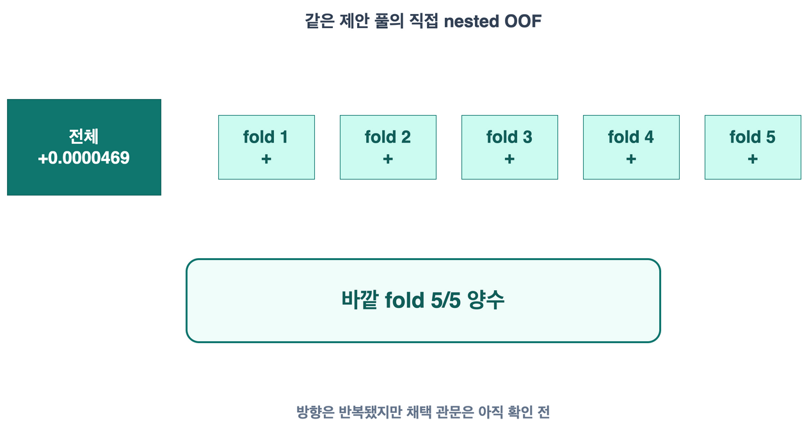

시각 자료 대체 설명: 전체 nested OOF AUC 차이 `+0.0000469`와 함께 바깥 fold 다섯 곳의 차이가 모두 양수로 표시되어 `5/5 양수`라는 반복 근거가 드러난다.

### 발표자 메모

- 다섯 값은 독립된 새 대회 다섯 번이 아니라 고정한 바깥 fold에서 방향이 반복됐다는 뜻입니다.
- 반복 방향을 확인한 뒤에도 결과를 보기 전에 채택 조건을 정했는지 한 번 더 묻습니다.

### Confluence 보충 설명

발표 표기의 바깥 fold 1부터 5는 기계 판독 기록의 0부터 4에 대응하며, 직접 nested OOF AUC 차이는 각각 `+0.0000566500`, `+0.0000477462`, `+0.0000399849`, `+0.0000281048`, `+0.0000619473`이었다.
다섯 곳 모두 양수여서 분할 승수는 `5/5`였다.

근거: [직접 nested OOF 관문 기록](https://github.com/tmheo/predicting-smartphone-addiction/blob/main/docs/research/missingness-propagation-batch/issue512/direct-nested-gate.json), [결측 증강 전파 일괄 판정](https://github.com/tmheo/predicting-smartphone-addiction/blob/main/docs/research/missingness-propagation-batch/issue512/report.md)

## 화면 16. 사전에 고정한 관문을 통과해 채택했습니다

missingness augmentation은 후보와 판정 절차를 결과 전에 고정한 뒤 두 관문을 통과해 채택됐습니다.

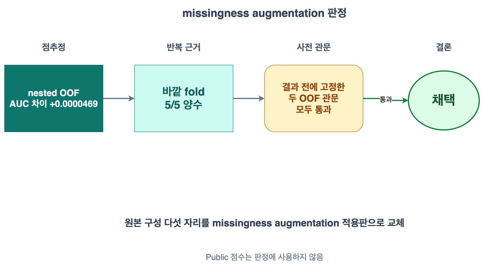

시각 자료 대체 설명: 점추정, 반복 근거와 사전에 고정한 관문을 차례로 확인하며, 마지막 열에만 초록 원 `채택` 결론이 표시된다.

### 발표자 메모

- missingness augmentation은 학습 자료의 관측값 일부를 추가로 가린 복제본을 보여 주어 값이 비어도 견디게 한 방법입니다.
- Public 점수가 아니라 선택과 평가를 분리한 두 OOF 관문을 모두 통과했기 때문에 채택했습니다.

### Confluence 보충 설명

결과 확인 전에 완결된 비교 짝과 후보 교체 단위, 중복 제한, 검색 절차와 두 채택 관문을 고정했다.
완결된 24개 비교 짝으로 1,658개 상태를 정확 채점한 뒤 원본 구성 다섯 자리를 missingness augmentation 적용판으로 바꿨다.
동결 OOF 조건부 절차 차이 `+0.000044152982`와 직접 nested OOF 차이 `+0.000046886614`가 모두 관문을 통과했다.

근거: [결측 증강 전파 일괄 판정](https://github.com/tmheo/predicting-smartphone-addiction/blob/main/docs/research/missingness-propagation-batch/issue512/report.md), [교정 종결 기록](https://github.com/tmheo/predicting-smartphone-addiction/issues/512#issuecomment-5472767484)

## 화면 17. 하나의 레시피, 여러 주방, 하나의 검수대

같은 실험 명세를 여러 실행 장소에서 실행하고 결과는 로컬의 한 검수 절차로 모았습니다.

시각 자료 대체 설명: 하나의 고정된 실험 명세가 역할이 다른 다섯 실행 장소로 전달되고, 각 장소에서 나온 실행 기록 묶음이 중앙의 로컬 검수대로 모인다.

### 발표자 메모

- `하나의 레시피, 여러 주방, 하나의 검수대`라는 비유는 이 화면에서만 사용합니다.
- 모든 장소에서 같은 실험을 복제했다는 뜻이 아니라, 역할이 다른 장소들이 같은 실행 명세와 중앙 검수 경계를 공유했다는 뜻입니다.

### Confluence 보충 설명

로컬은 개발, 소규모 실행, 중앙 반입, 재채점, 판정과 최종 조립을 맡았다.
Kaggle CPU는 고정 CPU 비교 짝의 병렬 실행, Kaggle GPU는 초반 정식 실행과 후반 호환성 확인 및 진단, Vast.ai는 주 GPU 실행, Runpod은 예비 GPU 실행을 맡았다.
한 비교 짝의 대조군과 후보군은 같은 공급자와 같은 실행 환경 등급에서 완결했다.

근거: [발표용 실행 환경과 전환 사건 근거](https://github.com/tmheo/predicting-smartphone-addiction/blob/main/docs/research/presentation-environment-evidence.md)

## 화면 18. 모든 결과는 실행 기록 묶음으로 다시 검수됐습니다

원격 결과는 실행 기록 묶음으로 회수해 해시와 OOF를 로컬에서 다시 검사한 뒤에만 판정에 사용했습니다.

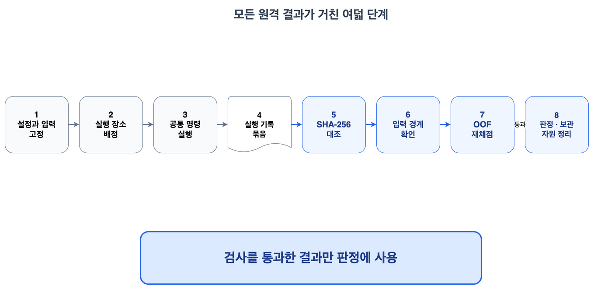

시각 자료 대체 설명: 결과 확인 전 설정과 입력을 고정한 뒤 실행 장소에서 공통 명령을 실행하고, 실행 기록 묶음을 SHA-256으로 대조해 로컬에서 입력 경계와 OOF를 다시 검사한 결과만 판정에 사용한다.

### 발표자 메모

- 실행 장소에서 로컬로 돌아온 것은 모델 자체가 아니라 설정, 예측, 지표와 진단을 함께 담은 실행 기록 묶음입니다.
- 원격에서 보고한 점수를 그대로 믿지 않고 로컬의 입력과 OOF로 다시 계산했습니다.

### Confluence 보충 설명

묶음 반입은 입력 해시, 출처 커밋, 커밋 시점 설정과 묶음 설정의 일치, 깨끗한 코드 상태와 주장 지표의 재채점을 검사한다.
검사를 통과한 실행만 로컬 실행 저장소의 정상 실행으로 재생하며, 실패한 묶음은 격리하고 필요한 실행을 다시 수행한다.
원격 계산 자원과 저장 공간은 결과 회수 뒤 삭제하고 과금 중지를 확인한다.

근거: [실행 기록 묶음 반입 구현](https://github.com/tmheo/predicting-smartphone-addiction/blob/main/src/pipeline/bundle.py), [발표용 실행 환경과 전환 사건 근거](https://github.com/tmheo/predicting-smartphone-addiction/blob/main/docs/research/presentation-environment-evidence.md)

## 화면 19. 휴식 동안 세 질문을 남깁니다

전반은 무엇을 예측했고, 어떻게 평가했으며, 실험 결과를 어떻게 믿었는지의 세 질문으로 정리됩니다.

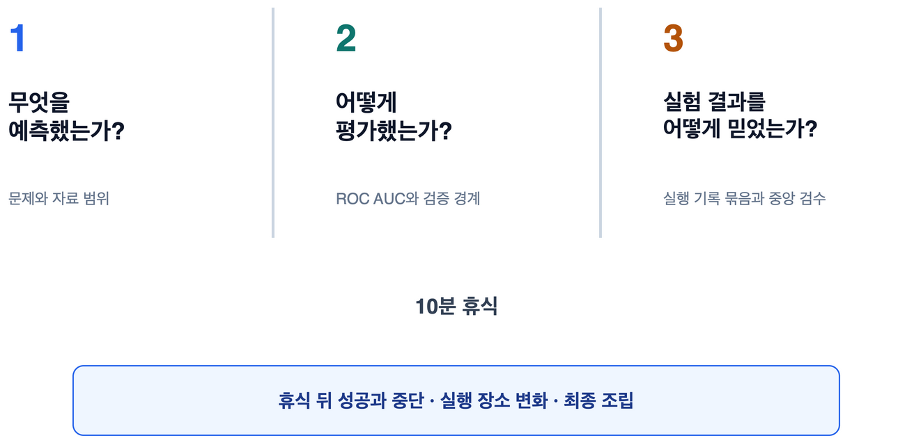

시각 자료 대체 설명: 전반의 문제, 평가와 신뢰를 회수하는 세 질문을 크게 남기고, 10분 휴식 뒤 성공과 중단, 실행 장소 변화와 최종 조립으로 이어진다고 예고한다.

### 발표자 메모

- 새 사실은 설명하지 않고 10분 휴식 뒤 다시 시작할 시각만 안내합니다.
- 후반에는 잘된 실험과 일찍 멈춘 실험, 실행 장소의 변화와 최종 314개 예측 열 조립을 다룬다고 예고합니다.

### Confluence 보충 설명

첫 질문은 화면 03의 문제와 자료 범위, 두 번째는 화면 04부터 16까지의 ROC AUC와 검증 경계, 세 번째는 화면 17과 18의 실행 체계로 돌아간다.
이 화면은 새 근거를 추가하지 않고 앞선 화면 묶음을 회수한다.

근거: [2시간 사내 대회 회고 이야기 흐름 설계서](https://github.com/tmheo/predicting-smartphone-addiction/blob/main/docs/presentation/s6e8-retrospective-story-flow.md)

## 화면 21. RealMLP 자료형 결함 수정이 +0.00461을 만들었습니다

가장 큰 단일 구성 상승은 새 복잡성을 더한 것이 아니라 입력 값의 의미와 구현을 맞춘 결과였습니다.

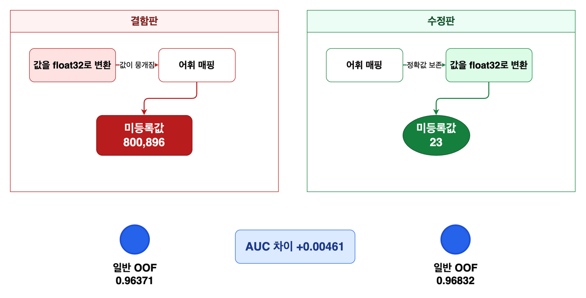

시각 자료 대체 설명: 어휘 매핑 전에 값을 `float32`로 바꾸던 순서를 고치자 검증 미등록값이 `800,896`개에서 `23`개로 줄었고, 3시드 평균 OOF AUC가 `0.9637131967`에서 `0.9683223458`로 회복됐다.

### 발표자 메모

- 화면에서는 `+0.00461`만 읽고 미등록값 수는 왜 영향이 컸는지 질문이 나올 때 설명합니다.
- 새로운 모델을 추가한 결과가 아니라 같은 RealMLP 이식판의 자료형 변환 순서 하나를 고친 짝비교입니다.

### Confluence 보충 설명

수정판은 어휘 매핑과 분위 구간 변환을 끝낸 뒤 `float32` 변환을 적용한다.
결함판과 수정판은 이 차이 외의 설정을 고정했고 같은 실행 환경 등급에서 난수 42, 43, 44를 짝지어 비교했다.

근거: [exp124 설정](https://github.com/tmheo/predicting-smartphone-addiction/blob/main/configs/exp124_realmlp_dtype_fix.yaml), [자료형 정합 복원 판정](https://github.com/tmheo/predicting-smartphone-addiction/issues/243#issuecomment-5343200265)

## 화면 23. 근거가 약한 탐색은 일찍 멈췄습니다

후보 수나 새로움이 아니라 미리 정한 1차 기준, 반복 근거와 전체 결합 기여로 탐색을 중단했습니다.

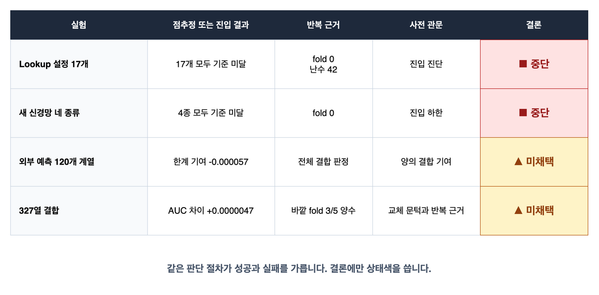

시각 자료 대체 설명: Lookup 설정 17개와 새 신경망 네 종류는 첫 fold의 진입 기준을 넘지 못해 중단했고, 외부 예측 120개 계열과 327열 결합은 전체 결합 기여 또는 반복 근거가 부족해 미채택했다.

### 발표자 메모

- Lookup 설정과 새 신경망은 fold 0 진입 진단에서 멈췄으므로 전체 5분할 결과처럼 말하지 않습니다.
- `중단`은 더 큰 실행을 열지 않았다는 뜻이고 `미채택`은 완성된 비교를 최종 구성에 넣지 않았다는 뜻입니다.

### Confluence 보충 설명

Lookup-Transformer 설정 17개는 학습률, 학습률 일정과 최적화 알고리즘을 바꿨지만 fold 0 기준보다 모두 낮았다.
약한 외부 예측 120개 계열의 한계 기여는 `-0.000057`이었고, 327열 결합은 점추정이 `+0.0000047` 높았지만 바깥 fold 다섯 곳 중 세 곳에서만 같은 방향이라 사전 관문을 넘지 못했다.

근거: [Lookup-Transformer 제한 탐색 판정](https://github.com/tmheo/predicting-smartphone-addiction/issues/160#issuecomment-5308772959), [확장 사다리 기록](https://github.com/tmheo/predicting-smartphone-addiction/blob/main/docs/research/extended-stack-ladder-2.md), [327열 판정 기록](https://github.com/tmheo/predicting-smartphone-addiction/blob/main/docs/research/extended-stack-ext327/issue526/comparison.json)

## 화면 24. 실행 장소가 달라도 판정은 한 검수대로 모였습니다

실행 장소마다 역할은 달랐지만 정식 판정은 모두 로컬의 같은 반입과 재채점 절차를 통과했습니다.

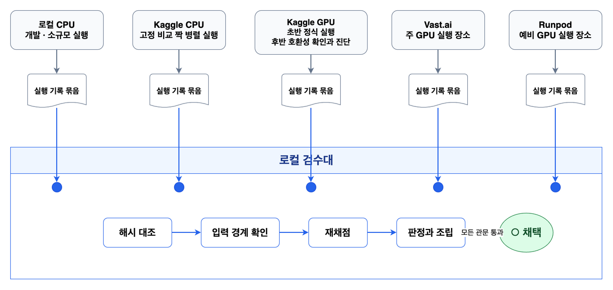

시각 자료 대체 설명: 다섯 실행 장소에서 만든 실행 기록 묶음이 로컬 검수대로 모이며, 로컬은 해시 대조, 입력 경계 확인, 재채점과 최종 판정을 맡는다.

### 발표자 메모

- 로컬은 개발과 소규모 실행뿐 아니라 결과 반입, 재채점, 판정과 최종 조립을 맡았습니다.
- 장소 자체를 성공이나 실패로 칠하지 않고 모든 관문을 통과한 결론에만 채택 표식을 붙입니다.

### Confluence 보충 설명

한 비교 짝은 같은 공급자와 같은 실행 환경 등급에 묶었다.
서로 다른 공급자에서 완결된 비교 짝은 각각 같은 계약을 통과한 뒤에만 한 판정 입력에 함께 넣었으며, 한쪽 실행끼리 이어 붙이지 않았다.

근거: [발표용 실행 환경과 전환 사건 근거](https://github.com/tmheo/predicting-smartphone-addiction/blob/main/docs/research/presentation-environment-evidence.md)

## 화면 31. 314개 예측 열은 검수해 남긴 조립 재료입니다

자체 36개와 외부 278개의 예측 열을 무결성과 nested OOF 판정으로 검수해 최종 314열 조립 입력으로 남겼습니다.

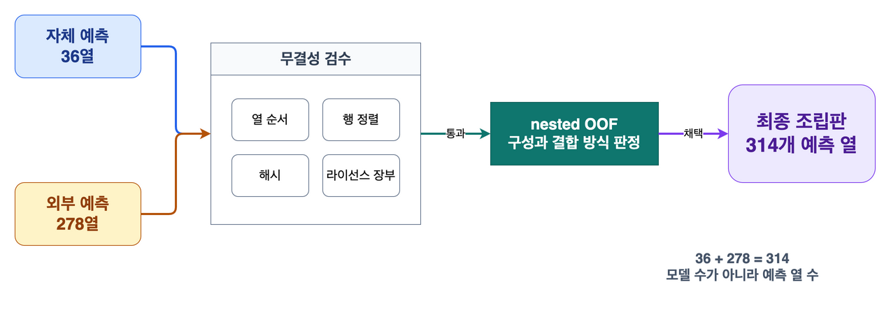

시각 자료 대체 설명: 자체 예측 36열과 외부 예측 278열이 열 순서, 행 정렬, 해시와 라이선스 장부 검수 및 nested OOF 판정을 지나 최종 314열 결합 입력이 된다.

### 발표자 메모

- 314개는 모델 수가 아니라 출처별 예측값 열 수입니다.
- 외부 278개를 모두 우리가 다시 학습했다는 뜻이 아니며, 자체 36개만 전체 자료로 다시 학습했습니다.

### Confluence 보충 설명

외부 구성원의 분할 근거와 라이선스 수준은 완전히 같지 않다.
외부 278개 가운데 64개는 사용 한정으로 분류했고, 이 한계는 최종 구성원 장부와 기술 근거 부록에 남겼다.

근거: [우리 최종 해법과 제출 계보 복원](https://github.com/tmheo/predicting-smartphone-addiction/blob/main/docs/research/s6e8-our-final-solution.md), [314열 재조립 판정](https://github.com/tmheo/predicting-smartphone-addiction/blob/main/docs/research/extended-stack-pool-reassembly/issue513/report.md)

## 화면 35. 작게 검증하고, 다르게 틀리는 예측을 모으고, 같은 검수대로 조립합니다

작은 검증, 서로 다른 오차와 공통 검수대라는 세 원칙이 이번 결과를 설명합니다.

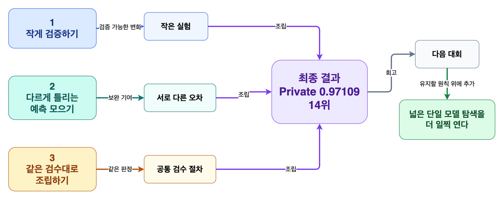

시각 자료 대체 설명: 작은 검증, 서로 다른 오차, 공통 검수대라는 세 조각이 최종 14위 결과로 모이며, 다음 대회에서는 같은 원칙 위에서 넓은 단일 모델 탐색을 더 일찍 시작한다.

### 발표자 메모

- 새로운 수치는 덧붙이지 않고 앞에서 본 RealMLP 수정, Lookup-Transformer, 실행 기록 묶음과 314열 조립을 한 문장씩 회수합니다.
- 마지막 문장은 질의응답을 여는 질문으로 바꿔 읽습니다.

### Confluence 보충 설명

작은 검증은 결과를 보기 전에 비교와 중단 관문을 고정하는 습관을 뜻한다.
서로 다른 오차는 단독 점수만 높이는 것이 아니라 기존 예측과 결합했을 때 보완하는 예측을 남긴다는 뜻이며, 공통 검수대는 실행 장소와 상관없이 같은 무결성 및 재채점 절차를 적용한다는 뜻이다.

근거: [발표 제작 장부](https://github.com/tmheo/predicting-smartphone-addiction/blob/main/docs/presentation/s6e8-retrospective-production-ledger.md)
