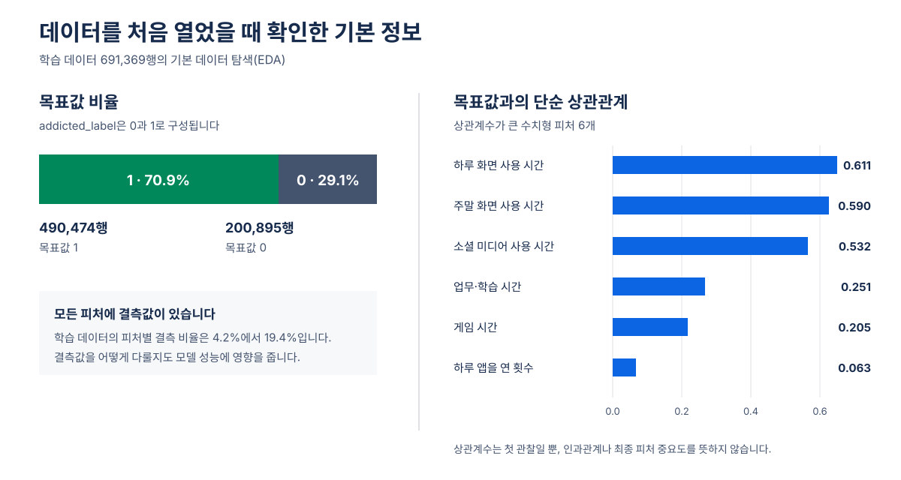
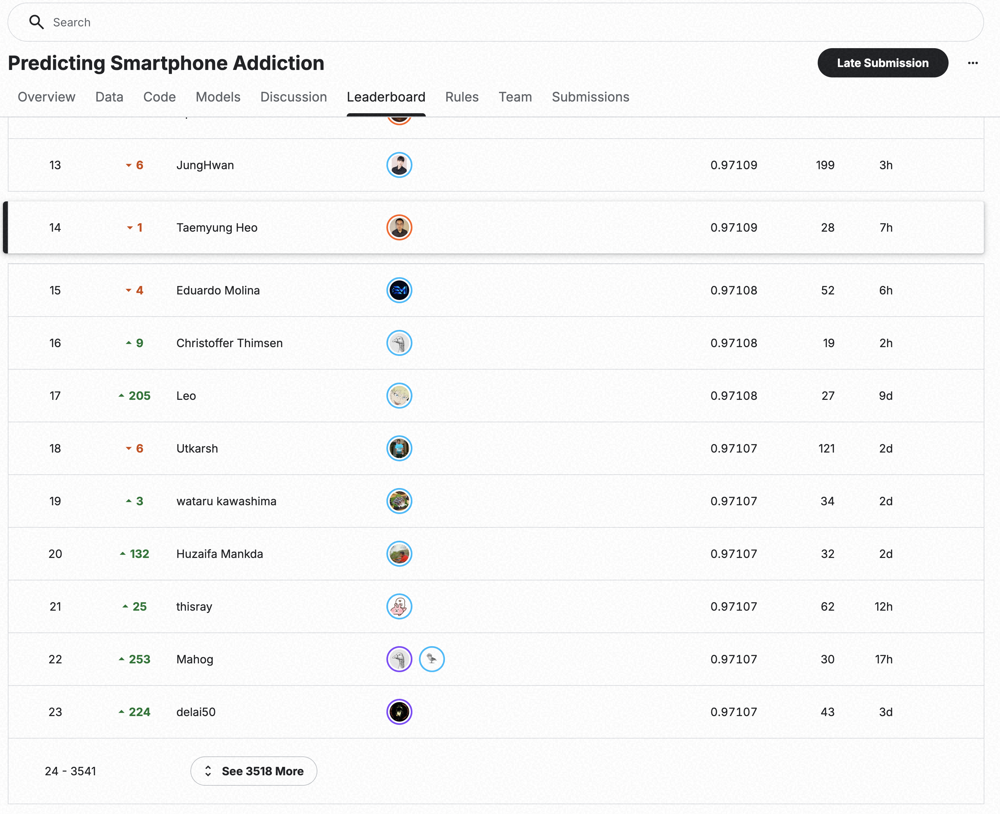

> 로컬 검토용 대표 구간입니다.
> 최종 본문은 90분, 질의응답은 30분으로 구성하며 이 시제품은 Confluence에 게시하지 않습니다.

# Kaggle S6E8 Predicting Smartphone Addiction 대회 후기

12개 생활 습관 피처로 스마트폰 중독 위험의 순서를 예측했습니다.
첫 기준 점수에서 최종 14위까지, 무엇을 시도했고 어떤 실패를 남겼으며 판단 방식이 어떻게 바뀌었는지를 시간순으로 돌아봅니다.

## 먼저, 어떤 문제를 푼 대회였을까요?

Kaggle Playground Series S6E8은 생활 습관 정보를 보고 스마트폰 중독 여부를 뜻하는 `addicted_label`의 확률을 예측하는 이진 분류 대회였습니다.
학습 데이터에는 정답이 있고, 테스트 데이터에는 정답이 없어 참가자가 예측 확률을 제출합니다.

모델이 출력한 값은 사람마다 0에서 1 사이의 위험 점수입니다.
ROC AUC는 목표값이 1인 사람에게 목표값이 0인 사람보다 더 높은 점수를 주는 순서를 얼마나 잘 맞추는지 평가합니다.
실제 개인을 진단하는 도구가 아니라 합성 데이터 안에서 예측 순위를 겨루는 문제입니다.

- 학습 데이터: 691,369행
- 테스트 데이터: 296,302행
- 입력 피처: 수치형 9개, 카테고리형 3개
- 평가 방식: ROC AUC

### 모델에 주어진 12개 피처

식별자와 목표값을 제외하면 아래 12개 피처만 주어졌습니다.

| 종류 | 의미 | 피처 이름 |
| --- | --- | --- |
| 수치형 | 나이 | `age` |
| 수치형 | 하루 화면 사용 시간 | `daily_screen_time_hours` |
| 수치형 | 소셜 미디어 사용 시간 | `social_media_hours` |
| 수치형 | 게임 시간 | `gaming_hours` |
| 수치형 | 업무·학습 시간 | `work_study_hours` |
| 수치형 | 수면 시간 | `sleep_hours` |
| 수치형 | 하루 알림 수 | `notifications_per_day` |
| 수치형 | 하루 앱을 연 횟수 | `app_opens_per_day` |
| 수치형 | 주말 화면 사용 시간 | `weekend_screen_time` |
| 카테고리형 | 성별 | `gender` |
| 카테고리형 | 스트레스 수준 | `stress_level` |
| 카테고리형 | 학업·업무 영향 여부 | `academic_work_impact` |

학습 데이터 원본을 기준으로 목표값 비율, 결측값, 수치형 피처와 목표값의 단순 상관관계를 확인하는 기본 데이터 탐색(EDA)을 했습니다.

## 행동 피처의 의미만 읽어서는 부족한 합성 데이터 대회였습니다

Kaggle Playground Series는 표 형식 데이터를 주제로 매달 열리는 대회입니다.
이번 대회에 제공된 약 98만 행은 실제 개인을 직접 관찰해 모은 데이터가 아니라, 공개된 Smartphone Addiction Prediction Dataset에서 영감을 받아 합성한 데이터였습니다.

따라서 화면 사용 시간이나 수면 시간처럼 피처가 현실에서 무엇을 뜻하는지 이해하는 일과 함께, 원본 데이터의 특성이 합성 과정에서 어떤 통계적 흔적으로 남았는지도 살펴봐야 했습니다.

### 합성 데이터를 읽는 두 가지 관점

| 관점 | 확인할 내용 |
| --- | --- |
| 행동 정보 | 화면 사용, 소셜 미디어, 게임, 수면, 스트레스가 중독 여부와 어떤 관계를 보이는지 확인합니다. |
| 합성 과정 | 특정 수치가 반복되는 값 눈금, 원본 데이터와 달라진 분포, 결측값 구조와 피처 사이의 계산 관계를 확인합니다. |

이번 데이터에서는 수치형 피처가 연속적으로 퍼지지 않고 정해진 값에 반복해서 모였고, 같은 수치에서 목표값 비율도 안정적으로 반복됐습니다.
하루 화면 사용 시간에서 소셜 미디어, 게임, 업무·학습 시간을 뺀 차이도 새로운 신호가 됐습니다.
이런 패턴은 사람 행동의 보편적인 법칙이라기보다 원본 데이터가 합성 데이터로 바뀌는 과정에서 남은 흔적으로 해석했습니다.

## 이 문제에서 최종 14위를 기록했습니다

- 최종 순위: 14위
- Private 점수: `0.97109`
- 최종 앙상블: 자체 예측 36개 + 공개 예측 278개

파란 선과 초록 선은 각각 같은 평가 방식의 대표 이정표만 시간순으로 이었습니다.
내부 검증 점수는 학습 데이터로 계산한 실험용 점수이고, Public과 Private 점수는 테스트 데이터로 계산한 공식 대회 점수이므로 그래프에서 구분해 표시했습니다.
작은 점수 차이가 보이도록 세로축 전체 범위가 아니라 각 점수가 모인 구간만 표시했습니다.

## 출발점은 OOF AUC 0.96270이었습니다

첫 모델은 12개 원본 피처를 그대로 사용한 LightGBM(LGB) 베이스라인 모델이었습니다.
OOF AUC `0.96270`을 출발점으로 정한 뒤, 같은 검증 방식에서 현재 가장 좋은 결과와 비교하며 피처와 모델을 하나씩 바꿔 갔습니다.

### 베이스라인에서 최종 앙상블까지 탐색 범위를 넓혔습니다

모델만 바꾼 것이 아니라, 같은 피처를 표현하는 방법부터 여러 예측을 앙상블하는 방법까지 차례로 실험했습니다.

1. **LightGBM 베이스라인:** 원본 피처 12개, OOF AUC `0.96270`
2. **피처 엔지니어링:** 수치형과 카테고리형, 잔차와 결측값 보완
3. **트리 모델 확장:** LightGBM에서 XGBoost와 CatBoost로 확장
4. **NN 모델 확장:** Lookup-Transformer, TabM, RealMLP, TabCNN, TabPFN-3
5. **앙상블:** 서로 다르게 틀리는 예측을 골라 함께 사용

이 순서는 앞선 모델을 버리고 다음 모델로 교체했다는 뜻이 아닙니다.
이전 예측을 남겨 둔 채 새 피처와 모델을 비교했고, 단독 점수가 높거나 기존 예측의 약점을 보완한 결과를 최종 앙상블 후보로 모았습니다.

## Claude Code와 Codex가 조사와 실험의 폭을 넓혔습니다

예전에 코딩 에이전트 없이 Kaggle에 참가했을 때는 자료를 찾고, 코드를 옮기고, 실험을 실행하고, 결과를 정리하는 일을 대부분 직접 반복했습니다.
이번에는 AI 코딩 에이전트인 Claude Code와 Codex에 이 반복 작업을 맡겨 훨씬 적은 시간과 노력으로 더 넓은 범위를 조사하고 더 많은 실험을 진행할 수 있었습니다.

| 조사한 영역 | 실제로 한 일 |
| --- | --- |
| 이전 대회 상위 솔루션 | 비슷한 11개 대회를 추리고 상위권 후기 12건에서 반복되는 전략을 정리했습니다. |
| 글과 기술 블로그 | Playground Series 관련 글과 기술 블로그 14건을 읽고 이번 대회에 적용할 가설을 골랐습니다. |
| 대회 Discussion | 초기 25개 글을 모두 읽고 대회가 진행되는 동안 새 글과 댓글을 계속 반영했습니다. |
| 공개 Code | 득표가 있던 공개 Code 267개를 목록화하고, 상위 37개는 코드 셀까지 읽어 검증할 후보를 찾았습니다. |

조사 결과는 `자료 찾기 → 주장과 코드 확인 → 실험 후보로 만들기 → 같은 검증 방식에서 판단` 순서로 실제 실험에 연결했습니다.

공개된 방법이나 코드를 그대로 믿고 복사한 것은 아닙니다.
검증을 통과한 구현과 공개 예측만 출처와 판본을 기록해 실험에 활용했습니다.
코딩 에이전트가 조사와 구현, 실행, 기록을 빠르게 반복했고, 저는 어떤 질문을 검증할지와 어떤 결과를 채택할지를 정했습니다.

이 협업 방식 덕분에 사람이 손으로만 진행할 때보다 훨씬 방대한 후보를 비교할 수 있었습니다.
반복 작업에 쓰는 시간을 줄이고 가설과 검증 결과를 판단하는 데 집중한 것이 455개 실험과 최종 14위까지 가는 데 크게 기여했습니다.

처음 크게 오른 순간은 복잡한 모델을 새로 추가했을 때가 아니었습니다.
같은 피처를 수치형으로 유지하면서 카테고리 형식으로도 함께 보여 주자, 내부 단일 구성 점수가 `0.96605`로 올랐습니다.

반대로 숫자를 모두 카테고리형 피처로만 바꾸자 AUC 차이가 `-0.00417`이었습니다.
점수가 오른 실험만 보면 계속 성공한 것처럼 보입니다.
실제로는 점수가 떨어지거나 기준에 못 미친 여러 실험 결과를 보고, 같은 방향의 시도를 멈추거나 다음 실험을 정했습니다.

> 윗선은 그 시점까지 확인한 단일 구성의 최고점을 잇습니다.
> 선 아래 상자는 최고점을 바꾸지는 못했지만 이후 판단에 영향을 준 사건입니다.
> 이 선은 대회 여정을 설명하기 위한 것이며, 개별 실험의 채택 근거를 대신하지 않습니다.

## 새 아이디어를 더한 것보다 구현 오류를 고친 뒤 점수가 더 크게 올랐습니다

RealMLP를 처음 옮겼을 때 기대보다 낮은 점수가 나왔습니다.
모델의 한계라고 결론 내리기 전에 데이터가 실제로 어떻게 전달되는지 확인했고, 카테고리형 피처의 값을 내부 번호로 바꾸기 전에 자료형이 달라지면서 학습 때 없던 값으로 잘못 처리되는 데이터 칸이 대량으로 생기는 문제를 찾았습니다.

| | 수정 전 | 자료형 변환 순서 수정 후 |
| --- | ---: | ---: |
| 검증 데이터에서 학습 때 없던 값으로 처리된 피처 칸 | 800,896건 | 23건 |
| 3시드 평균 OOF AUC | `0.96371` | `0.96832` |
| AUC 차이 | | `+0.00461` |

이 숫자는 사람 수나 서로 다른 값의 개수가 아닙니다.
검증 데이터 한 묶음에서 12개 카테고리형 피처를 변환하면서, 학습 때 없던 값으로 처리된 데이터 칸을 모두 센 결과입니다.

이때부터 새 구성을 더 많이 찾는 일과 이미 만든 구성이 의도대로 작동하는지 확인하는 일을 같은 무게로 보기 시작했습니다.
대회 후반의 작은 개선들을 믿을 수 있었던 바탕도 이 구분이었습니다.

## 실험이 늘자 기록은 판단을 돕는 장치가 됐습니다

실험이 늘어나자 무엇을 바꿨는지 기억만으로 따라갈 수 없었습니다.
그래서 실험 조건과 결과를 MLflow 한곳에 모았습니다.

MLflow에는 이번 대회에서 진행한 455개 실험 기록이 남아 있습니다.
이 화면은 이야기의 중심이 아니라 실험을 다시 찾기 위한 보조 장치입니다.

다만 MLflow 화면의 순위가 결정을 내리지는 않았습니다.
같은 자료와 같은 분할에서 비교할 수 있는 결과만 판단에 사용했고, 채택과 중단의 이유는 별도 기록으로 남겼습니다.

## 마지막에는 한 점보다 서로 다른 오답을 모았습니다

단일 구성의 최고점이 `0.96941`에 이른 뒤에는 혼자 높은 점수를 내는지만 보지 않았습니다.
기존 예측과 다르게 틀리는지도 함께 확인했습니다.

앙상블을 평가할 때는 데이터를 다섯 부분으로 나눴습니다.
한 부분은 선택에 쓰지 않고 남겨 둔 채, 나머지 네 부분에서 어떤 예측을 앙상블에 넣고 어떻게 합칠지 정한 다음 남겨 둔 한 부분에서 성능을 확인했습니다.
평가할 부분을 바꿔 가며 이 과정을 다섯 번 반복해 계산한 점수가 중첩 OOF AUC입니다.

이렇게 선택 과정에서 보지 않은 데이터로 평가해, 새 예측을 앙상블에 넣었을 때 실제로 점수가 높아지는지 확인했습니다.

자체 예측 35개를 합친 중첩 OOF AUC `0.96981`에서 출발해 검증한 공개 예측을 더했고, 도움이 되지 않은 120개는 다시 뺐습니다.
마지막에는 자체 모델에서 만든 예측 36개와 공개된 예측 278개를 합쳐 내부 결합 점수 `0.97038`을 만들었습니다.

여기서 314개는 서로 완전히 다른 모델 314개를 뜻하지 않습니다.
같은 모델 계열에서 설정을 바꿔 얻은 결과와 공개된 예측도 각각 하나의 예측 결과로 셌습니다.

### Public과 Private 점수는 이렇게 계산됩니다

- **Public 점수 `0.97135`:** 대회가 진행되는 동안 테스트 데이터의 20%로 계산해 공개합니다.
- **Private 점수 `0.97109`:** 대회가 끝난 뒤 나머지 80%로 계산하며, 이 점수로 최종 순위가 정해집니다.

대회 중 공개된 일부 데이터의 점수에만 맞춘 모델이 아니라, 처음 보는 데이터에서도 성능을 유지하는지 확인하기 위해 두 부분으로 나눠 채점합니다.
즉, 모델의 일반화 성능을 확인하는 장치입니다.
대회 중에는 Public `0.97135`가 공개됐고, 종료 후 Private `0.97109`를 기준으로 최종 14위가 정해졌습니다.

## 점수는 결과였고, 남은 것은 판단 방식이었습니다

돌아보면 점수는 큰 도약 몇 번과 수많은 중단 사이에서 조금씩 올랐습니다.
작게 바꾸고, 같은 기준에서 비교하고, 실패도 다음 선택의 근거로 남기는 방식이 있었기 때문에 마지막 작은 차이까지 믿고 조립할 수 있었습니다.

## 이 대표 구간이 들어갈 90분 본문

최종 글은 아래 다섯 막을 시간순으로 전개합니다.
코딩 에이전트 활용은 조사에서 실험으로 이어지는 흐름으로 설명하고, MLflow는 455개 실험을 관리한 사례로만 짧게 다룹니다.

1. 문제, 합성 데이터와 기본 탐색, 15분
2. 결과와 오늘 이야기, 8분
3. 믿을 수 있는 실험 만들기, 17분
4. 코딩 에이전트 활용, 피처 엔지니어링과 모델 확장, 30분
5. 조립, 최종 결과와 남은 교훈, 20분
