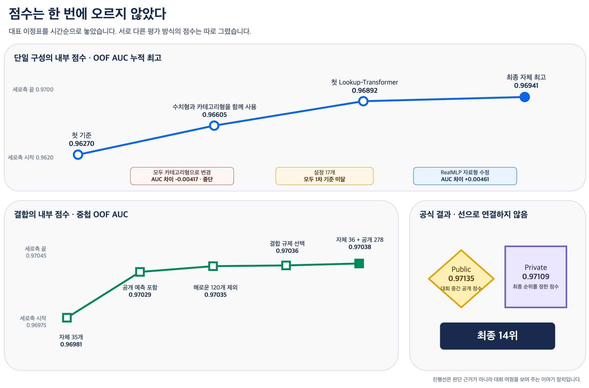
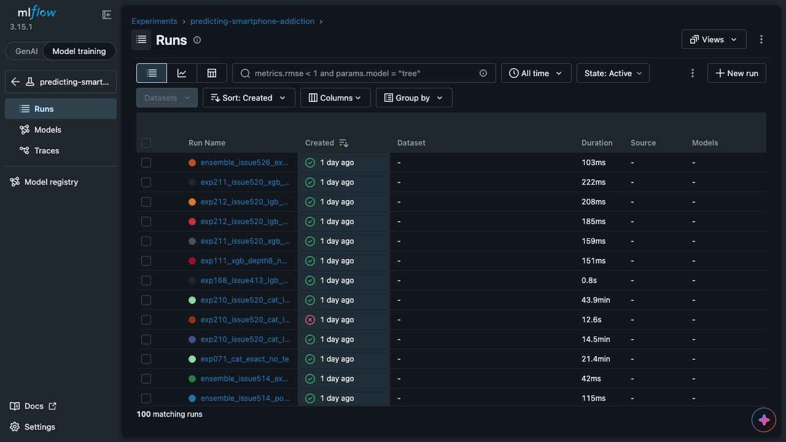
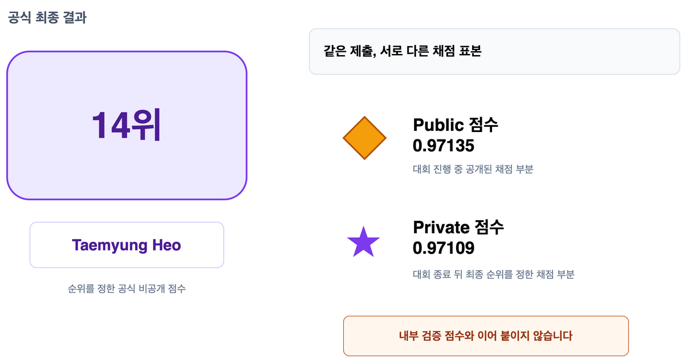

> 로컬 검토용 대표 구간입니다.
> 최종 본문은 90분, 질의응답은 30분으로 구성하며 이 시제품은 Confluence에 게시하지 않습니다.

# Kaggle S6E8 Predicting Smartphone Addiction 대회 후기

12개 생활 습관 피처로 스마트폰 중독 위험의 순서를 예측했습니다.
첫 기준 점수에서 최종 14위까지, 무엇을 시도했고 어떤 실패를 남겼으며 판단 방식이 어떻게 바뀌었는지를 시간순으로 돌아봅니다.

- 최종 순위: 14위
- Private 점수: `0.97109`
- 최종 결합: 자체 예측 36개 + 공개 예측 278개

파란 선과 초록 선은 각각 같은 평가 방식의 대표 이정표만 시간순으로 이었습니다.
Public과 Private 점수는 다른 자료를 채점한 값이므로 선에 붙이지 않았습니다.
작은 점수 차이가 보이도록 세로축 전체 범위가 아니라 각 점수가 모인 구간만 표시했습니다.

## 출발점은 OOF AUC 0.96270이었습니다

첫 기준 실행은 12개 원본 피처를 그대로 사용했습니다.
점수 자체보다 중요한 목적은 이후 실험이 돌아올 비교 기준을 하나 세우는 일이었습니다.

처음 크게 오른 순간은 복잡한 모형을 새로 붙였을 때가 아니었습니다.
같은 피처를 수치형으로 유지하면서 카테고리 형식으로도 함께 보여 주자, 내부 단일 구성 점수가 `0.96605`로 올랐습니다.

반대로 숫자를 모두 카테고리형 피처로만 바꾸자 AUC 차이가 `-0.00417`이었습니다.
점수가 오른 실험만 보면 계속 성공한 것처럼 보입니다.
실제로는 점수가 떨어지거나 기준에 못 미친 여러 실험 결과를 보고, 같은 방향의 시도를 멈추거나 다음 실험을 정했습니다.

> 윗선은 그 시점까지 확인한 단일 구성의 최고점을 잇습니다.
> 선 아래 상자는 최고점을 바꾸지는 못했지만 이후 판단에 영향을 준 사건입니다.
> 이 선은 대회 여정을 설명하기 위한 것이며, 개별 실험의 채택 근거를 대신하지 않습니다.

## 가장 큰 회복은 새 아이디어가 아니라 구현을 바로잡는 데서 나왔습니다

RealMLP를 처음 옮겼을 때 기대보다 낮은 점수가 나왔습니다.
모형의 한계라고 결론 내리기 전에 자료가 실제로 어떻게 전달되는지 확인했고, 카테고리형 피처의 값을 내부 번호로 바꾸기 전에 자료형이 달라지면서 값이 대량으로 미등록 처리되는 문제를 찾았습니다.

| | 수정 전 | 자료형 변환 순서 수정 후 |
| --- | ---: | ---: |
| 검증 자료에서 미등록 처리된 값 | 800,896개 | 23개 |
| 3시드 평균 OOF AUC | `0.96371` | `0.96832` |
| AUC 차이 | | `+0.00461` |

이때부터 새 구성을 더 많이 찾는 일과 이미 만든 구성이 의도대로 작동하는지 확인하는 일을 같은 무게로 보기 시작했습니다.
대회 후반의 작은 개선들을 믿을 수 있었던 바탕도 이 구분이었습니다.

## 실험이 늘자 기록은 판단을 돕는 장치가 됐습니다

실행 장소와 모형이 늘어나자 무엇을 바꿨는지 기억만으로 따라갈 수 없었습니다.
그래서 실행 조건과 결과를 MLflow 한곳에 모았습니다.

이번 대회의 중앙 기록에는 455개 실행이 남아 있습니다.
이 화면은 이야기의 중심이 아니라 실험을 다시 찾기 위한 보조 장치입니다.

다만 MLflow 화면의 순위가 결정을 내리지는 않았습니다.
같은 자료와 같은 분할에서 비교할 수 있는 결과만 판단에 사용했고, 채택과 중단의 이유는 별도 기록으로 남겼습니다.

## 마지막에는 한 점보다 서로 다른 오답을 모았습니다

단일 구성의 최고점이 `0.96941`에 이른 뒤에는 혼자 높은 점수를 내는지만 보지 않았습니다.
기존 예측과 다르게 틀리는지, 함께 넣었을 때 봉인한 자료에서도 실제로 도움이 되는지를 따로 확인했습니다.

자체 예측 35개를 합친 중첩 OOF AUC `0.96981`에서 출발해 검증한 공개 예측을 더했고, 도움이 되지 않은 120개는 다시 뺐습니다.
마지막에는 자체 모형에서 만든 예측 36개와 공개된 예측 278개를 합쳐 내부 결합 점수 `0.97038`을 만들었습니다.

여기서 314개는 서로 완전히 다른 모델 314개를 뜻하지 않습니다.
같은 모델 계열에서 설정을 바꿔 얻은 결과와 공개된 예측도 각각 하나의 예측 결과로 셌습니다.

최종 제출은 Public `0.97135`, Private `0.97109`로 14위를 기록했습니다.
두 공식 점수는 내부 검증선의 다음 점이 아니라 대회 결과를 확인하는 별도 표식입니다.

## 점수는 결과였고, 남은 것은 판단 방식이었습니다

돌아보면 점수는 큰 도약 몇 번과 수많은 중단 사이에서 조금씩 올랐습니다.
작게 바꾸고, 같은 기준에서 비교하고, 실패도 다음 선택의 근거로 남기는 방식이 있었기 때문에 마지막 작은 차이까지 믿고 조립할 수 있었습니다.

## 이 대표 구간이 들어갈 90분 본문

최종 글은 아래 다섯 막을 시간순으로 전개합니다.
MLflow는 네 번째 막에서 기록 방식의 사례로만 짧게 다룹니다.

1. 결과와 오늘 이야기, 8분
2. 문제와 평가 기준, 12분
3. 믿을 수 있는 실험 만들기, 20분
4. 탐색이 커지며 바뀐 일하는 방식, 30분
5. 조립, 최종 결과와 남은 교훈, 20분
