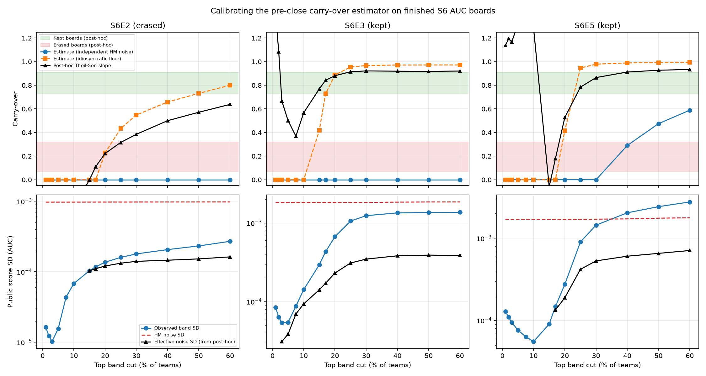

# carry-over 사전 추정기 보정: 완료 AUC 에피소드 S6E2/E3/E5 (#206)

[#204의 사전 추정](carryover-preclose-estimate.md)은 25% 컷에서 판정 불가로 끝났다.
원인은 노이즈 상관 가정에 따라 추정치가 0(독립 노이즈)과 0.98(고유 노이즈 하한)로 갈리기 때문이었다.
이 문서는 정답지가 있는 S6 완료 AUC 에피소드 3개(S6E2 전멸, S6E3 유지, S6E5 유지)에 같은 추정기를 적용해, 두 노이즈 가정 중 어느 쪽이 현실에 가까운지와 전멸/유지가 마감 전 정보만으로 분리되는지를 확인한 결과다.
스크립트는 `scripts/calibrate_carryover.py`(에피소드 3개 일괄)이고, `scripts/estimate_carryover.py`는 OOF 없이 Hanley-McNeil 노이즈만으로 돌 수 있게 확장했다(`--hm-only`).

## 결론 요약

- **독립 노이즈 가정은 기각된다.**
  이 가정으로는 세 에피소드 모두 30% 이하 컷에서 carry-over가 0으로 나온다.
  실제로 유지된 S6E3(사후 0.91), S6E5(사후 0.78)까지 전멸로 판정하므로, 이 가정의 추정치는 판별력이 없다.
- **고유 노이즈 하한 가정은 25% 컷에서 세 에피소드를 모두 맞춘다.**
  S6E8에서 유도한 고유 노이즈 비율(전체 노이즈의 0.123)을 각 에피소드의 HM 노이즈에 이식하면, 25% 컷 추정치가 S6E2 0.43, S6E3 0.95, S6E5 0.95로 나온다.
  전멸 보드만 낮게 나와 3전 3승으로 분리된다(경계는 0.5~0.7 사이 어디에 둬도 같다).
- **사후 기울기를 역산한 유효 노이즈는 HM 노이즈의 0.14~0.25에 몰린다.**
  25% 컷에서 S6E2 0.136, S6E3 0.170, S6E5 0.246으로, S6E8 스레드에서 실측된 고유 노이즈 비율 0.123과 같은 자릿수에서 일관된다.
  팀 간 노이즈는 강하게 상관되어 있고, 순위를 흔드는 성분은 전체 노이즈의 4분의 1 이하라는 뜻이다.
- **S6E8에 소급 적용하면 25% 컷의 판정 불가는 유지 쪽으로 좁혀진다.**
  보정된 유효 비율 0.14~0.25를 S6E8의 관측 산포에 대입하면 25% 컷 carry-over는 0.94~0.98이다.
  전멸 판정이 나오려면 유효 비율이 0.53을 넘어야 하는데, 이는 보정에서 관측된 최대값의 2배가 넘는다.
  단 표본 3개의 방향 증거이며 확증이 아니다.

## 입력과 출처

| 항목 | S6E2 | S6E3 | S6E5 |
| --- | --- | --- | --- |
| 사후 체제(노트북 판정) | 전멸 | 유지 | 유지 |
| public LB 팀 수 | 4,371 | 4,143 | 3,023 |
| train 행 수 | 630,000 | 594,194 | 439,140 |
| train 양성 비율 | 0.4483 | 0.2252 | 0.1990 |
| test 행 수 | 270,000 | 254,655 | 188,165 |
| public 비율 / n_pub | 20% / 54,000 | 20% / 50,931 | 20% / 37,633 |

출처는 다음과 같고, 대회 규칙 미수락으로 막힌 데이터 다운로드는 사람에게 요청하지 않고 공개 자료로 전부 대체했다.

- public LB: `kaggle competitions leaderboard --download` 2026-08-19 스냅샷(`run-logs/kaggle-out/issue206/`, 커밋 제외 경로).
- private 점수와 사후 기울기 원자료: Kaggle 데이터셋 [georgymamarin/playground-series-s6-leaderboards](https://www.kaggle.com/datasets/georgymamarin/playground-series-s6-leaderboards) (Apache-2.0). 노트북(id 130021535) 저자가 공개한 public+private 결합 리더보드다. 데이터만 썼고 동봉 코드는 쓰지 않았다.
- public 비율 20%: Meta Kaggle `Competitions.csv`의 LeaderboardPercentage(세 에피소드와 S6E8 모두 20).
- 행 수와 양성 비율: 공개 노트북 실행 로그(S6E2 train은 cdeotte의 Basic EDA, S6E3은 datasciencegrad EDA 로그의 "Train : 594,194 rows | Churn rate : 22.52%", S6E5는 cdeotte EDA 로그의 shape과 "Target rate: 0.19898")와 공개 산출물(S6E2 test 행 수는 공개 노트북 submission.csv 270,000행, S6E3 test 행 수는 EDA 산출 test 예측 254,655행)에서 확보했다.
  S6E2 양성 비율 0.4483은 미러 데이터셋 [yudainogata/playground-series-s6e2-train-combined](https://www.kaggle.com/datasets/yudainogata/playground-series-s6e2-train-combined) (Apache-2.0)의 대회 train 630,000행에서 직접 계산했다.

## 방법

#204와 같은 분산 분해(carry-over ≈ 1 - 노이즈 분산 / 관측 산포 분산)를 컷 1%~60%로 스윕했다.
#204와 다른 점은 다음 세 가지다.

1. **노이즈는 Hanley-McNeil 근사만 쓴다.**
   완료 에피소드에는 우리 OOF가 없으므로 부트스트랩 재표집이 불가능하다.
   HM 근사의 AUC에는 컷별 상위 밴드 public 점수의 중앙값을 대입했다(컷마다 노이즈가 미세하게 달라진다).
   S6E8에서는 HM 근사가 부트스트랩과 10% 이내로 합치했다(0.000634 대 0.000573).
2. **고유 노이즈 하한은 비율로 이식한다.**
   다른 에피소드에는 paired sigma 실측이 없으므로, S6E8의 고유 노이즈 비율(0.00007 / 0.000573 ≈ 0.123)이 보드 간에 유지된다고 가정하고 각 에피소드의 HM 노이즈에 곱했다.
   이 가정 자체가 보정 대상이며, 아래 유효 노이즈 역산이 그 검증이다.
3. **사후 기준을 에피소드별로 재계산했다.**
   결합 리더보드에서 컷별 private~public Theil-Sen 기울기를 직접 계산해(주최 측 베이스라인 행 제외), 노트북의 판정 밴드(전멸 0.07~0.32, 유지 0.73~0.91)와 대조했다.
   25% 컷 재계산값은 S6E2 0.32, S6E3 0.91, S6E5 0.78로 노트북 판정을 재현한다.

마감 시점 LB 확인: 2026-08-19 최신 다운로드와 데이터셋(2026-08 수집)의 public 점수를 team_id로 대조한 결과 세 에피소드 모두 불일치 0팀이었다(다운로드 쪽 +1팀은 주최 측 베이스라인).
마감 직후의 진짜 스냅샷은 구할 수 없지만, 독립 수집된 두 스냅샷이 완전히 일치하므로 마감 후 재채점이나 팀 삭제의 흔적은 없다.

## 결과

전체 표는 `run-logs/carryover_calibration_sweep.csv`(커밋 제외 경로), 주요 컷만 발췌하면 다음과 같다.

| 에피소드 | 컷 | 관측 SD | HM 노이즈 | 추정(독립) | 추정(고유 하한) | 사후 Theil-Sen | 유효 노이즈 비율 |
| --- | --- | --- | --- | --- | --- | --- | --- |
| S6E2 (전멸) | 17% | 0.000117 | 0.000975 | 0.00 | 0.00 | 0.11 | 0.114 |
| S6E2 (전멸) | 20% | 0.000137 | 0.000976 | 0.00 | 0.23 | 0.22 | 0.124 |
| S6E2 (전멸) | 25% | 0.000160 | 0.000976 | 0.00 | 0.43 | 0.32 | 0.136 |
| S6E2 (전멸) | 30% | 0.000179 | 0.000977 | 0.00 | 0.55 | 0.38 | 0.144 |
| S6E3 (유지) | 17% | 0.000431 | 0.001822 | 0.00 | 0.73 | 0.84 | 0.094 |
| S6E3 (유지) | 20% | 0.000669 | 0.001824 | 0.00 | 0.89 | 0.88 | 0.127 |
| S6E3 (유지) | 25% | 0.001058 | 0.001825 | 0.00 | 0.95 | 0.91 | 0.170 |
| S6E3 (유지) | 30% | 0.001238 | 0.001830 | 0.00 | 0.97 | 0.92 | 0.190 |
| S6E5 (유지) | 17% | 0.000148 | 0.001701 | 0.00 | 0.00 | 0.18 | 0.079 |
| S6E5 (유지) | 20% | 0.000275 | 0.001701 | 0.00 | 0.42 | 0.53 | 0.111 |
| S6E5 (유지) | 25% | 0.000900 | 0.001702 | 0.00 | 0.95 | 0.78 | 0.246 |
| S6E5 (유지) | 30% | 0.001443 | 0.001707 | 0.00 | 0.98 | 0.87 | 0.311 |

유효 노이즈 비율은 사후 기울기를 분산 비율 정의로 재현하는 노이즈 SD를 역산해 HM 노이즈로 나눈 값이다.

## 판독

1. **어느 노이즈 가정이 현실에 가까운가: 고유 노이즈 하한 쪽이다.**
   독립 가정의 추정치는 세 에피소드 모두 30% 이하 컷에서 0이라 전멸/유지를 구분하지 못한다.
   유지 보드조차 상위 밴드의 관측 산포가 전체 HM 노이즈보다 훨씬 작기 때문인데, 사후 기울기가 0.9라는 사실은 그 노이즈의 대부분이 팀 간에 공유되어 순위에 무해하다는 뜻이다.
   역산된 유효 노이즈 비율 0.14~0.25가 이를 정량화하고, S6E8 실측 0.123과 정합적이다.
2. **전멸/유지는 25% 컷의 고유 하한 추정치로 사전 분리된다.**
   전멸 S6E2는 0.43, 유지 S6E3/E5는 0.95로 간격이 크다.
   사후 기울기의 판정 밴드(0.32 대 0.73)를 추정치에 그대로 적용해도 3전 3승이다.
   단 20% 이하 컷에서는 S6E5가 유지인데도 낮게 나와 실패하므로(20% 컷 0.42), 판별 컷은 25%(±30%)로 고정해야 한다.
   전멸 보드의 표식은 "25% 컷을 넓혀도 관측 산포가 고유 노이즈 수준을 벗어나지 못하는 것"이다(S6E2 관측 SD 0.00016 대 고유 하한 0.00012).
3. **S6E8 소급 적용: 25% 컷은 유지 체제로 읽힌다.**
   보정된 유효 비율 0.136~0.246을 S6E8의 25% 컷 관측 SD 0.000555와 전체 노이즈 0.000573에 대입하면 carry-over는 0.94~0.98이다.
   #204 표의 두 행 중 고유 노이즈 하한 행(25% 컷 0.98)이 읽어야 할 행이고, 독립 노이즈 행(0)은 이번 보정으로 기각됐다.
   추정치가 0.7 아래로 내려가려면 유효 비율이 0.53을 넘어야 하는데, 세 에피소드 어디에서도 0.25를 넘지 않았다.
   따라서 #204의 "25% 컷 판정 불가"는 "유지 체제 쪽 방향 증거"로 좁혀진다.
4. **상단 내부에는 여전히 정보가 없다.**
   10% 이내 컷에서는 유지 보드조차 추정치가 0이고(S6E3의 10% 컷 사후 기울기 0.57을 놓친다), 5자리 반올림 때문에 사후 기울기 자체도 퇴화한다.
   "상위 밴드 안의 public 순위는 방어 대상이 아니다"라는 기존 결론(#204, discussion-insights 3장)은 그대로다.

## 한계

- 표본이 3개뿐이므로 어떤 결과도 확증이 아니라 방향 증거다.
  특히 전멸 표본은 S6E2 하나라, "전멸 보드는 낮게 나온다"는 일반화는 한 점에 기대 있다.
- 고유 노이즈 비율을 S6E8에서 이식한 상수(0.123)로 둔 것은 가정이다.
  역산 결과(0.14~0.25)가 그 근방이라 사후적으로 지지되지만, 비율이 보드 특성(중복 제출 문화, 밴드 폭)에 따라 변하는 양이라면 S6E5의 0.25처럼 위로 벗어날 수 있다.
- 사후 기준(Theil-Sen 기울기)과 추정기(분산 비율)는 정의가 완전히 일치하지 않는다(#204 문서의 주의 사항과 동일).
- 결합 리더보드의 public 열은 최고 public 제출, private 열은 실제 선택 제출이라 같은 모델의 두 점수가 아닌 팀이 섞여 있다(데이터셋 설명 기준 전체의 16%, 상위 300팀의 29~55%).
  사후 기울기는 이 선택 효과를 포함한 값이며, 노트북의 판정 밴드도 같은 데이터로 계산됐으므로 대조 자체는 일관된다.
- S6E8의 블라인드 블렌딩 유행은 준복제 팀을 늘려 유효 노이즈 비율을 보정 표본보다 낮추는 방향(유지 판정 강화)과, public 최적화 선택 편향으로 관측 산포를 부풀리는 방향(과대 추정)이 함께 작용한다.
  소급 적용의 2배 여유(0.25 대 0.53)는 이 불확실성에 대한 완충이다.
- ADR 0001 개선 판정 규칙과 제출 전략은 이 문서로 바꾸지 않는다(이슈 명세).
  #204와 같은 참고 자료 지위이며, 실무 함의는 기존 방침의 재확인이다: 최종 제출은 CV(nested OOF) 기준으로 고르고, 상단 내부 미세 순위 경쟁에 제출을 소모하지 않는다.
