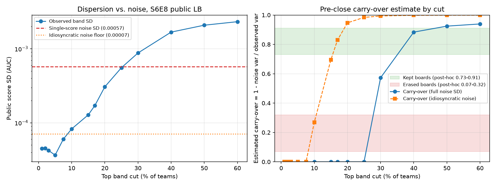

# S6E8 public 보드 carry-over 사전 추정 (#204)

2026-08-18 기준 public 리더보드 스냅샷으로, 마감 전에는 계산할 수 없다고 알려진 carry-over를 분산 분해로 근사한 결과다.
디스커션 [734005](https://www.kaggle.com/competitions/playground-series-s6e8/discussion/734005)와 파생 노트북 [Three of seven S6 boards erased the public top ten](https://www.kaggle.com/code/georgymamarin/three-of-seven-s6-boards-erased-the-public-top-ten)(id 130021535)이 남긴 미해결 과제의 후속 실험이다.
노트북 코드는 가져다 쓰지 않았고 아이디어(분산 분해 제안)만 차용했으므로 라이선스 절차 대상이 아니다.

## 결론 요약

- 상위 25% 컷(노트북의 기준 컷)에서 관측 산포(0.000555)가 단일 점수 노이즈(0.000573)보다 작다.
  독립 노이즈 가정의 주 추정치는 carry-over = 0으로, 전멸 체제 사후 범위(0.07~0.32)보다도 아래다.
- 그러나 이 추정은 팀 간 노이즈 상관 가정에 전적으로 좌우된다.
  스레드의 paired sigma(0.00009~0.00011)에서 유도한 고유 노이즈 하한(≈0.00007)을 쓰면 같은 컷에서 carry-over ≈ 0.98로 유지 체제(0.73~0.91) 위로 나온다.
  두 경계 가정이 사후 기준의 양 체제를 모두 지나치므로, **25% 컷에서는 판정 불가**가 정직한 판독이다.
- 가정과 무관하게 성립하는 사실은 상단의 극단적 압축이다.
  상위 5%(110팀)가 0.00022 폭 안에 몰려 있는데 이는 단일 public 점수 표준편차의 0.4배다.
  상위 ~200팀 내부의 public 순위 차이는 노이즈 상관이 어떻든 private 순위에 대한 정보가 거의 없다.
- 컷을 30~60%로 넓히면 두 가정 모두에서 carry-over가 유지 체제 범위 이상(0.57~0.94 / 0.99+)으로 올라간다.
  상단 밴드 밖의 보드는 실력 산포가 지배한다는 노트북의 사후 관찰(톱10% 밖 순위 상관 0.96~1.00)과 정합적이다.

## 방법

carry-over ≈ 1 - (노이즈 분산 / 관측 산포 분산)을 컷별로 계산했다.
스크립트는 `scripts/estimate_carryover.py`, 실행 명령과 산출 경로는 스크립트 docstring에 있다.

### 분자: 단일 public 점수의 노이즈

public 채점 표본은 n_pub = 59,260행(test 296,302행의 20%)이다.
champion exp081의 OOF 예측 691,369행(재채점 AUC 0.9691958, champion.yaml과 일치 확인)에서 59,260행을 재표집해 AUC 표준편차를 쟀다(B = 500, seed 42).

| 방법 | 노이즈 SD |
| --- | --- |
| 부트스트랩(복원 추출, 주 방법) | 0.000573 |
| 부분표집(비복원 추출) | 0.000583 |
| Hanley-McNeil 근사(AUC 0.9692, 양성 비율 0.7094) | 0.000634 |

세 값이 10% 이내에서 합치하고, 스레드에서 보고된 약 0.00066과도 같은 자릿수다.
이하 계산은 주 방법인 부트스트랩 값 0.000573을 쓴다.

### 분모: public LB 상단 밴드의 산포

`kaggle competitions leaderboard playground-series-s6e8 --download`로 받은 2026-08-18T12:25(UTC) 스냅샷을 썼다(2,203팀, 1위 0.97134, 중앙값 0.96548).
컷을 상위 1%~60%로 스윕하며 밴드 내 점수 표준편차를 쟀다.
LB 점수는 소수 5자리 반올림이라 반올림 노이즈 SD는 약 0.000003으로 무시 가능하다.

### 노이즈 상관 민감도

관측 산포에 기여하는 노이즈는 팀별 고유(비상관) 성분뿐이다.
채점 표본이 모든 팀에 공통이므로, 예측이 비슷한 팀끼리는 노이즈가 강하게 상관되어 산포에 거의 기여하지 않는다.
스레드가 실측한 유사 상위 모델 짝의 점수 차 SD(paired sigma) 0.00009~0.00011에서 팀별 고유 노이즈 하한 0.0001/√2 ≈ 0.00007을 유도해 반대쪽 경계로 병기했다.
독립 가정(전체 노이즈 0.000573)은 carry-over의 하한 방향, 고유 노이즈 하한(0.00007)은 상한 방향 경계다.

## 컷 스윕 결과

| 컷 | 팀 수 | 밴드 하한 점수 | 관측 SD | carry-over(독립 노이즈) | carry-over(고유 노이즈 하한) |
| --- | --- | --- | --- | --- | --- |
| 1% | 22 | 0.97116 | 0.000045 | 0.00 | 0.00 |
| 2% | 44 | 0.97114 | 0.000045 | 0.00 | 0.00 |
| 3% | 66 | 0.97113 | 0.000042 | 0.00 | 0.00 |
| 5% | 110 | 0.97112 | 0.000037 | 0.00 | 0.00 |
| 7.5% | 165 | 0.97099 | 0.000060 | 0.00 | 0.00 |
| 10% | 220 | 0.97095 | 0.000083 | 0.00 | 0.27 |
| 15% | 330 | 0.97071 | 0.000128 | 0.00 | 0.70 |
| 17% | 375 | 0.97053 | 0.000171 | 0.00 | 0.83 |
| 20% | 441 | 0.96998 | 0.000306 | 0.00 | 0.95 |
| 25% | 551 | 0.96927 | 0.000555 | 0.00 | 0.98 |
| 30% | 661 | 0.96809 | 0.000877 | 0.57 | 0.99 |
| 40% | 881 | 0.96618 | 0.001680 | 0.88 | 1.00 |
| 50% | 1,102 | 0.96548 | 0.002084 | 0.92 | 1.00 |
| 60% | 1,322 | 0.96478 | 0.002324 | 0.94 | 1.00 |

원자료 표는 `run-logs/carryover_cut_sweep.csv`, LB 스냅샷 CSV는 `run-logs/kaggle-out/`에 보존했다(둘 다 커밋 제외 경로).

## 판독

노트북의 사후 기준(상위 25% 컷 Theil-Sen 기울기: 전멸 0.07~0.32, 유지 0.73~0.91)과 나란히 놓으면 다음과 같다.

- 25% 컷의 주 추정치(독립 노이즈)는 0으로 전멸 범위 하단보다 아래, 민감도 경계(고유 노이즈 하한)는 0.98로 유지 범위 위다.
  이슈의 판독 규칙(0.32~0.73 사이면 판정 불가)을 확장 적용하면, 경계 구간이 두 체제를 모두 덮으므로 판정 불가다.
  판별에 필요한 수치는 상단 팀들 사이의 실제 노이즈 상관인데, 이것이 바로 관측 산포만으로는 식별되지 않는 양이다.
- 다만 어느 가정에서도 상위 10% 이내 컷의 carry-over는 0이다.
  상위 5%가 0.00022 폭(단일 점수 노이즈의 0.4 시그마, 고유 노이즈 하한의 0.5 시그마)에 압축되어 있어, 상단 내부의 public 순위 차이는 신호가 아니다.
  이는 "상위 밴드 안의 public 순위는 방어 대상이 아니다"라는 기존 결론(discussion-insights 3장)을 수치로 재확인한다.
- 전멸 시나리오의 형태도 노트북 관찰과 맞다.
  전멸 보드에서 선두는 서로 자리를 바꾸는 게 아니라 집단으로 가라앉았다(S6E6 톱10 내부 순서 상관 +0.62).
  S6E8 상단이 실제로 전멸한다면 그 원인은 상단 내부 순위의 뒤섞임이 아니라, 압축된 상단 집단 전체와 그 아래 실력 밴드 사이의 재배열일 것이다.
- 실무 함의는 기존 방침의 유지다.
  최종 제출은 CV(nested OOF) 기준으로 고르고, 마감 주간에 상단 내부의 미세 순위 경쟁에 제출을 소모하지 않는다.
  ADR 0001 개선 판정 규칙은 이 실험으로 바꾸지 않는다(이슈 명세).

## 주의 사항

- 사후 기준 자체가 7개 에피소드 표본이고, 완벽한 판별 변수라도 우연 분리 확률 하한이 p = 0.057이다.
- 두 그룹 사이(0.32~0.73)는 빈 구간이라 문턱 위치를 정할 수 없다.
  이번 추정은 점 추정이 그 사이에 떨어진 경우가 아니라, 가정 경계가 두 체제를 모두 덮는 더 약한 상황이므로 역시 판정 불가로 쓴다.
- 사후 carry-over는 private-public 점수 회귀의 Theil-Sen 기울기이고 이 추정은 분산 비율이다.
  회귀 기울기 정의로는 carry-over ≈ 실력 분산 / (실력 분산 + 고유 노이즈 분산)과 같은 형태여서 방향은 같지만 정의가 완전히 일치하지는 않는다.
  특히 Theil-Sen은 이상값에 둔감하고 분산 비율은 민감하다는 차이가 있다.
- 최근 블라인드 블렌딩 유행(Tilii 코멘트)은 두 방향으로 작용한다.
  공개 제출물을 섞은 준복제 팀들이 상단에 몰리면 노이즈 상관이 커져 독립 노이즈 가정이 더 심하게 깨지고(주 추정치의 하향 왜곡), 동시에 public 최적화 선택 편향이 상단 산포를 실력이 아닌 방향으로 키운다(과대 추정 요인).
  상위 5% 밴드 폭이 고유 노이즈 하한의 0.5 시그마에 불과하다는 관측 자체가 준복제 집단의 존재를 시사한다.
- 이 추정기는 이후 완료 에피소드 3개(S6E2 전멸, S6E3/E5 유지)로 보정됐다([#206 보정 문서](carryover-calibration-completed-episodes.md)).
  보정 결과 독립 노이즈 가정은 기각됐고(유지 보드까지 0으로 판정), 고유 노이즈 하한 가정이 25% 컷에서 세 에피소드를 모두 맞췄다.
  따라서 위 표에서 읽어야 할 행은 고유 노이즈 하한 열이며, 25% 컷의 판정 불가는 유지 체제 쪽 방향 증거(0.94~0.98)로 좁혀졌다.
- 파이프라인이나 제출 전략 변경은 이 이슈의 범위 밖이다(이슈 명세).
