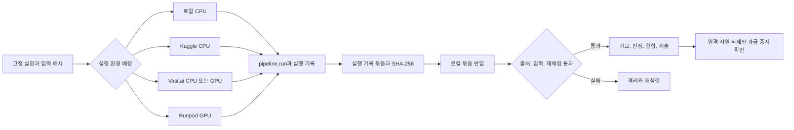

# 발표용 실행 환경과 전환 사건 근거

## 조사 질문과 결론

로컬, Kaggle CPU와 GPU, Vast.ai, Runpod은 서로 같은 일을 하는 다섯 개의 대체재가 아니었다.
공통 설정과 `pipeline.run`을 여러 실행 환경에서 사용하되, 모든 원격 결과를 실행 기록 묶음으로 회수해 로컬에서 다시 검수하는 하나의 실행 체계였다.
각 환경의 역할은 대회 중간에 바뀌었으며, 발표에서는 최종 역할과 실제 변천을 함께 보여줘야 오해가 없다.

발표의 핵심 비유는 "하나의 레시피, 여러 주방, 하나의 검수대"로 고정할 수 있다.
레시피는 커밋된 설정과 잠긴 의존성, 주방은 각 실행 환경, 봉인된 배달 상자는 실행 기록 묶음, 검수대는 로컬의 묶음 반입과 재채점, 조리 기록 보관소는 실행 저장소다.
원격 학습이 끝났다는 사실만으로는 유효한 결과가 아니며, 로컬 반입 검증을 통과해야만 **원격 결과 완료**로 인정했다.
이 용어와 경계는 [`CONTEXT.md`](../../CONTEXT.md)의 "원격 실험 실행 환경", "원격 결과 완료", "실행 기록 묶음", "묶음 반입" 정의에 고정돼 있다.

## 환경별 역할

| 환경 | 대회 후반의 확정 역할 | 실제 사용 근거 | 발표용 한 문장 |
| --- | --- | --- | --- |
| 로컬 | 개발, 소규모 CPU 실행, 중앙 반입, 재채점, 판정과 최종 조립 | 결측 증강 짝비교 중 여러 CPU 짝을 로컬에서 실행했고, 원격 실행은 전부 로컬 실행 저장소로 반입했다. | 가까운 시험 주방이면서 모든 결과가 통과해야 하는 중앙 검수대 |
| Kaggle CPU | 무료 병렬 CPU 용량이며, 엄격한 조건을 통과하면 정식 개선 판정에 사용 | 이슈 414에서 동시 실행 한도 5개를 실측하고 18개 가운데 5개를 Kaggle CPU, 13개를 Vast.ai CPU에서 실행해 모두 중앙 반입했다. | 비용 없이 다섯 작업을 동시에 맡은 보조 주방 |
| Kaggle GPU | 초반에는 정식 신경망 실행에 사용했지만, 후반 정책에서는 사람이 지켜보는 호환성 확인과 진단으로 제한 | Lookup-Transformer와 TabM은 Kaggle T4에서 정식 실행됐고, 이후 운영 문서는 GPU 개선 판정의 주 환경을 Vast.ai, 예비 환경을 Runpod으로 바꿨다. | 초반 주력 시험장이었지만 시간과 장비 제약 때문에 후반에는 시험 주방으로 역할이 줄어듦 |
| Vast.ai | 외부 GPU의 주 실행 환경이며, 필요하면 CPU 병렬 용량도 제공 | 실제 스크리닝이 Runpod보다 저렴했고, 운영 전환 뒤 다수의 정식 GPU와 CPU 실행 및 최종 전체 자료 재학습을 맡았다. | 값싼 매물을 골라 크게 확장할 수 있는 주 실행 환경 |
| Runpod | Vast.ai를 쓸 수 없을 때의 예비 실행 환경 | 실제 검증에 성공했고, 이슈 108에서는 Vast.ai 두 호스트의 SSH 준비 실패 뒤 정해 둔 조건에 따라 Runpod으로 전환해 실행을 끝냈다. | 주 환경이 막혔을 때 같은 레시피를 이어받는 예비 주방 |

환경별 최종 정책은 [`AGENTS.md`](../../AGENTS.md)와 [`docs/kaggle-gpu-run.md`](../kaggle-gpu-run.md)에 적혀 있다.
CPU 전용 개선 판정은 로컬 CPU, Kaggle CPU와 Vast.ai CPU를 함께 활용할 수 있지만, 한 짝의 대조군과 후보군은 같은 공급자와 같은 실행 환경 등급에 묶어야 한다.
Kaggle GPU와 Colab은 후반 정책상 사람이 지켜보는 호환성 확인과 진단에 한정됐고, GPU가 필요하다는 이유만으로 Kaggle을 고르지 않았다.

## 역할이 바뀐 시간순 사건

### 1. 초반에는 로컬과 Kaggle GPU가 중심이었다

Lookup-Transformer는 Kaggle T4에서 고정 5분할과 세 난수로 재현됐고, OOF AUC가 당시 기준보다 `+0.00038` 높아 기준 모형 교체와 후보 풀 진입에 모두 채택됐다.
Kaggle 안에서도 별도 학습 코드를 만들지 않고 공통 `pipeline.run`을 실행한 뒤 실행 기록 묶음을 로컬로 반입했다.
근거는 [Lookup-Transformer의 다양성 기여 결정](https://github.com/tmheo/predicting-smartphone-addiction/issues/58#issuecomment-5287565965)과 [`docs/kaggle-gpu-run.md`](../kaggle-gpu-run.md)다.

TabM도 Kaggle T4에서 선별 두 번과 확정 재검증을 수행했고 총 GPU 사용 시간은 약 10시간이었다.
이 실행은 단독 최고 성능 갱신에는 실패했지만 다른 방식으로 틀리는 구성원으로 채택됐다.
근거는 [RealMLP과 TabM의 다양성 기여 결정](https://github.com/tmheo/predicting-smartphone-addiction/issues/61#issuecomment-5293048109)이다.

이 시기 Kaggle GPU는 무료라는 장점이 있었지만, 주간 GPU 할당 30시간, 한 배치 약 9시간, 지정 가능한 장비와 소프트웨어 호환성 제약이 있었다.
예를 들어 잘못된 가속기 문자열은 기본 P100을 배정했고, 사용한 PyTorch 판본은 그 P100에서 실행되지 않았다.
이 제약과 T4 두 장의 난수별 병렬 실행 방식은 [`docs/kaggle-gpu-run.md`](../kaggle-gpu-run.md)에 기록돼 있다.

### 2. 첫 외부 유료 환경 결정은 Runpod 우선이었다

동일한 `exp059_lookup_transformer` 선별 실행을 Runpod RTX A5000과 Vast.ai RTX A4000에서 각각 끝까지 검증했다.
Runpod은 모형 실행 26분 24초, 실제 표시 차감액 `$0.24`였고, Vast.ai는 모형 실행 31분 45초, 실제 차감액 `$0.12`였다.
두 실행 모두 고정 커밋과 입력 자료, 실행 기록 묶음 회수, 로컬 반입 검증, 원격 자원 삭제와 과금 중지를 통과했다.
근거는 [Runpod 실제 스크리닝 검증](https://github.com/tmheo/predicting-smartphone-addiction/issues/120#issuecomment-5290902322)과 [Vast.ai 실제 스크리닝 검증](https://github.com/tmheo/predicting-smartphone-addiction/issues/119#issuecomment-5291665729)이다.

최초 결정은 준비 속도와 24GB 메모리 여유를 중시해 Runpod RTX A5000을 주 실행 환경, Vast.ai RTX A4000을 예비 실행 환경으로 두는 것이었다.
이 결정은 [주 실행 환경과 예비 실행 환경 선택](https://github.com/tmheo/predicting-smartphone-addiction/issues/116#issuecomment-5291726413)에 남아 있다.

### 3. 실제 운영 경험이 우선순위를 뒤집었다

이슈 106의 Runpod 실행은 RTX A5000이 전 지역에서 품절돼 계산 자원을 만들지 못했고, 이후 Vast.ai RTX A4000에서 확정 실행을 마쳤다.
이 사건만으로 공급자 전체의 우열을 단정할 수는 없지만, 재고와 실제 운영 가능성이 기술 사양만큼 중요하다는 사례다.
근거는 [Lookup-Transformer 복원 특성 실행 기록](https://github.com/tmheo/predicting-smartphone-addiction/issues/106#issuecomment-5293773332)과 [같은 이슈의 해결 기록](https://github.com/tmheo/predicting-smartphone-addiction/issues/106#issuecomment-5299745499)이다.

Vast.ai의 실제 스크리닝은 `$0.12`, Runpod은 `$0.24`였고, 그 뒤 실제 사용에서 Vast.ai가 더 안정적이고 저렴했다는 운영 판단을 바탕으로 주 환경을 Vast.ai, 예비 환경을 Runpod으로 뒤집었다.
이 전환과 전체 수명주기 합격 검사는 [Vast.ai 중심 원격 실험 운영 전환](https://github.com/tmheo/predicting-smartphone-addiction/issues/123)에 기록돼 있다.
최종 전환 규칙은 적합한 Vast.ai 매물을 선별과 확정 재검증에서 각각 10분과 30분 안에 확보하지 못하거나, 서로 다른 두 호스트에서 SSH 접속과 사전 검사에 실패하거나, 공급 환경 장애가 발생하거나, 독립 종료를 설정하지 못하면 Runpod으로 옮기도록 정했다.
근거는 [Vast.ai 주 실행 환경의 비용, 전환, 재평가 규칙](https://github.com/tmheo/predicting-smartphone-addiction/issues/126#issuecomment-5299901434)이다.

### 4. 정해 둔 전환 규칙이 실제로 작동했다

Lookup-Transformer의 여섯 변형을 다룬 이슈 108은 Vast.ai에서 시작했지만 서로 다른 두 호스트 모두 SSH 호스트 키가 준비되지 않았다.
정해 둔 조건에 따라 Runpod으로 옮겨 실행을 끝냈고, Vast.ai 비용은 약 `$0.089`, Runpod 비용은 약 `$3.91`, 합계는 약 `$4.00`이었다.
결과 묶음과 내부 파일 해시를 대조하고 로컬 실행 저장소에 반입했으며, 두 공급자의 계산 자원과 작업용 키도 정리했다.
근거는 [Lookup-Transformer 제한적 재검증 완료 기록](https://github.com/tmheo/predicting-smartphone-addiction/issues/108#issuecomment-5303015536)이다.

이 사건은 "가장 싼 공급자를 고른다"가 아니라 "주 실행 환경이 실패해도 같은 비교를 통째로 예비 실행 환경에서 다시 수행한다"는 운영 원칙을 보여준다.
Vast.ai와 Runpod에서 나온 한 짝의 일부 결과를 이어 붙여 개선 판정을 내리는 것은 금지했다.

### 5. Kaggle CPU는 후반 병렬 처리량을 늘렸다

이슈 414에서는 GPU를 쓰지 않는 고정 반복 수 변형 18개를 세 난수와 다섯 분할로 확정 실행했다.
Kaggle CPU 동시 실행 한도는 실제로 5개였고 여섯 번째 작업이 거부돼, 5개를 Kaggle CPU에, 13개를 Vast.ai CPU에 배정했다.
18개 실행과 270개 진단은 입력 해시, 출처 커밋, 깨끗한 코드 상태, 묶음 해시, 실행 환경 태그와 OOF 재채점을 모두 통과했다.
Vast.ai 청구 합계는 `$1.801`이었고 이슈 전용 계산 자원과 저장 공간은 모두 삭제됐다.
근거는 [`docs/research/issue414-tree-confirmation.md`](issue414-tree-confirmation.md), [`artifacts/issue414-tree-confirm-results.yaml`](../../artifacts/issue414-tree-confirm-results.yaml), [이슈 414 해결 기록](https://github.com/tmheo/predicting-smartphone-addiction/issues/414#issuecomment-5413811888)이다.

이 사례에서 서로 다른 공급자의 결과를 함께 판정할 수 있었던 이유는 비교 짝 하나를 쪼개지 않았기 때문이다.
각 실행은 공통 입력과 분할, 난수, 설정, 실행 기록 묶음과 중앙 반입 관문을 공유했고, 서로 다른 완결 짝만 한 일괄 판정에 모았다.

결측 증강 전파의 후반 실행도 로컬, Kaggle과 Vast.ai를 함께 사용했다.
완결된 24개 짝의 공급자 분포와 각 점수는 [`docs/research/issue511-missingness-propagation-confirmation.md`](issue511-missingness-propagation-confirmation.md)에 남아 있다.
이 기록은 로컬과 Kaggle이 단순 준비 환경이 아니라 CPU 실험을 실제로 수행했고, Vast.ai가 CPU와 GPU 실행을 모두 맡았다는 근거다.

### 6. 마지막 제출에서는 필요한 신경망 하나만 Vast.ai에서 다시 학습했다

최종 자체 풀은 36개였지만, 변경되지 않은 29개 전체 자료 예측은 구성원 항목 해시를 확인해 재사용했다.
새로 들어오거나 교체된 7개 가운데 신경망인 `mpv1_exp131_lookup_bivariate_plr5_missingness_augmented`만 Vast.ai에서 실행했고 나머지는 로컬에서 학습했다.
이 신경망의 난수 42, 43, 44를 GPU 세 장에 하나씩 나눠 전체 자료로 학습했다.
근거는 [`docs/research/extended-stack-final-assembly/issue514/report.md`](extended-stack-final-assembly/issue514/report.md)와 [최종 조립 해결 기록](https://github.com/tmheo/predicting-smartphone-addiction/issues/514#issuecomment-5473985714)이다.

사용한 Vast.ai 계산 자원은 RTX A4000 네 장을 가진 인스턴스였지만 실제 모형 실행에는 세 장을 사용했다.
시작 잔액과 종료 잔액의 차이는 정확히 `$0.393844836990070`이며, 결과 회수와 로컬 재검증 뒤 활성 인스턴스와 별도 저장 공간이 모두 0개임을 확인했다.
이 수치는 [`submission-record.json`](extended-stack-final-assembly/issue514/submission-record.json)에도 기계 판독 값으로 남아 있다.

이 `$0.39`는 대회 전체 원격 비용이 아니다.
최종 변경 신경망 하나의 전체 자료 재학습 작업 비용이며, 앞선 검증, 실패, 후보 탐색과 CPU 실행 비용은 별도다.

## 공통 실행과 검수 흐름

발표에서는 다음 여덟 단계를 하나의 흐름도로 보여주면 된다.

1. 결과를 보기 전에 설정 파일, 실행 단계, 난수, 분할, 소스 커밋, 입력 파일과 잠금 파일의 내용을 고정한다.
2. 모형이 CPU인지 GPU인지, 비교 짝인지 단독 실행인지에 따라 로컬, Kaggle CPU, Vast.ai 또는 Runpod을 배정한다.
3. 어느 환경이든 별도 학습 반복문을 만들지 않고 같은 `pipeline.run <config> --stage <screen|confirm>`을 실행한다.
4. 실행 기록과 예측, 지표와 진단을 실행 저장소에 남긴다.
5. 원격 실행은 완료된 기록과 산출물 전체를 manifest가 든 ZIP 실행 기록 묶음으로 내보낸다.
6. 묶음의 SHA-256을 대조해 로컬로 회수한다.
7. 로컬 묶음 반입은 입력 해시, 커밋 존재, 커밋 시점 설정과 묶음 설정의 일치, 깨끗한 코드 상태, 난수별 OOF 평균과 모든 주장 지표의 재채점을 검사한다.
8. 모든 검사를 통과한 실행만 로컬 실행 저장소의 정상 실행으로 재생해 비교, 후보 풀 판정, 결합과 제출 조립에 사용하고, 원격 계산 자원과 저장 공간을 삭제한 뒤 과금 중지를 확인한다.

공통 실행 명령과 Kaggle의 커밋 고정 복제, 잠긴 환경 설치, 실행, 묶음 내보내기 순서는 [`docs/kaggle-gpu-run.md`](../kaggle-gpu-run.md)에 있다.
반입 검사 구현과 실패 시 거부 조건은 [`src/pipeline/bundle.py`](../../src/pipeline/bundle.py)에 있다.
Vast.ai와 Runpod의 입력 전송은 로컬 보안 프로그램 때문에 `scp`와 `sftp` 대신 SSH 표준 스트림과 SHA-256 검증을 사용했으며, 자세한 절차는 [`docs/agents/remote-gpu-transfer.md`](../agents/remote-gpu-transfer.md)에 있다.
원격 자원의 생성, 비용 확인, 삭제와 목록 부재 확인은 [`docs/agents/vast-resource-control.md`](../agents/vast-resource-control.md)에 고정돼 있다.

## 발표에 쓸 수치

| 사건 | 확인된 수치 | 의미 |
| --- | ---: | --- |
| Runpod 실제 선별 검증 | `$0.24`, 모형 실행 26분 24초 | 초기 공급자 비교의 실제값 |
| Vast.ai 실제 선별 검증 | `$0.12`, 모형 실행 31분 45초 | 느리지만 절반 비용이었던 초기 실제값 |
| Vast.ai 실패 뒤 Runpod 전환 | Vast.ai `$0.089` + Runpod `$3.91` | 예비 실행 환경이 실제로 작동한 사건 |
| Kaggle CPU 5개 + Vast.ai CPU 13개 | Vast.ai `$1.801`, 18개 모두 반입 통과 | 무료 할당과 유료 용량을 함께 확장한 사례 |
| 최종 신경망 전체 자료 재학습 | Vast.ai `$0.393844836990070`, GPU 3장 사용 | 최종 변경분만 필요한 만큼 계산한 사례 |
| 초반 TabM Kaggle GPU | 약 10 GPU 시간 | 무료지만 할당량이 소모되는 환경의 사례 |

위 비용은 서로 범위가 다른 사건별 비용이므로 더해 "대회 전체 비용"으로 제시하면 안 된다.
특히 Kaggle의 할당 시간은 달러 비용이 아니고, 원격 실행 비용에는 실패와 준비, 저장 공간, 전송이 포함될 수 있어 순수 학습 시간과도 다르다.

## 발표에서 피해야 할 오해

| 피해야 할 표현 | 근거에 맞는 표현 |
| --- | --- |
| 다섯 환경에서 같은 실험을 복제했다. | 공통 실행 체계를 사용했지만 환경마다 맡은 역할과 시기가 달랐다. |
| Vast.ai가 처음부터 주 실행 환경이었다. | 최초 결정은 Runpod 우선이었고, 실제 비용과 운영 경험 뒤 Vast.ai 우선으로 바뀌었다. |
| Runpod은 실패한 서비스였다. | 실제 선별 검증에 성공했고, Vast.ai 접속 준비 실패 때 예비 실행 환경으로 정식 실행을 마쳤다. |
| Vast.ai가 실패하면 남은 결과만 Runpod에서 이어 붙였다. | 같은 비교의 대조군과 후보군 전체를 같은 공급자와 실행 환경 등급에서 다시 수행했다. |
| Kaggle GPU 결과는 끝까지 정식 판정에 썼다. | 초반에는 정식 신경망 실행에 썼지만, 후반 정책에서는 호환성 확인과 진단으로 역할을 제한했다. |
| Kaggle CPU와 Vast.ai CPU 결과를 섞었으므로 비교가 불공정했다. | 비교 짝 하나는 같은 환경에 묶고, 각자 완결되고 중앙 검증을 통과한 서로 다른 짝만 함께 일괄 판정했다. |
| 원격에서 AUC가 잘 나오면 채택했다. | 원격이 주장한 지표는 믿지 않고 로컬 입력과 OOF로 다시 계산했다. |
| GPU를 세 장 썼으니 서로 다른 모형 세 개를 학습했다. | 같은 신경망 설정의 난수 42, 43, 44를 GPU 세 장에 하나씩 배정했다. |
| 최종 제출의 원격 비용은 약 `$0.39`였다. | `$0.39`는 마지막에 바뀐 신경망 하나의 전체 자료 재학습 비용이다. |
| GPU가 많을수록 성능이 좋아졌다. | GPU는 더 빨리 여러 난수와 실험을 끝내는 계산 자원이며, 채택 여부는 고정 검증 절차가 결정했다. |

## 차트와 다이어그램으로 옮길 자료

### 실행 환경 역할 지도

가운데에 로컬 검수대를 놓고, 로컬 CPU, Kaggle CPU, Kaggle GPU, Vast.ai와 Runpod에서 실행 기록 묶음이 들어오는 방사형 그림이 적합하다.
화살표는 모형이 아니라 실행 기록 묶음의 이동을 뜻하게 해야 한다.
Kaggle GPU에는 "초반 정식 실행, 후반 진단"이라는 시간 변화 꼬리표를 붙인다.

### 공급자 결정 시간선

다섯 지점을 표시하면 된다.

1. Kaggle T4에서 Lookup-Transformer와 TabM 정식 실행.
2. Runpod `$0.24`, Vast.ai `$0.12` 실제 비교 뒤 Runpod 우선 결정.
3. 재고와 운영 경험을 반영해 Vast.ai 우선으로 전환.
4. Vast.ai 두 호스트 접속 준비 실패 뒤 Runpod에서 실제 복구.
5. 최종 신경망 하나를 Vast.ai GPU 세 장에서 `$0.3938`에 전체 자료 재학습.

시간선의 두 번째와 세 번째 지점을 모두 보여줘야 "처음 판단이 틀렸다"가 아니라 "새 근거로 운영 결정을 갱신했다"는 이야기가 된다.

### 중앙 검수 흐름도

"레시피 고정 -> 실행 환경 선택 -> 공통 명령 실행 -> 실행 기록 묶음 -> SHA-256 대조 -> 로컬 재채점 -> 판정 -> 자원 정리"의 여덟 칸으로 그리면 된다.
실패 갈래는 "묶음 격리와 재실행"으로 보내고, 공급 환경 장애 갈래만 Runpod 전환으로 연결한다.
프로그램 오류, 자료 오류, 설정 불일치와 GPU 메모리 부족은 공급자 전환 사유가 아니었다.

## 근거 색인

- 공통 용어와 판정 경계: [`CONTEXT.md`](../../CONTEXT.md)
- 현재 공급자 정책: [`AGENTS.md`](../../AGENTS.md)
- Kaggle CPU와 GPU 공통 실행 절차: [`docs/kaggle-gpu-run.md`](../kaggle-gpu-run.md)
- 실행 기록 묶음의 생성과 중앙 반입 검사: [`src/pipeline/bundle.py`](../../src/pipeline/bundle.py)
- Vast.ai와 Runpod 공통 전송 절차: [`docs/agents/remote-gpu-transfer.md`](../agents/remote-gpu-transfer.md)
- Vast.ai 자원 제어와 정리 관문: [`docs/agents/vast-resource-control.md`](../agents/vast-resource-control.md)
- 초기 Runpod 우선 결정: [주 실행 환경과 예비 실행 환경 선택](https://github.com/tmheo/predicting-smartphone-addiction/issues/116#issuecomment-5291726413)
- Vast.ai 우선 전환: [Vast.ai 중심 원격 실험 운영 전환](https://github.com/tmheo/predicting-smartphone-addiction/issues/123)
- 공급자 전환 규칙: [Vast.ai 주 실행 환경의 비용, 전환, 재평가 규칙](https://github.com/tmheo/predicting-smartphone-addiction/issues/126#issuecomment-5299901434)
- 실제 Vast.ai에서 Runpod 전환 사건: [Lookup-Transformer 제한적 재검증](https://github.com/tmheo/predicting-smartphone-addiction/issues/108#issuecomment-5303015536)
- Kaggle CPU와 Vast.ai CPU 병렬 실행: [`docs/research/issue414-tree-confirmation.md`](issue414-tree-confirmation.md)
- 최종 신경망 전체 자료 재학습과 비용: [`docs/research/extended-stack-final-assembly/issue514/report.md`](extended-stack-final-assembly/issue514/report.md)
- 최종 조립 원 이슈: [최종 두 번째 제출 유지, 교체 결정과 조립](https://github.com/tmheo/predicting-smartphone-addiction/issues/514#issuecomment-5473985714)
