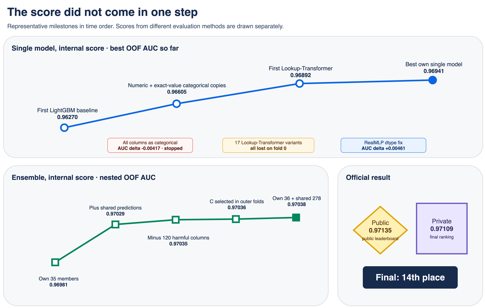
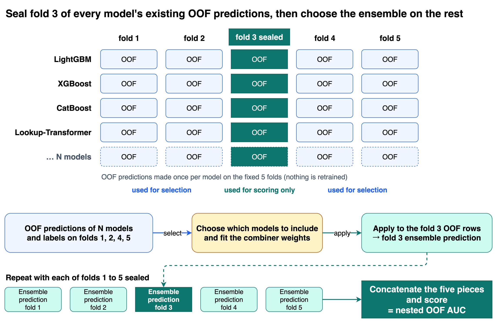
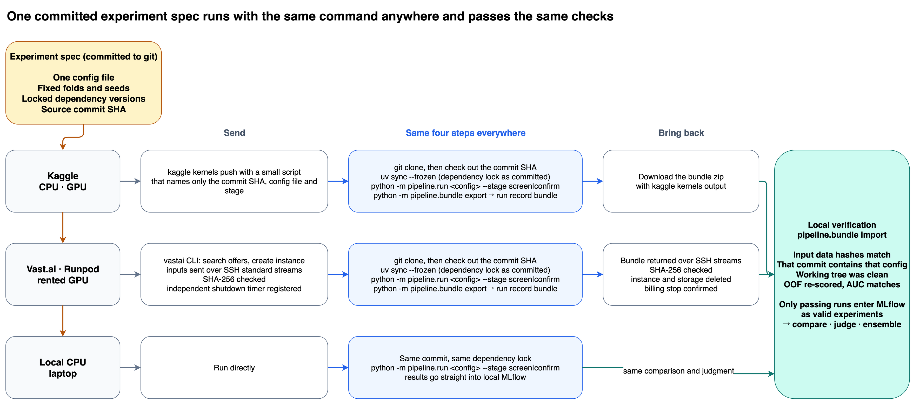
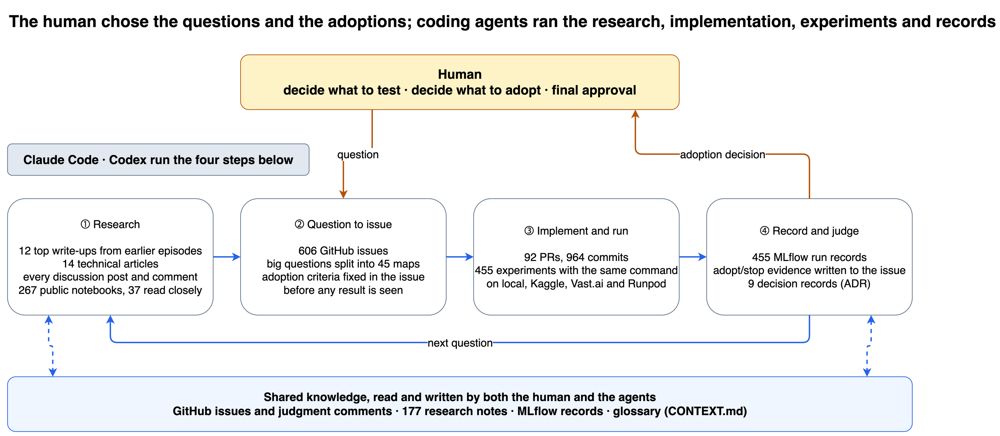

# Kaggle S6E8 solution write-up (English source)

This file is the source for the Kaggle `New Solution Writeup` form.
The first section holds the form fields.
Everything under `Content` is pasted into the Content editor.
Facts come from `docs/research/s6e8-our-final-solution.md`, the technical evidence appendix that lived at `docs/presentation/s6e8-retrospective-technical-evidence.md` until commit `cdcd677`, `artifacts/pool.yaml` and `docs/research/extended-stack-submission-2-manifest.json`.

## Form fields

| Field | Value |
| --- | --- |
| Title (80 max) | 14th Place - 278 Shared OOF Sets + 36 Own Models, All Judged on a Sealed Fold |
| Subtitle (140 max) | Own models alone: Private 0.97063. Stacking 278 OOF/test pairs shared by other Kagglers, judged on a sealed fold, reached 0.97109. |
| Tags (2-5) | Ensembling, Tabular, Tabular Classification, Feature Engineering, Neural Networks (Kaggle's own tag names, same set the 7th place write-up used) |
| Project links | none (the repository is not linked from the write-up, user decision 2026-09-02) |
| Files | none |
| Card and thumbnail (560 x 280) | `assets/writeup-thumbnail.png` |
| Media gallery | `assets/writeup-score-progression.png`, `assets/writeup-nested-oof.png` |

The figures under `assets/` are English versions of the Korean retrospective figures.
Each PNG has a `.drawio` source next to it; edit the source and re-export rather than editing the PNG.

## Content

Congratulations to the winners, and thank you to everyone who published OOF and test predictions during this competition.
My own models did not get me to 14th place.
My best own-only submission scored Private 0.97063.
The final submission that scored 0.97109 is a stack of 36 of my models and 278 prediction sets that other participants shared as Kaggle datasets and notebook outputs.
The full credit list is in the section "Who the 278 columns came from", and I would ask anyone reusing this approach to keep that list with it.

What is mine is the procedure: the checks a shared prediction had to pass before it could enter, the sealed-fold judgment behind every ensemble decision, and the 36 models that gave the stack something the shared sets did not have.

Final selections:

| Slot | What it was | Nested OOF | Public | Private |
| --- | --- | ---: | ---: | ---: |
| Safety | 35 own models only, 5:1 CV/full-refit blend | 0.96981 | 0.97099 | 0.97063 |
| Primary | 36 own + 278 shared, logistic stack | 0.97038 | 0.97135 | 0.97109 |

## TL;DR

- `StratifiedKFold(5, shuffle=True, random_state=42)` generated once, committed, never regenerated. Every own model is a 3-seed average (42, 43, 44) on those folds.
- Own pool of 36 models, best single OOF AUC 0.96941 (a Lookup-Transformer variant). Own-only stack: nested OOF 0.96981, Private 0.97063.
- 278 shared OOF/test pairs admitted after an integrity check: row counts, finiteness, re-scored AUC within 1e-5 of the declared value, hash dedup, fold evidence, leakage review.
- Combiner: L2 logistic regression on standardized rank and logit of every column. `C` and a shrinkage factor toward the plain rank mean chosen inside the outer training folds. Final `C = 0.03`, shrinkage 1.0 (no rank-mean mixing), negative weights allowed.
- Every pool change judged by nested OOF: seal one fold, choose everything on the other four, score the sealed fold, repeat five times. Adoption needed a pre-set delta and a positive sealed-fold delta in 5/5 folds for late changes.
- Nested OOF ladder: own 35 at 0.96981, plus 207 shared columns 0.97029, plus 71 more and minus 120 harmful ones 0.97035, `C` selection 0.97036, final 314 columns 0.97038.
- Public LB was never used for any decision.

## Who the 278 columns came from

Everything below is a Kaggle dataset or a notebook output published by its owner during the competition.
Counts are the number of OOF/test pairs from that source that made it into the final stack.
Licence is what the owner declared on the dataset page; notebook outputs carry no licence field, and a few datasets declared none, so those are marked unknown.
I used the arrays from unknown or other licences only as combiner inputs and do not redistribute them anywhere.

| Owner | Source | Licence | Columns |
| --- | --- | --- | ---: |
| @szymonkapiski | `s6e8-oof-library-47-models` | CC0-1.0 | 65 |
| @szymonkapiski | `s6e8-50-weakest-oof-models` | CC0-1.0 | 50 |
| @boltuzamaki | `s6e8-oof-prediction-library` | CC0-1.0 | 44 |
| @adarsh1077 | `s6e8-adarsh-oof-library` | CC0-1.0 | 22 |
| @hboyang | `s6e8-150-fusion-local-members` | unknown | 11 |
| @hboyang | `s6e8-catstrall-member` | CC0-1.0 | 6 |
| @paiky1995 | `s6e8-oof-library-11-members` | CC0-1.0 | 6 |
| @omidbaghchehsaraei | 6 notebooks: FT-Transformer, CNN, TabTransformer, fastai, XGBoost v2, CatBoost | unknown | 6 |
| @najiama | 5 models republished inside `szymonkapiski/s6e8-oof-library-47-models` | unknown | 5 |
| @raykkretzschmar | `s6e8-fm-lattice-blend-members` | Apache-2.0 | 5 |
| @beicicc | 5 `*-artifacts` datasets: lookup-transformer, second-seed lookup, exact-value CatBoost, RealMLP two-seed, fixed900 identity-digit LightGBM | CC-BY-4.0 | 6 |
| @beicicc | `s6e8-fixed1500-xgb-identity-digit-artifacts`, `s6e8-fixed1500-xgb-screen-relation-artifacts` | CC0-1.0 | 3 |
| @beicicc | `s6e8-fixed900-structural-lgbm-artifacts`, `s6e8-fixed4000-catboost-screen-relation-artifacts` | other | 3 |
| @rv1922 | notebook `smartphone-addiction` | unknown | 4 |
| @mohankrishnathalla | `s6e8-cat-mlp-oof`, `s6e8-lgb-dart-oof`, `s6e8-xgb-oof` | CC0-1.0 | 3 |
| @mohankrishnathalla | notebooks `s6e8-realmlp-oof-saver`, `s6e8-tabm-oof-saver` | unknown | 2 |
| @dariushafshar | `s6e8-golem-oof-library` | CC0-1.0 | 3 |
| @dariushafshar | notebook `0-97184-leader-xgb-feature-ablation` | unknown | 1 |
| @zhukovoleksiy | notebook `ps6e8-eda-feature-engineering-pipeline` | unknown | 3 |
| @yaminh | notebook `smartphone-addiction-prediction-strong-eda-cv-eble` | unknown | 3 |
| @sidhaarthshree | notebook `lightgbm-ensemble-based-on-eda` | unknown | 3 |
| @danushkumarv | notebook `smartphone-addiction-gbm-rank-blend-nb01` | unknown | 3 |
| @lopure | notebook `hdviz-pca-parallel-with-linear-svm` | unknown | 3 |
| @cdeotte | notebooks `simple-xgb-starter`, `simple-cat-starter`, `simple-nn-starter` | unknown | 3 |
| @yadoy666 | notebook `predicting-smartphone-addiction` | unknown | 2 |
| @dynamo14324 | notebook `smartphone-addiction-championship-v11` | unknown | 2 |
| @shamanthakreddymallu | notebook `s6e8-baseline` | unknown | 2 |
| @redamountassir | notebooks `s6e8-lgbm-lb-0-96965`, `s6e8-histgradientboosting-lb-0-96945` | unknown | 2 |
| @lucymlai32 | notebooks `phase-2-xgboost-and-model-blending`, `smartphone-addiction-prediction` | unknown | 2 |
| @kodaifukuda0311 | notebook `s6e8-how-to-achieve-0-97-with-realmlp-only` | unknown | 1 |
| @masayakawamata | `s6e8-catstr-aug16` | CC0-1.0 | 1 |
| @harwindersingh766 | notebook `ps-s6e8-xgboost-te-lb-0-96548` | unknown | 1 |
| @yekenot | notebook `ps-s6-e8-trompt-pytorch-frame` | unknown | 1 |
| @kava1 | notebook `predicting-smartphone-addiction-resnet-fe` | unknown | 1 |

Totals by licence: CC0 203, CC BY 4.0 6, Apache 2.0 5, unknown 61, other 3.

Some of these libraries are themselves re-runs of other people's work, and those authors deserve credit too.
szymonkapiski's 47-model library includes a 5-fold re-training of tamerlanomralinov's Lookup-Transformer and re-runs of notebooks by donmarch14, factualexplorer, mohankrishnathalla, omidbaghchehsaraei and ryota517.
paiky1995's library is also built on tamerlanomralinov's architecture.
My own Lookup-Transformer members are a port of the same notebook.

For scale, own 35 members alone: nested OOF 0.96981, Private 0.97063.
The same 35 plus the first 207 shared columns: nested OOF 0.97029, Private 0.97106.
That one step is larger than everything I did on my own models after the first two weeks.

## Validation

### Fixed folds, OOF, gates

I made the folds once and committed them as a parquet file.
Everything that touches the target (target encoding, imputation models, vocabularies and rank-gauss quantiles for the transformers) is fit inside the training part of each fold.
All numbers below are OOF AUC on those folds, averaged over seeds 42, 43, 44, unless stated otherwise.

Two rules ran from the first week.

- A placebo feature is always present.
  A new feature is accepted only if its fold-averaged gain importance beats the placebo.
  Non-tree models convert their own importance to the same scale so the gate applies everywhere.
- Screening happens on fold 0, seed 42, against the current champion on the same fold.
  A candidate that loses on fold 0 is dropped without a full run.
  Champion replacement always requires the full 3-seed confirmation.

### Nested OOF for every ensemble decision

An ensemble chosen by comparing many combinations on OOF is optimistic, because the choice already looked at those labels.
So every ensemble judgment used a sealed fold.

1. Seal fold k. Take the OOF rows and labels of the other four folds.
2. Choose members, combiner weights and combiner hyperparameters on those rows only.
3. Apply the frozen combiner to the OOF rows of fold k.
4. Repeat for k = 1..5, concatenate in the original row order, score ROC AUC.

No model is retrained in this loop and there is no inner re-splitting, so it is not a full double CV.
It only removes the optimism of selecting the ensemble on the rows you score.

Each candidate had to answer two questions: is it good alone (its own OOF AUC), and does it help together (nested OOF delta when added to the current pool)?
A weaker model stayed if it was wrong on different rows than the pool, and a stronger one was dropped if it was wrong on the same rows.
Duplicate rule: Spearman rank correlation above 0.998 with any existing member.

### Adoption gate

I adopted a pool change only if both conditions below held, and both were fixed before I looked at the result.

- Nested OOF delta above a threshold (+0.00002 for late pool changes).
- Sealed-fold delta positive in at least 3/5 folds early on, 5/5 for the final pool.

Two examples:
Replacing five own members with missingness-augmented versions: +0.0000469, positive on 5/5, adopted.
Widening the final stack from 314 to 327 columns: +0.0000047, positive on 3/5, rejected.
I submitted the 327 version anyway for the record and it scored Private 0.97108 against 0.97109 for the 314 version.

## Own models

### Data observations that drove the features

The numeric columns are not continuous.
Values sit on a small set of exact numbers, and the target rate is stable within each exact value, so exact values work as keys.
There is also a budget relation: `daily_screen_time_hours` is roughly `social_media_hours + gaming_hours + work_study_hours + something else`.
The residual and the part-to-total ratios were useful features and also bounded the imputations.

### Features

Counting feature providers across the final 36 configs: derived features 30, constraint-based imputation 27, target encoding 18, XGBoost-based imputation 14, exact-value categorical copies 3, frequency encoding 2, lattice pair target encoding 1, and five configs with original-dataset proxies.

**Exact-value categorical copies.**
Keeping the 9 numeric columns and adding 9 categorical copies (same value = same category) moved LightGBM from 0.96276 to 0.96605.
Converting everything to categorical and dropping the numeric columns went to 0.95859.
The model needed order and distance as well as the exact-value view, so the categorical copies had to sit next to the numeric columns rather than replace them.

| Representation | OOF AUC | Delta |
| --- | ---: | ---: |
| Numeric only (baseline) | 0.96276 | |
| All 12 columns as categorical | 0.95859 | -0.00417 |
| Numeric + exact-value categorical copies | 0.96605 | +0.00329 |

Same LightGBM settings for all three (`num_leaves=255`, `learning_rate=0.05`, early stopping 200, seed 42).

**Screen-time budget.**
`other_screen = daily - (social + gaming + work)` (NaN if any part is missing), `screen_slack = daily - sum of observed parts` (NaN only if daily is missing), part-to-daily ratios, weekday/weekend differences, `weekend - slack`, and a count of observed parts.

**Imputation as auxiliary columns.**
Raw columns were never overwritten; imputed values went into `<col>_recon` columns next to them.
Constraint-based: an `IterativeImputer` fit on the training fold, with screen-time estimates clipped to the interval allowed by `daily >= social + gaming + work`.
XGBoost-based: per-column XGBoost imputers fit on the training fold, plus compositions on the imputed values (fractions, awake-time screen fraction, weekend minus daily, and so on).

**Target encoding.**
Exact-value target encoding, fit with an inner split inside each training fold, in half the pool.
One config used a lattice of pairwise exact-value target means.
The placebo gate earned its keep on the composition features over the imputed matrix: twelve of them passed the AUC gate as a group (+0.00019), but seven had lower gain than the placebo, and only the five that beat it went into the champion.

**Original dataset proxies.**
Five configs used the public `Smartphone_Usage_And_Addiction_Analysis_7500_Rows.csv` as a proxy for the generator's source: nearest-neighbour features, prior means, class-conditional CDF differences, and a first-stage prediction trained on it.
They were modest on their own but wrong on different rows than the rest of the pool.

**Missingness augmentation.**
Six of the final 36 members trained on 3x rows: the original training fold plus two copies where each observed cell was masked with probability 0.25.
Existing NaNs stay NaN, copies inherit fold and label, all preprocessing state is fit on the original rows only.
A version that copied empirical row-level mask patterns from train and test instead of independent masking did not pass the gate, so the gain came from mask diversity rather than from realistic missing patterns.

### Model families

| Family | Members | Best OOF AUC |
| --- | ---: | ---: |
| Lookup-Transformer | 5 | 0.96941 |
| LightGBM | 14 | 0.96884 |
| CatBoost | 3 | 0.96875 |
| RealMLP | 4 | 0.96855 |
| TabM | 1 | 0.96838 |
| XGBoost | 2 | 0.96833 |
| Contextual Spline Transformer | 1 | 0.96814 |
| TabCNN | 3 | 0.96795 |
| Scalar Token Transformer | 1 | 0.96782 |
| TabPFN-3 | 1 | 0.96724 |
| One-hot exact-value logistic regression | 1 | 0.95962 |

The best LightGBM member is a config from an AutoGluon-style hyperparameter portfolio trained on missingness-augmented rows.
The one-hot logistic regression at 0.9596 stayed because it was the most different member in the pool, and its OOF logit was also the init score for one LightGBM member.

**Lookup-Transformer.**
A port of tamerlanomralinov's public notebook, with vocabulary and rank-gauss quantiles fit on the training fold only.
Each column is one token: an exact-value lookup embedding (the repeated keys) plus a PLR embedding of the rank-gauss value (the smooth trend).
Values seen only in validation or test map to a per-column UNK id, distinct from NA.
4 layers, width 128, 8 heads, CLS head.
32 epochs, batch 2,048, OneCycle with peak LR 2e-3, EMA, value dropout.
The best variants used Muon instead of AdamW, averaged several initializations per fold, and added five PLR-only composition tokens on the imputed screen-time columns.
The first version scored 0.96892 against a champion of 0.96854, its highest Spearman correlation with any pool member was 0.98149 (an XGBoost), and adding it gave +0.00025 to the ensemble.
Seventeen learning-rate, schedule and optimizer variants after that all lost on fold 0.

**The RealMLP dtype bug.**
The largest single-model gain of the competition was a bug fix.
My RealMLP port also used numeric columns as exact-value categories.
The vocabulary was built from float64 values, but the encoding step cast to float32 before the lookup, so any value with a fractional part missed the vocabulary and the categorical channel for 6 columns was effectively dead.

| | Before | After |
| --- | ---: | ---: |
| Validation cells mapped to UNK (one fold, 12 categorical columns) | 800,896 | 23 |
| 3-seed OOF AUC | 0.96371 | 0.96832 |

Moving the cast after the lookup was the whole fix, worth +0.00461.

## Admitting shared predictions

Every shared OOF/test pair went through the same ledger before it could be a candidate.

- 691,369 OOF rows and 296,302 test rows, all finite, row order checked against the competition ids.
- Re-scored AUC on the labels within 1e-5 of the AUC the author declared.
- Deduplicated by a hash of the prediction arrays; near-duplicates flagged by Spearman.
- Fold evidence recorded per member: author statement 152, published code 98, sibling code by the same author 13, an included fold vector matching ours 12, none 3.
- Code reviewed where available. I excluded two members for target-mean leakage found in their code.
- Licence and caveats recorded per member.

I then judged the candidates as a ladder with the nested rule.
The whole 433-column set gave +0.0000063 over the 242-column stack, positive on only 3/5 folds.
The same set without one family of 120 weak classical probabilistic models gave +0.0000633 on 5/5.
That is how the 278 was chosen: width helped only when the new columns carried something the pool did not already have.

The shared predictions do not all share my fold assignment.
Nested OOF removes the selection bias of my combiner; it cannot remove selection bias that happened upstream when the authors built their models.
That caveat stands and I have no way to quantify it.

## Combiner

For each column, compute the empirical rank and the logit of the raw probability, standardize both, and fit an L2 logistic regression over all columns.
Negative weights are allowed.
The output rank is shrunk toward the plain rank mean of the members with a factor `lambda`.

`C` in {0.001, 0.003, 0.01, 0.03, 0.1, 0.3, 1.0} and `lambda` in {0.25, 0.5, 0.75, 1.0} are chosen by leave-one-fold-out inside the outer training folds, so they are part of what the sealed fold judges.
Ties go to the smaller `C`, then the smaller `lambda`.
On the final full-OOF fit: `C = 0.03`, `lambda = 1.0`, so the plain rank mean was not mixed in at all.

For the test prediction the combiner is refit once on the full 314-column OOF matrix and applied to the test matrix in the same column order.
Own members' test predictions come from full-train refits using the training length observed in CV.
Shared members' test predictions are whatever the author published, normally a fold average.
The combiner works in rank space per column, so the scale mismatch does not matter.

| Step | Columns | Nested OOF AUC |
| --- | ---: | ---: |
| Own pool | 35 | 0.96981 |
| Plus validated shared predictions (ledger v1) | 242 | 0.97029 |
| Plus 71 new shared columns, minus 120 harmful ones | 313 | 0.97035 |
| `C` selected inside outer folds | 313 | 0.97036 |
| Own pool updated to 36 members | 314 | 0.97038 |

## Submissions

| Submission | Columns | Nested OOF | Public | Private | Selected |
| --- | ---: | ---: | ---: | ---: | --- |
| Own 35, safety pick | 35 | 0.96981 | 0.97099 | 0.97063 | yes |
| Own 35 + shared 207 | 242 | 0.97029 | 0.97134 | 0.97106 | no |
| Own 35 + shared 278 | 313 | 0.97035 | 0.97135 | 0.97108 | no |
| Same 313 with `C` selection | 313 | 0.97036 | 0.97135 | 0.97109 | no |
| Own 36 refit + shared 278 (final) | 314 | 0.97038 | 0.97135 | 0.97109 | yes |
| 314 + 13 strict candidates | 327 | 0.97039 | 0.97133 | 0.97108 | no, for the record |

Public and Private moved with nested OOF across the ladder, with an offset of about +0.0010 between nested OOF and Public.

## What did not work

- All-categorical representation (-0.00417).
- 17 Lookup-Transformer learning-rate, schedule and optimizer variants: none beat the champion on fold 0.
- TabR-S, TabICLv2, AMFormer, Trompt: -0.027 to -0.244 on fold 0. Trompt would also have needed about 40 hours for 5 folds.
- Row-mask missingness augmentation copied from real missing patterns: below the independent-mask version.
- DAE latent representations fed to Lookup-Transformer and CatBoost: -0.00002 and -0.00016.
- CatBoost on GPU was 5.7x faster but -0.00013 OOF, so CPU stayed the reference. XGBoost on GPU was 3.8x slower on this data.
- Rebuilding the own pool from scratch with an exact search over 6 size ranges: the proposed 13-member pool came out -2.5e-06 under the incumbent.
- The last 13 strict shared candidates (+0.0000047, 3/5).

## Infrastructure

One experiment is one YAML config committed with the fixed folds, seeds and locked dependencies.
The same `pipeline.run <config>` runs on a laptop, on Kaggle CPU/GPU, on Vast.ai and on Runpod; no environment had its own training loop.

Remote runs come back as a bundle (config, predictions, metrics, diagnostics) with a SHA-256.
On import the laptop checks the input hashes, that the commit exists and contains that config, that the tree was clean, and re-scores the OOF against local labels before the run is accepted into MLflow (455 runs by the end).
I deleted instances and volumes right after each import.
Vast.ai was the primary GPU provider with Runpod as fallback; the final refit of the one changed neural member was 3 seeds on 3 GPUs for about $0.39.
Wide stacking judgments were memory bound: 400-column jobs took 10-16 GB each, five in parallel rebooted the laptop, three became the cap.

Most of the repetitive work went to coding agents (Claude Code and Codex): reading prior write-ups and notebooks, turning a question into a GitHub issue with the adoption criteria written down before anything ran, implementing, running, recording.
I decided what to test and what to adopt.
That loop is the reason the shared-prediction ledger could be checked at the level of individual notebooks.
The working conventions behind that loop are not mine.
One map of issues per big question, grilling and domain-modeling sessions before anything is built, a `CONTEXT.md` glossary and ADRs for decisions all come from Matt Pocock's agent skills (github.com/mattpocock/skills), installed as-is and pointed at my repository.

## Takeaways

- The score came from other people's predictions plus a strict gate on what to admit. Credit and checking both matter.
- Fix the folds and the stopping rules before seeing results, then stop early on small evidence.
- Judge "good alone" and "helps together" separately. The second one is what the leaderboard pays for.
- Verify that a config does what it says. The biggest own-model gain was a dtype bug.
- Next time: search wider across model families with different inductive biases in the first week, and tune the leader less.

## Thanks

- @tamerlanomralinov for the Lookup-Transformer notebook. My four strongest own members are ports of it.
- @szymonkapiski, @boltuzamaki, @adarsh1077, @hboyang, @paiky1995, @dariushafshar and @mohankrishnathalla for publishing OOF libraries with matching test predictions. Those libraries are most of the 278 columns, and @najiama's five models reached me through the first of them.
- @beicicc and @raykkretzschmar for artifact datasets with fold vectors or published code, which made the fold check possible without guessing, and @masayakawamata for the `s6e8-catstr-aug16` dataset.
- @omidbaghchehsaraei, @rv1922, @zhukovoleksiy, @yaminh, @sidhaarthshree, @danushkumarv, @lopure, @yadoy666, @dynamo14324, @shamanthakreddymallu, @redamountassir, @lucymlai32, @kodaifukuda0311, @harwindersingh766, @yekenot and @kava1 for notebooks whose outputs became members.
- @cdeotte for the starter notebooks and for the discussion threads that set the baseline everyone measured against.
- @ryota517 for framing the screen-time budget constraint in the discussion, and @kitopl for the EDA LightGBM notebook whose settings bundle one of my LightGBM configs is named after.
- Matt Pocock for the agent skills (github.com/mattpocock/skills) that gave the coding agents their working conventions: issue maps, grilling, domain modeling, `CONTEXT.md` and ADRs.

If I have missed anyone whose predictions are in the table above, tell me in the comments and I will add you.
